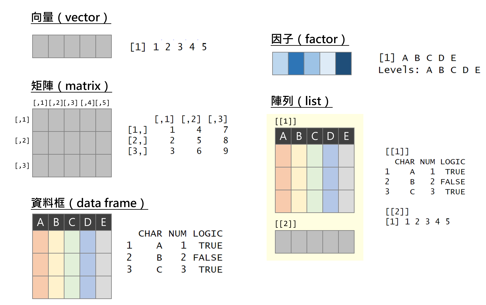
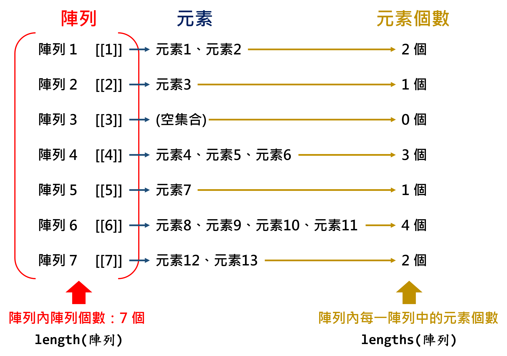
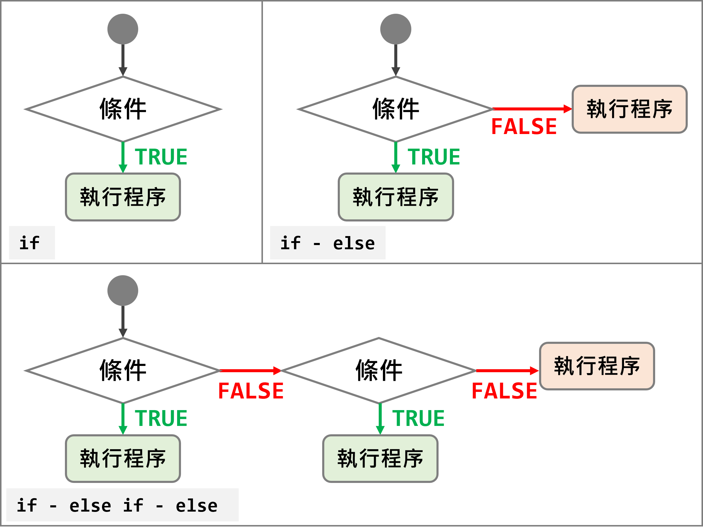

```{r setup1, include=FALSE}
knitr::opts_chunk$set(echo = TRUE)
library(dplyr)
library(data.table)
library(sf)
library(ggplot2)
library(ggsflabel)
library(ggspatial)
library(knitr)
library(kableExtra)
library(TDX)
library(DT)
library(stringr)
library(jsonlite)
library(xml2)

Sys.setlocale(category = "LC_ALL", locale = "zh_TW.UTF-8")

windowsFonts(A=windowsFont("微軟正黑體"))

client_id=read.csv("./key.txt", header=F)[1,2]
client_secret=read.csv("./key.txt", header=F)[2,2]
access_token=get_token(client_id, client_secret)
```

# **R 語言基礎語法**
本章節系統性介紹 R 語言的重要語法和`dplyr`套件的功能及用法，請務必熟悉各函式，以便後續程式碼撰寫。  

## 物件（Object）
物件是 R 語言中構成資料的基本要素，常見者包含五大類：  

1.  向量（vector）  
2.  因子（factor）  
3.  矩陣（matrix）   
4.  資料框（data frame）  
5.  陣列（list）  

物件的圖示如圖\@ref(fig:object-fig)。

```{r object-fig, echo=F, eval=T, out.width="80%", fig.align="center", fig.cap="R 物件示意圖"}

```


以下小節針對各基本要素的構建與運算詳細說明。

### 向量（Vector）
<p style="color:#003D79;font-size:18px;line-height:2">**⌾ 向量的性質**</p>  

* 一組值  
* 一維  
* 資料型態可為：數值、文字、邏輯值  

<p style="color:#003D79;font-size:18px;line-height:2">**⌾ 建立向量**</p>  

建立向量可利用`c()`函式建構。  

<p style="font-size:18px;line-height:1">**<u>數值向量</u>**</p>  
```{r vector1, echo=T, eval=F}
vec1=c(1,2,3,4,5)
```

```{r vector1-show, echo=F, eval=T}
vec1=c(1,2,3,4,5)
vec1
```

<p style="font-size:18px;line-height:1">**<u>文字向量</u>**</p>  
```{r vector2, echo=T, eval=F}
vec2=c("A","B","C","D","E")
```

```{r vector2-show, echo=F, eval=T}
vec2=c("A","B","C","D","E")
vec2
```

<p style="font-size:18px;line-height:1">**<u>邏輯向量</u>**</p>  
```{r vector3, echo=T, eval=F}
vec3=c(T,F,T,F,T)

# 或寫完整的邏輯值
vec3=c(TRUE,FALSE,TRUE,FALSE,TRUE)
```

```{r vector3-show, echo=F, eval=T}
vec3=c(T,F,T,F,T)
vec3
```

<p style="color:#003D79;font-size:18px;line-height:2">**⌾ 擷取向量中特定元素**</p>  

<p style="font-size:18px;line-height:1">**<u>擷取單一元素</u>**</p>  
```{r vector-retrieve1, echo=T, eval=T}
vec2[3]
```

<p style="font-size:18px;line-height:1">**<u>擷取多個連續元素</u>**</p>  
```{r vector-retrieve2, echo=T, eval=T}
vec2[2:4]
```

<p style="font-size:18px;line-height:1">**<u>擷取多個非連續元素</u>**</p>  
```{r vector-retrieve3, echo=T, eval=T}
vec2[c(1,3,5)]
```

<p style="font-size:18px;line-height:1">**<u>以邏輯值擷取元素</u>**</p>  
請注意輸入的邏輯值向量長度必須與原向量相同！
```{r vector-retrieve4, echo=T, eval=T}
vec2[c(T,T,F,F,T)]
```


<p style="color:#003D79;font-size:18px;line-height:2">**⌾ 連續數值資料**</p> 
利用`seq()`函式建立連續數值，程式碼撰寫如下：
```{r vector-continuous0, echo=T, eval=F}
seq(from=開始數值, to=結束數值, by=遞增數值)
```

```{r vector-continuous1, echo=T, eval=T}
seq(from=2, to=20, by=2)
```

<p style="color:#003D79;font-size:18px;line-height:2">**⌾ 向量運算**</p>  

<p style="font-size:18px;line-height:1">**<u>統計運算</u>**</p>  

以下建立一個向量`vec4`作為範例，所有運算的程式碼與結果請參照表\@ref(tab:vector-operation-table)。
```{r vector-exg1, echo=T, eval=T}
vec4=c(5,9,3,15,6,2,8,12)
```


```{r vector-operation-table, echo=F, eval=T}
vector_operation=data.frame(ope_name=c("最大值","最小值","最大值索引","最小值索引","全域","總和","平均","中位數","乘積","變異數","標準差"), operation=c("`max(vec4)`","`min(vec4)`","`which.max(vec4)`","`which.min(vec4)`","`range(vec4)`","`sum(vec4)`","`mean(vec4)`","`median(vec4)`","`prod(vec4)`","`var(vec4)`","`sd(vec4)`"),
                         result=c(paste0("`", max(vec4), "`"), paste0("`", min(vec4), "`"), paste0("`", which.max(vec4), "`"), paste0("`", which.min(vec4), "`"), paste0("`", paste(range(vec4), collapse="  "), "`"), paste0("`", sum(vec4), "`"), paste0("`", mean(vec4), "`"), paste0("`", median(vec4), "`"), paste0("`", prod(vec4), "`"), paste0("`", round(var(vec4), 3), "`"), paste0("`", round(sd(vec4), 3), "`")))

colnames(vector_operation)=c("運算","程式碼","輸出結果")
kable(vector_operation, booktabs=T, caption="向量運算")%>%
  kable_styling(bootstrap_options=c("striped", "hover"), font_size=14)%>%
  column_spec(1, bold=T)%>%
  row_spec(0, bold=T, color="white", background="#8E8E8E")
```

<p style="font-size:18px;line-height:1">**<u>數學運算</u>**</p>  

以下利用`vec4`與新建向量`vec5`作為範例，所有運算的程式碼與結果請參照表\@ref(tab:vector-calculation-table)。。
```{r vector-exg2, echo=T, eval=T}
vec5=c(0.57,4.28,-1.23,6.58,-4.67,2.09)
```

```{r vector-calculation-table, echo=F, eval=T}
vector_calculation=data.frame(ope_name=c("絕對值","根號","四捨五入","取整函數","下取整函數","對數","指數","標準化","累積加總"), operation=c("`abs(vec5)`","`sqrt(vec4)`","`round(vec5, digits=1)`","`ceiling(vec5)`","`floor(vec5)`","`log(vec4)`","`exp(vec4)`","`scale(vec4)`","`cumsum(vec4)`"),
                         result=c(paste0("`", paste(abs(vec5), collapse=" "), "`"), paste0("`", paste(round(sqrt(vec4), 3), collapse=" "), "`"), paste0("`", paste(round(vec5, digits=1), collapse="  "), "`"), paste0("`", paste(ceiling(vec5), collapse=" "), "`"), paste0("`", paste(floor(vec5), collapse=" "), "`"), paste0("`", paste(round(log(vec4), 3), collapse=" "), "`"), paste0("`", paste(round(exp(vec4), 1), collapse=" "), "`"), paste0("`", paste(round(scale(vec4), 3), collapse=" "), "`"), paste0("`", paste(cumsum(vec4), collapse=" "), "`")))

colnames(vector_calculation)=c("運算","程式碼","輸出結果")
kable(vector_calculation, booktabs=T, caption="數學運算")%>%
  kable_styling(bootstrap_options=c("striped", "hover"), font_size=14)%>%
  column_spec(1, bold=T)%>%
  row_spec(0, bold=T, color="white", background="#8E8E8E")
```


<p style="color:#003D79;font-size:18px;line-height:2">**⌾ 向量長度**</p>  
計算向量中的元素個數。
```{r vector-length, echo=T, eval=T}
length(vec4)
```

<p style="color:#003D79;font-size:18px;line-height:2">**⌾ 向量統計**</p>  
統計向量中各元素的個數。
```{r vector-table, echo=T, eval=T}
vec_tab=c("A","C","B","D","E","C","E","B","A","E","E","B")
table(vec_tab)
```

<H2 id="vector-sort"><p style="color:#003D79;font-size:18px;line-height:2">**⌾ 向量排序**</p></H2>

* `sort()`函式直接將向量予以由小至大之排序  
* `order()`函式回傳向量由小至大排序所對應的原向量序號  
* `rank()`函式回傳向量中各元素由小至大之順序  

程式碼撰寫如下，請參照圖\@ref(fig:vector-sort-order-rank-fig)之示意圖。

```{r vector-sort-order-rank-fig, echo=F, eval=T, out.width="90%", fig.align="center", fig.cap="排序函式示意圖"}
include_graphics("./figure/sort_order_rank.png")
```

```{r vector-sort-order-rank, echo=T, eval=T}
sort(vec4)
order(vec4)
rank(vec4)
```
 
由`sort()`的結果可知，其將`vec4`向量由小至大排序。`order()`則是回傳排序所對應至原向量的序號，例如回傳結果的最後一個值是`4`，表示該向量中最大的數值位於向量的第 4 個元素。根據上述，我們亦可透過如下程式碼達到與`sort()`相同的結果。

```{r vector-sort-order-eg, echo=T, eval=T}
vec4[order(vec4)]
```


<p style="color:#003D79;font-size:18px;line-height:2">**⌾ 向量唯一值**</p>  
去除重複的值。
```{r vector-unique, echo=T, eval=T}
vec_dup=c(1,9,5,2,6,1,8,5,2)
unique(vec_dup)
```


<p style="color:#003D79;font-size:18px;line-height:2">**⌾ 檢查使否存在 NA**</p>  
```{r vector-na, echo=T, eval=T}
vec_na=c(1,9,5,NA,6,NA)
is.na(vec_na)
```

<H2 id="vector-computation"><p style="color:#003D79;font-size:18px;line-height:2">**⌾ 向量四則運算**</p></H2>

以下範例使用`vec4`與新建立的`vec6`示範向量的四則運算。

```{r vector-vec5, echo=T, eval=T}
vec6=c(2,5,8,11,7,4,10,3)
```


<H2 id="vector-compute"><p style="font-size:18px;line-height:1">**<u>兩向量運算</u>**</p></H2>
兩向量運算時，兩組向量的長度（`length()`）務必相同！  
所有運算結果如表\@ref(tab:vector-arithmetic-table)。

```{r vector-arithmetic-table, echo=F, eval=T}
vector_arithmetic=data.frame(ope_name=c("","加法","減法","乘法","除法","取餘數","取除數","內積"), operation=c("", "`vec4+vec6`","`vec4-vec6`","`vec4*vec6`","`vec4/vec6`","`vec4 %% vec6`","`vec4 %/% vec6`","`vec4 %*% vec6`"), result=c("", paste0("`", paste(vec4+vec6, collapse=" "), "`"), paste0("`", paste(vec4-vec6, collapse=" "), "`"), paste0("`", paste(vec4*vec6, collapse=" "), "`"), paste0("`", paste(round(vec4/vec6, 3), collapse=" "), "`"), paste0("`", paste(vec4 %% vec6, collapse=" "), "`"), paste0("`", paste(vec4 %/% vec6, collapse=" "), "`"), paste0("`", paste(vec4 %*% vec6, collapse=" "), "`")))
vector_arithmetic$result[1]="**`vec4=c(5,9,3,15,6,2,8,12)`\\\n`vec6=c(2,5,8,11,7,4,10,3)`**"

colnames(vector_arithmetic)=c("運算","程式碼","輸出結果")
kable(vector_arithmetic, booktabs=T, caption="向量運算")%>%
  kable_styling(bootstrap_options=c("striped", "hover"), font_size=14)%>%
  column_spec(1, bold=T)%>%
  row_spec(0, bold=T, color="white", background="#8E8E8E")
```


<p style="font-size:18px;line-height:1">**<u>向量與元素運算</u>**</p>  
一組向量與一個元素之間的運算，即是將向量中的每一個元素分別與該元素運算。  

```{r vector-addition2, echo=T, eval=T}
vec6+5
vec6*5
```


<p style="color:#003D79;font-size:18px;line-height:2">**⌾ 檢查元素是否包含於向量**</p>  
檢查`vec6`向量內個元素是否包含於`c(1,2,3)`的向量中。

```{r vector-contain, echo=T, eval=T}
vec6 %in% c(1,2,3)
```


<p style="color:#003D79;font-size:18px;line-height:2">**⌾ 轉換資料型態**</p>  

<p style="font-size:18px;line-height:1">**<u>文字轉換為數值</u>**</p>  
建立`vec_cha`文字資料

```{r vector-convert1, echo=T, eval=T}
vec_cha=c("1","2","3","4","5")
```

先利用`class()`函式檢查`vec_cha`資料型態
```{r vector-convert2, echo=T, eval=T}
class(vec_cha)
```

利用`as.numeric()`函式轉化為數值資料
```{r vector-convert3, echo=T, eval=T}
as.numeric(vec_cha)
```

<p style="font-size:18px;line-height:1">**<u>數值轉換為文字</u>**</p>  
另外，可利用`as.character()`函式轉化為文字資料
```{r vector-convert4, echo=T, eval=T}
vec_num=c(1,2,3,4,5)
as.character(vec_num)
```


<p style="color:#003D79;font-size:18px;line-height:2">**⌾ 建立重複資料**</p> 
利用`rep()`函式建立重複資料，該函式主要有兩大引數可以設定：  

* `each=`是設定每一個元素重複的次數
* `times=`是設定該向量整體循環的次數

以實際範例說明之，程式碼撰寫如下：
```{r vector-repeat, echo=T, eval=T}
vec6=c(2,5,8,11,7,4,10,3)

# 設定每一個元素重複的次數
rep(vec6, each=2)

# 設定向量整體重複的次數
rep(vec6, times=2)
```


<p style="color:#003D79;font-size:18px;line-height:2">**⌾ 回傳向量中 TRUE 索引值**</p>   
`which()`函式可用以回傳向量中 TRUE 的索引值。

<p style="font-size:18px;line-height:1">**<u>TRUE 索引值</u>**</p>  
```{r vector-which1, echo=T, eval=T}
vec3=c(T,F,T,F,T)
which(vec3)
```

由上述範例可知，TRUE 位於`vec3`向量的第 1、3、5 個元素。


<p style="font-size:18px;line-height:1">**<u>回傳符合條件索引值</u>**</p>  
除了上述基本案例外，通常我們會藉由運算子（`==`, `>`, `<`, ...）以尋找符合條件的元素，並進一步透過`which()`函式回傳結果為 TRUE 的索引值。範例如下。

```{r vector-which2, echo=T, eval=T}
vec6=c(2,5,8,11,7,4,10,3)

# vec6大於5的邏輯判斷
vec6>5

# 回傳vec6大於5的索引值
which(vec6>5)
```


### 因子（Factor）
<p style="color:#003D79;font-size:18px;line-height:2">**⌾ 因子的性質**</p>  

* 由文字向量建立  
* 須設定文字層級  
* 設立因子的延伸應用：  
  * 在`ggplot2`套件中調整圖例順序  
  * 在計量模型中建立啞變量（dummy variables）  


<p style="color:#003D79;font-size:18px;line-height:2">**⌾ 建立因子**</p>   
因子的建立可以使用`factor()`函式，其中必須透過`levels=`引數設定層級，程式碼建構如下：  

```{r factor1, echo=T, eval=F}
factor(文字向量, levels=期望的層級向量)
```

以下列簡單範例說明因子的功能，建立`school`之文字向量。

```{r factor2, echo=T, eval=T}
school=c("大學","幼稚園","國小","高中","國中")
```

若欲將`school`轉換為具有層級意義的因子，並依據學校層級排序，則程式碼撰寫如下：

```{r factor3, echo=T, eval=T}
school_fc=factor(school, levels=c("幼稚園","國小","國中","高中","大學"))
school_fc
```

由上述可發現，有別於文字向量，因子會另出現「Levels:」的訊息，表示文字具有層級意義。  
最後可利用`is.factor()`函式判斷一變數是否為因子，抑或利用`class()`函式逕查詢該變數的資料型態。  

```{r factor5, echo=T, eval=T}
is.factor(school_fc)
class(school_fc)
```

上述所建立的因子具有層級意義，故可以排序，可進一步利用`sort()`函式排序，程式碼如下：

```{r factor-sort, echo=T, eval=T}
sort(school_fc)
```

<p style="color:#003D79;font-size:18px;line-height:2">**⌾ 建立有序因子**</p>   
上述所建立的因子具有層級意義，可以排序，然而各元素間不具有大小意義，無法直接比較大小值。以`school_fc`為例，我們所設定的「大學」層級高於「幼稚園」，然而這不意謂著`大學>幼稚園`。因此若直接拿兩元素相比較大小，程式會出現警告（大小關係對因子無意義），且回傳`NA`，試驗如下：

```{r factor-error, echo=T, eval=T}
school_fc[1]>school_fc[2]
```

若欲建立具大小關係的因子，則需在`factor()`函式中設定`order=T`引數，以表達具有順序意義。

```{r factor-order1, echo=T, eval=T}
school_order=factor(school, levels=c("幼稚園","國小","國中","高中","大學"), order=T)
school_order
```

由輸出結果可發現，層級中具有「<」符號，用以表達有序之大小關係。

```{r factor-order2, echo=T, eval=T}
# 比較幼稚園與大學的大小關係
school_order[1]>school_order[2]
```

<p style="color:#003D79;font-size:18px;line-height:2">**⌾ 轉換資料型態**</p>   
可透過`as.character()`將因子轉換為單純的文字向量，亦可藉由`as.numeric()`將因子轉換為數值，而該數值乃依據層級的大小給定，層級越高（後）者，數值愈大。以上述`school_fc`為案例說明。

```{r factor-char-num, echo=T, eval=T}
# 轉換為文字向量
as.character(school_fc)

# 轉換為數值向量
as.numeric(school_fc)
```


### 矩陣（Matrix）
<p style="color:#003D79;font-size:18px;line-height:2">**⌾ 矩陣的性質**</p>  

* 二維  
* 含括多個橫列（rows）與直行（columns）  
* 可以組合「相同」資料型態的向量 (文字向量、數值向量、邏輯向量)  

<p style="color:#003D79;font-size:18px;line-height:2">**⌾ 建立矩陣**</p>  
利用`matrix()`函式建立矩陣，其中必須設定兩引數：  
 
* `nrow=` 設定矩陣的橫列數  
* `ncol=` 設定矩陣的直行數  

```{r matrix-function, echo=T, eval=F}
matrix(向量, nrow=, ncol=)
```

範例如下：
```{r matrix1, echo=T, eval=T}
mat1=matrix(c(1:15), nrow=3, ncol=5)
mat1
```

由回傳結果可發現，該矩陣是先由上至下，再由左至右填入向量。若希望矩陣的填法是先由左至右，再由上至下，則須設定引數`byrow=T`，程式碼撰寫如下。


```{r matrix2, echo=T, eval=T}
mat2=matrix(c(1:15), nrow=3, ncol=5, byrow=T)
mat2
```

<p style="color:#003D79;font-size:18px;line-height:2">**⌾ 查看矩陣的維度**</p>  
矩陣是二維的資料，若要進一步該二維資料中的橫列與直行個數，可利用`nrow()`與`ncol()`函式分別查看，或逕利用`dim()`函式查看之。

```{r matrix3, echo=T, eval=T}
nrow(mat2)
ncol(mat2)
dim(mat2)
```

<p style="color:#003D79;font-size:18px;line-height:2">**⌾ 回傳矩陣的特定元素**</p>  
利用中括號`[ , ]`可回傳特定元素的值，其中逗點前必須放置橫列的索引值，而逗點後則是直行的索引值。  
以第 2 橫列第 4 行為例，程式碼撰寫如下。  

```{r matrix4, echo=T, eval=T}
mat2[2, 4]
```

<p style="color:#003D79;font-size:18px;line-height:2">**⌾ 轉置矩陣**</p>  
藉由`t()`函式將矩陣予以轉置（transpose）。

```{r matrix5, echo=T, eval=T}
t(mat2)
```

<p style="color:#003D79;font-size:18px;line-height:2">**⌾ 矩陣運算**</p>  
矩陣的運算是 R 語言的利器，執行效率相當高，在許多統計模型背後的運算亦是牽涉複雜的矩陣運算。以下簡單介紹重要的運算函式。

<p style="font-size:18px;line-height:1">**<u>橫列與直行運算</u>**</p>  
橫列與直行的加總與平均值計算彙整如表\@ref(tab:matrix-operation-table)。

```{r matrix-operation-table, echo=F, eval=T}
matrix_operation=data.frame(TYPE=rep(c("橫列","直行"), each=2), sum=c("`rowSums(mat2)`", paste0("`", paste(rowSums(mat2), collapse=" "), "`"), "`colSums(mat2)`", paste0("`", paste(colSums(mat2), collapse=" "), "`")), ave=c("`rowMeans(mat2)`", paste0("`", paste(rowMeans(mat2), collapse=" "), "`"), "`colMeans(mat2)`", paste0("`", paste(colMeans(mat2), collapse=" "), "`")))

colnames(matrix_operation)=c("","加總","平均")
kable(matrix_operation, booktabs=T, caption="矩陣運算")%>%
  kable_styling(bootstrap_options=c("striped", "hover"), font_size=14)%>%
  column_spec(1, bold=T)%>%
  collapse_rows(c(1:2))%>%
  row_spec(0, bold=T, color="white", background="#8E8E8E")
```


<p style="font-size:18px;line-height:1">**<u>四則運算</u>**</p>  
矩陣的四則運算大致操作方法與<A href="#vector-computation">向量的運算</A>雷同，惟須注意的是大部分的四則運算皆須確保兩矩陣的維度（`dim()`）相同。以矩陣的加法為例，程式碼如下。

```{r matrix-addition, echo=T, eval=T}
mat1+mat2
```

矩陣運算中「內積」是相當常見的，應用於諸多模型的係數校估過程中，可利用`%*%`達成目的。在內積運算時另須確保第一個運算之矩陣的直行數（`ncol`）必須與第二個運算矩陣之橫列數（`nrow`）相同。以`mat1`與`mat2_trans`（`mat2`的轉置矩陣）為例，程式範例如下。

```{r matrix-product, echo=T, eval=T}
mat2_trans=t(mat2)
mat1 %*% mat2_trans
```

請注意，`mat1`的維度為 3 橫列 5 直行；`mat2_trans`的維度為 5 橫列 3 直行，其中第一個矩陣的直行數與第二個運算矩陣之橫列數務必相同，最終所得結果為 `3*3` 的矩陣。


### 資料框（Data Frame）
<p style="color:#003D79;font-size:18px;line-height:2">**⌾ 資料框的性質**</p>  

* 類似矩陣（Matrix），但可涵括多種不同的資料型態  
* 功能類似 Excel 的工作表  
* 資料分析中最常見的資料型態  
* 可利用`dplyr`套件處理資料（參見[`dplyr`資料處理](#資料清洗與處理)）

<p style="color:#003D79;font-size:18px;line-height:2">**⌾ 建立資料框**</p>  
資料框的建立如下程式碼：

```{r dataframe-function, echo=T, eval=F}
data.frame(VAR1=c(), VAR2=c(), VAR3=c(), ...)
```

VAR1、VAR2、VAR3 皆表示資料框中的變數名稱，亦即表格中的表頭名。  

以下簡單範例說明資料框的建構。  

```{r dataframe1, echo=T, eval=T}
StuScore=data.frame(StudentID=c("ID1","ID2","ID3","ID4","ID5"),
                    Name=c("Bob","Mary","Robert","Jason","Jane"),
                    Score=c(60,80,40,50,100))
StuScore
```


<p style="color:#003D79;font-size:18px;line-height:2">**⌾ 回傳資料欄位名稱**</p>  
```{r dataframe2, echo=T, eval=F}
colnames(StuScore)

# 或可以直接使用names()函式
names(StuScore)
```

```{r dataframe2-show, echo=F, eval=T}
colnames(StuScore)
```

<p style="color:#003D79;font-size:18px;line-height:2">**⌾ 回傳特定欄列**</p>  

<p style="font-size:18px;line-height:1">**<u>回傳指定橫列</u>**</p>  
將列號或邏輯向量置於中括號內的逗號前，惟須注意，使用邏輯向量時，其長度必須與資料列數相同。程式碼撰寫如下。

```{r dataframe3, echo=T, eval=F}
# 使用列號
StuScore[c(1,3,5),]

# 使用邏輯向量
StuScore[c(T,F,T,F,T),]
```

```{r dataframe3-show, echo=F, eval=T}
StuScore[c(1,3,5),]
```

<p style="font-size:18px;line-height:1">**<u>回傳指定直行</u>**</p>  
有三種方法可回傳指定（多個）直行，包括：  

* 列號向量  
* 邏輯向量  
* 欄位名稱向量  

其中使用邏輯向量時，其長度與資料行數必須相同。程式碼撰寫如下。

```{r dataframe4, echo=T, eval=F}
# 列號向量
StuScore[, c(1,2)]

# 邏輯向量
StuScore[, c(T,F,T,F,T)]

# 欄位名稱向量
StuScore[, c("StudentID","Name")]
```

```{r dataframe4-show, echo=F, eval=T}
StuScore[, c("StudentID","Name")]
```

此外，資料框亦可透過「`$`」回傳特定單一欄位，程式碼撰寫如下。

```{r dataframe-retrieve-col, echo=T, eval=F}
資料$欄位名稱
```

```{r dataframe5, echo=T, eval=T}
StuScore$Name
```

<p style="color:#003D79;font-size:18px;line-height:2">**⌾ 回傳與編輯指定元素**</p>  

<p style="font-size:18px;line-height:1">**<u>使用行列索引值</u>**</p>  

```{r dataframe-retrieve-element, echo=T, eval=F}
資料[橫列索引, 直行索引]
```

```{r dataframe6, echo=T, eval=T}
StuScore[2,2]
```

<p style="font-size:18px;line-height:1">**<u>編輯指定元素</u>**</p>  
```{r dataframe7, echo=T, eval=T}
StuScore[2,2]="Jessica"

StuScore
```


<p style="color:#003D79;font-size:18px;line-height:2">**⌾ 查看前後六筆資料**</p>  
在此我們使用 R 語言內建的`iris`資料說明。`iris`資料共計 150 個樣本，並含括三種不同的鳶尾花（setosa、virginica、versicolor），欄位則包含花瓣與花萼的長度與寬度。

<p style="font-size:18px;line-height:1">**<u>回傳前六筆資料</u>**</p>  
```{r dataframe_head, echo=T, eval=T}
head(iris)
```

<p style="font-size:18px;line-height:1">**<u>回傳後六筆資料</u>**</p>  
```{r dataframe_tail, echo=T, eval=T}
tail(iris)
```


<p style="color:#003D79;font-size:18px;line-height:2">**⌾ 擴增資料框**</p>  

<p style="font-size:18px;line-height:1">**<u>擴增資料列（新增紀錄）</u>**</p>  
若欲新增資料，可以透過`rbind()`函式連結。程式碼如下。

```{r dataframe_rbind, echo=T, eval=T}
# 建立欲新增的資料
new_student=data.frame(StudentID="ID6", Name="Roy", Score=90)

# 利用rbind()函式相接
StuScore=rbind(StuScore, new_student)

StuScore
```


<p style="font-size:18px;line-height:1">**<u>擴增資料欄（新增屬性）</u>**</p>  
若欲針對整份資料新增屬性（如`StuScore`中增加性別欄位...），可以透過`cbind()`函式連結。程式碼如下。

```{r dataframe_cbind, echo=T, eval=T}
# 建立欲新增之屬性
Gender=c("M","F","M","M","F","M")

# 利用cbind()函式連結
StuScore=cbind(StuScore, Gender)

StuScore
```

或可以直接透過「`$`」新增新欄位內容。程式碼如下：
```{r dataframe_add_col-fun, echo=T, eval=F}
資料$新欄位=c(...)
```

```{r dataframe_add_col, echo=T, eval=T}
StuScore$Height=c(180,165,170,160,175,180)

StuScore
```


<p style="color:#003D79;font-size:18px;line-height:2">**⌾ 檢查重複列**</p>  
為說明範例，在此先行建立一句有重複資料的資料框。

```{r dataframe_duplicated1, echo=T, eval=T}
StuScore_dup=data.frame(StudentID=c("ID1","ID2","ID4","ID3","ID4","ID5","ID2"),
                        Name=c("Bob","Mary","Jason","Robert","Jason","Jane","Mary"),
                        Score=c(60,80,40,100,40,100,80))
StuScore_dup
```

由上述結果可知，資料中含有重複的橫列（ID2 & ID4）。我們可以進一步利用`duplicated()`函式檢查之。

```{r dataframe_duplicated2, echo=T, eval=T}
duplicated(StuScore_dup)

# 使用which()函式尋找重複的資料列索引
which(duplicated(StuScore_dup))
```

由執行結果可知，第 5 與第 7 筆資料屬於重複資料。請務必注意，資料框中首次出現的列不會被視為重複者。


### 陣列（List）
<p style="color:#003D79;font-size:18px;line-height:2">**⌾ 陣列的性質**</p>  

* 物件的集合（可包含向量、矩陣、資料框、陣列...）  
* 最複雜的物件，然其使用彈性相當高  

<p style="color:#003D79;font-size:18px;line-height:2">**⌾ 建立陣列**</p>  
使用`list()`函式建立陣列資料。

```{r list1, echo=T, eval=T}
StuScore_list=list(StudentID=c("ID1","ID2","ID3","ID4","ID5"),
                   Name=c("Bob","Mary","Robert","Jason","Jane"),
                   Score=c(60,80,40,50,100),
                   Class="A")
```

```{r list1-show, echo=F, eval=T}
StuScore_list
```


<p style="color:#003D79;font-size:18px;line-height:2">**⌾  回傳陣列屬性**</p>  

<p style="font-size:18px;line-height:1">**<u>使用`陣列$屬性`回傳</u>**</p>  

```{r list2, echo=T, eval=T}
StuScore_list$Score
```

<p style="font-size:18px;line-height:1">**<u>使用陣列索引回傳</u>**</p>  
```{r list3, echo=T, eval=T}
StuScore_list[[2]]
```


<p style="color:#003D79;font-size:18px;line-height:2">**⌾  陣列長度**</p>  
向量的長度可以利用`length()`函式計算，而陣列亦同，程式碼撰寫如下。
```{r list4, echo=T, eval=T}
# 建立陣列
num_list=list(c(1:5), c("A","B","C","D"), c(T,F,T))
num_list

# 計算陣列長度
length(num_list)
```

由此可知，`num_list`的長度為 3。而若欲知該陣列內各別陣列的長度，則必須透過`lengths()`函數達成此一目的。程式碼撰寫如下，陣列長度的計算詳如圖\@ref(fig:list-length-fig)之示意圖所示。

```{r list5, echo=T, eval=T}
# 計算陣列內各陣列長度
lengths(num_list)
```

由此可知，`num_list`陣列內第一個陣列的長度為 5，其次為 4，最後一者為 3。

```{r list-length-fig, echo=F, eval=T, out.width="70%", fig.align="center", fig.cap="陣列長度示意圖"}

```

<p style="color:#003D79;font-size:18px;line-height:2">**⌾  去除陣列**</p>  
若欲將陣列去除，並回傳所有陣列中的元素，則可使用`unlist()`達成之。

```{r unlist, echo=T, eval=T}
# 去除陣列
unlist(num_list)
```


## 文字處理
在資料分析中，文字處理是相當重要的程序，可從中解析特定的詞彙，如計算詞彙數量、取代特定字詞、查看文字出現位置等等，從中探索資料中的文字內容。文字處理可以透過 R 內建的`base`套件或另安裝`stringr`套件處理之，本節主要即是針對此二套件說明文字處理之應用。

```{r stringr-install, echo=T, eval=F}
install.packages("stringr")
library(stringr)
```

本節中所論及的函式彙整如表\@ref(tab:string-fun)。  

```{r string-fun, echo=F, eval=T}
str_fun=data.frame(Package=c(rep("`base`", 11), rep("`stringr`", 18)), fun=c("[`paste()`](#連接字串)","[`paste0()`](#連接字串)","[`toupper()`](#轉換大小寫)","[`tolower()`](#轉換大小寫)","[`substr()`](#擷取與取代字元)","[`strsplit()`](#拆解字串)","[`gsub()`](#擷取與取代字元)","[`nchar()`](#計算字元數)","[`grep()`](#搜尋字元)","[`grepl()`](#搜尋字元)","[`regexpr()`](#搜尋字元)","[`str_to_upper()`](#轉換大小寫)","[`str_to_lower()`](#轉換大小寫)","[`str_to_title()`](#轉換大小寫)","[`str_which()`](#搜尋字元)","[`str_detect()`](#搜尋字元)","[`str_starts()`](#搜尋字元)","[`str_locate()`](#搜尋字元)","[`str_locate_all()`](#搜尋字元)","[`str_count()`](#計算字元數)","[`str_sub()`](#擷取與取代字元)","[`str_replace_all()`](#擷取與取代字元)","[`str_length()`](#計算字元數)","[`str_pad()`](#文字填補)","[`str_split()`](#拆解字串)","[`str_flatten()`](#連接字串)","[`str_glue()`](#連接字串)","[`str_order()`](#文字排序)","[`str_sort()`](#文字排序)"), description=c("連接字串","連接字串（無分隔）","轉換為大寫","轉換為小寫","擷取字元","拆解字串","取代字元","字串長度(字元數)","回傳符合條件的索引值","回傳是否含有特定字元","回傳特定字元首次出現的位置索引","轉換為大寫","轉換為小寫","首字大寫","回傳符合條件的索引值","回傳是否含有特定字元","回傳是否以特定字元開頭","回傳特定字元首次出現的位置索引","回傳特定字元所有出現的位置索引","回傳特定字元出現的次數","擷取字元（可進一步取代）","取代字元","字串長度(字元數)","統一字串長度的格式","拆解字串","連接字串","連接字串（含變數）","回傳字串排序索引值","回傳字串排序後結果"))
str_fun$FIGURE=""

colnames(str_fun)=c("套件","函式","功能","圖示")

temp=paste0("./figure/string/", c(1:11,3,4,12,9,10,13,11,14,15,5,7,8,16,6,1,1,17,18), ".png")

kbl(str_fun, booktabs=T, escape=F, caption="文字處理重要函式")%>%
  kable_styling(bootstrap_options=c("striped", "hover"), font_size=14)%>%
  column_spec(4, image=spec_image(temp, 700, 100))%>%
  collapse_rows(1)%>%
  row_spec(0, bold=T, color="white", background="#8E8E8E")
```


### 連接字串

<p style="color:#003D79;font-size:18px;line-height:2">**⌾  `paste()`：以特定符號連接**</p>  
```{r paste-string1, echo=T, eval=F}
paste(文字向量, collapse="分隔符號")
```

`collapse=`引數須設定欲分隔字串的符號。

<p style="color:#003D79;font-size:18px;line-height:2">**⌾  `paste0()`：直接連接（無分隔）**</p>  
`paste0()`將向量內各元素直接連接，相當於`paste(文字向量, collapse="")`。

```{r paste-string2, echo=T, eval=F}
paste0(文字向量)
```

<p style="color:#003D79;font-size:18px;line-height:2">**⌾  `str_flatten()`：以特定符號連接**</p>  
與`paste()`函式功能相同。
```{r paste-string3, echo=T, eval=F}
str_flatten(文字向量, collapse="分隔符號")
```

`collapse=`引數須設定欲分隔字串的符號。

<p style="color:#003D79;font-size:18px;line-height:2">**⌾  `str_glue()`：連結字串與變數**</p>  
```{r paste-string4, echo=T, eval=F}
str_glue("文字{變數}")
```

以下簡單示範連結字串之函式應用案例。

```{r paste-string5, echo=T, eval=T}
# 原始文字向量
transport=c("Bus", "MRT", "Car", "Motorcycle", "Bike", "Taxi")
all_name="Mode"

# paste()函式連結所有transport內的元素
paste(transport, collapse="|")

# paste()函式連結all_name與transport內各元素
paste(all_name, ":", transport)

# paste0()函式連結all_name與transport內各元素
paste0(all_name, ": ", transport)

# str_flatten()函式連結所有transport內的元素
str_flatten(transport, collapse="|")

# str_glue()函式連結all_name與transport內各元素
str_glue("{all_name}: {transport}")
```


### 轉換大小寫
<p style="color:#003D79;font-size:18px;line-height:2">**⌾  `toupper()`：全部轉換為大寫**</p>  
```{r uplow-string1, echo=T, eval=F}
toupper(文字向量)
```

<p style="color:#003D79;font-size:18px;line-height:2">**⌾  `tolower()`：全部轉換為小寫**</p>  
```{r uplow-string2, echo=T, eval=F}
tolower(文字向量)
```

<p style="color:#003D79;font-size:18px;line-height:2">**⌾  `str_to_upper()`：全部轉換為大寫**</p>  
```{r uplow-string3, echo=T, eval=F}
str_to_upper(文字向量)
```

<p style="color:#003D79;font-size:18px;line-height:2">**⌾  `str_to_lower()`：全部轉換為小寫**</p>  
```{r uplow-string4, echo=T, eval=F}
str_to_lower(文字向量)
```

<p style="color:#003D79;font-size:18px;line-height:2">**⌾  `str_to_title()`：首字大寫**</p>  
```{r uplow-string5, echo=T, eval=F}
str_to_title(文字向量)
```

以下簡單示範轉換字元大小寫之應用案例。

```{r uplow-string6, echo=T, eval=T}
# 原始文字向量
transport=c("Bus", "MRT", "Car", "Motorcycle", "Bike", "Taxi")
all_name="Mode"

# toupper()函式轉換大寫
toupper(transport)

# tolower()函式轉換小寫
tolower(transport)

# str_to_upper()函式轉換大寫
str_to_upper(transport)

# str_to_lower()函式轉換小寫
str_to_lower(transport)

# str_to_title()函式首字大寫
str_to_title("national yang ming chiao tung university")
```


### 擷取與取代字元
<p style="color:#003D79;font-size:18px;line-height:2">**⌾  `substr()`：擷取字元**</p>  
```{r sub-string1, echo=T, eval=F}
substr(文字向量, 開始字元索引, 結束字元索引)
```

<p style="color:#003D79;font-size:18px;line-height:2">**⌾  `gsub()`：取代字元**</p>  
```{r sub-string2, echo=T, eval=F}
gsub("被取代字元", "新替換字元", 文字向量)
```

<p style="color:#003D79;font-size:18px;line-height:2">**⌾  `str_sub()`：擷取並取代字元**</p>  
```{r sub-string3, echo=T, eval=F}
# 擷取字元
str_sub(文字向量, 開始字元索引, 結束字元索引)

# 取代指定位置的字元(此時以下的文字向量務必是變數)
str_sub(文字向量, 開始字元索引, 結束字元索引)="新替換字元"
```

<p style="color:#003D79;font-size:18px;line-height:2">**⌾  `str_replace_all()`：取代字元**</p>  
`str_replace_all()`可取代所有字元，而`str_replace()`僅能取代第一次出現的字元，應用性較低。

```{r sub-string4, echo=T, eval=F}
str_replace_all(文字向量, "被取代字元", "新替換字元")
```

以下簡單示範擷取與取代字元之應用案例。

```{r sub-string5, echo=T, eval=T}
# 原始文字向量
transport=c("Bus", "MRT", "Car", "Motorcycle", "Bike", "Taxi")
all_name="Mode"

# substr()擷取字元
substr(transport, 1, 3)

# gsub()取代字元
gsub("a", "?", transport)

# str_sub()擷取字元
str_sub(transport, 1, 2)

# str_sub()取代特定位置之字元
transport_new=transport
str_sub(transport_new, 2, 3)="??"
transport_new

# str_replace_all()取代字元
str_replace_all(transport, "[aeiou]", "?")
```

以上範例中`str_replace()`函式的`[aeiou]`係指中括號內任一字元皆可被取代。關於此類符號的表達請參考[**正規表示式**](#正規表示式)一節。


### 拆解字串
<p style="color:#003D79;font-size:18px;line-height:2">**⌾  `strsplit()`：拆解字串**</p>  
```{r split-string1, echo=T, eval=F}
strsplit(文字向量, "切割符號")
```

程式碼中的「切割符號」係指在字串中用以切割字串的符號。

<p style="color:#003D79;font-size:18px;line-height:2">**⌾  `str_split()`：拆解字串**</p>
`str_split()`函式為`stringr`套件的函式，其與`base`套件中的`strsplit`函式完全相同。

```{r split-string2, echo=T, eval=F}
str_split(文字向量, "切割符號")
```

以下範例說明拆解字串的做法。

```{r split-string3, echo=T, eval=T}
# 原始文字向量
transport_comb=c("Bus & MRT & Bike", "Motorcycle & Car", "Taxi")

# strsplit()拆解字串
strsplit(transport_comb, " & ")

# str_split()拆解字串
str_split(transport_comb, " & ")
```

上述拆解完成後的字串，儲存於一陣列中，[[1]] 中即是`transport_comb`向量中第一個元素拆解後的結果，包含三個元素（Bus、MRT、Bike），其他則以此類推。此外我們亦可利用`unlist()`函式將所有拆解的結果從陣列中抽離出來，轉換成向量。程式碼撰寫如下。

```{r split-string-unlist, echo=T, eval=T}
# 拆解字串
word_split=strsplit(transport_comb, " & ")

# 去除陣列，轉換為向量
unlist(word_split)
```


### 計算字元數
<p style="color:#003D79;font-size:18px;line-height:2">**⌾  `nchar()`：計算字串內所有字元數**</p>  
```{r count-string1, echo=T, eval=F}
nchar(文字向量)
```

<p style="color:#003D79;font-size:18px;line-height:2">**⌾  `str_length()`：計算字串內所有字元數**</p>  
抑或可利用`stringr`套件中的`str_length()`函式達成相同目的。

```{r count-string2, echo=T, eval=F}
str_length(文字向量)
```

```{r count-string3, echo=T, eval=T}
# 建立向量
transport=c("Bus", "MRT", "Car", "Motorcycle", "Bike", "Taxi")

# nchar()計算長度
nchar(transport)

# str_length()計算長度
str_length(transport)
```

<p style="color:#003D79;font-size:18px;line-height:2">**⌾  `str_count()`：計算符合條件的字元數**</p>  

```{r count-string4, echo=T, eval=F}
str_count(文字向量, "欲尋找字元")
```

```{r count-string5, echo=T, eval=T}
str_count(transport, "[^aeiou]")
```

程式碼中的`[^aeiou]`意指「不包含」「aeiou」任一字元者，因此「Bus」去除「u」之後，字元數為 2。此類符號的表達請參考[**正規表示式**](#正規表示式)一節。


### 搜尋字元
透過搜尋字元，可以瞭解特定字元是否存在於一文字向量中，抑或進一步知道特定字元在向量各元素內的出現位置。

<p style="color:#003D79;font-size:18px;line-height:2">**⌾  `grep()`尋找特定字元存在索引**</p>  
回傳結果為一索引值向量，若完全無符合條件者，會回傳`integer(0)`。  

```{r grep-string, echo=T, eval=F}
grep("欲尋找字元", 文字向量)
```

<p style="color:#003D79;font-size:18px;line-height:2">**⌾  `str_which()`尋找特定字元存在索引**</p>  
回傳結果為一索引值向量，若完全無符合條件者，會回傳`integer(0)`。  

```{r str_which-string, echo=T, eval=F}
str_which(文字向量, "欲尋找字元")
```

<p style="color:#003D79;font-size:18px;line-height:2">**⌾  `grepl()`尋找特定字元存在與否**</p>  
回傳結果為一邏輯向量，該向量長度與輸入的文字向量長度相同。  

```{r grepl-string, echo=T, eval=F}
grepl("欲尋找字元", 文字向量)
```

<p style="color:#003D79;font-size:18px;line-height:2">**⌾  `str_detect()`尋找特定字元存在與否**</p>  
回傳結果為一邏輯向量，該向量長度與輸入的文字向量長度相同。  

```{r str_detect-string, echo=T, eval=F}
str_detect(文字向量, "欲尋找字元")
```


```{r find-string1, echo=T, eval=T}
# 建立向量
transport=c("Bus", "MRT", "Car", "Motorcycle", "Bike", "Taxi")

# grep()尋找字元存在之索引
grep("a|c", transport)

# str_which()尋找字元存在之索引
str_which(transport, "a|c")

# grepl()尋找字元存在之邏輯值
grepl("a|c", transport)

# str_detect()尋找字元存在之邏輯值
str_detect(transport, "a|c")
```

程式碼中，`a|c`表示 a 或者 c，相當於`[ac]`，關於此類符號的表達請參考[**正規表示式**](#正規表示式)一節。


<p style="color:#003D79;font-size:18px;line-height:2">**⌾  `str_starts()`查看是否以特定字元起始**</p>  
程式碼中所設定的引數「欲尋找字元」，會尋找文字向量中各元素是否會以該字元為開頭。

```{r str_start-string1, echo=T, eval=F}
str_starts(文字向量, "欲尋找字元")
```

再次以`transport`向量為例，程式碼撰寫如下。

```{r str_start-string2, echo=T, eval=T}
str_starts(transport, "B")
```

回傳結果顯示第一個元素（Bus）與第五個元素（Bike）符合所設定規則。


上述是查看特定字元是否存在於向量中，輸出結果為邏輯向量或索引值向量。然有時我們會希望瞭解該特定字元位於向量各元素中的位置，此時可利用`regexpr()`與`str_locate()`函式達成目的。


<p style="color:#003D79;font-size:18px;line-height:2">**⌾  `regexpr()`尋找特定字元「首次」出現位置**</p>  
回傳結果為一索引值向量，該向量長度與輸入的文字向量長度相同。若元素無該字元，會回傳`-1`。  

```{r regexpr-string, echo=T, eval=F}
regexpr("欲尋找字元", 文字向量)
```

<p style="color:#003D79;font-size:18px;line-height:2">**⌾  `str_locate()`尋找特定字元「首次」出現位置**</p>  
回傳結果為一矩陣（matrix），該矩陣的橫列數（`nrow()`）為輸入的文字向量之長度，而直行有兩個，其一為 start，表示字元開始的索引；另一為 end，表示字元結束的索引。若元素無該字元，會回傳`NA`。

```{r str_locate-string, echo=T, eval=F}
str_locate(文字向量, "欲尋找字元")
```


```{r location-string1, echo=T, eval=T}
# 建立向量
fruit_eg=c("papaya", "grape", "lychee", "apple", "guava", "coconut")

# grepl()尋找字元出現位置
regexpr("a", fruit_eg)
```

回傳結果第一列係顯示 a 字元第一次出現於`fruit_eg`向量各元素中的索引位置，如第一個元素「papaya」，其首次出現 a，是位於第二個字元，故回傳結果為「2」。此外，以第三個元素「lychee」為例，由於該元素內並無 a 字元，故回傳結果為「-1」。

```{r location-string2, echo=T, eval=T}
# str_locate()尋找字元出現位置
str_locate(fruit_eg, "a")
```

利用`str_locate()`函式所得結果更為直接，其顯示字元出現的起迄位置，如回傳結果第一列係指第一個元素「papaya」首次出現 a，是位於第二個字元；而第三列的「NA」則表示該字元未出現於第三個元素中。

<p style="color:#003D79;font-size:18px;line-height:2">**⌾  `str_locate_all()`尋找特定字元「所有」出現位置**</p>  

然而由上述範例可知，無論是`regexpr()`或是`str_locate()`函式接僅能回傳首次出現字元的位置，若希望能回傳所有結果，可使用`str_locate_all()`函式，引數設定方式與`str_locate()`相同，回傳結果則包含各元素內所有出現特定字元的起迄位置，並以陣列（list）顯示，有別於`str_locate()`係以矩陣表示。程式碼撰寫如下。

```{r location-string3, echo=T, eval=T}
# str_locate_all()尋找字元所有出現位置
str_locate_all(fruit_eg, "a")
```

回傳結果為一陣列，陣列中共有 6 個子陣列，分別代表`fruit_eg`向量中各元素的執行結果。其中第一個陣列 [[1]] 的矩陣內橫列數（`nrow()`）為 3，表示在「papaya」元素中共找到 3 個符合條件的字元，而其位置分別為第 2、4、6 個字元。若未找到符合條件的字元，則逕顯示表頭（start、end），其橫列數為 0。


<p style="color:#003D79;font-size:18px;line-height:2">**⌾  合併使用尋找字元與擷取字元**</p>  
在實務資料分析時，我們很常在一文字向量中尋找特定字元並依據特定字元擷取段落，此時有賴於尋找及[擷取](#擷取與取代字元)兩種不同功能的函式。範例如下：

以鄉鎮市區的名稱擷取為例，由於全臺灣行政區的名稱長度落於 2 至 4 字之間，無法單純藉由`substr()`直接鎖定位置，故應先尋找出「鄉鎮市區」字元所在的位置，再進一步擷取。得知該位置後，擷取的字元必須自第一個開始，結束於上述「鄉鎮市區」的位置減 1。程式碼撰寫如下。

```{r location-string4, echo=T, eval=T}
# 建立文字向量
cha_vec=c("竹北市","東區","那瑪夏區","羅東鎮","太麻里鄉")

# 先利用regexpr()搜尋「鄉鎮市區」的位置
district_loc=regexpr("[鄉鎮市區]", cha_vec)
# regexpr("鄉|鎮|市|區", cha_vec) # 或利用「|」
district_loc

# 接著利用substr()擷取字元 (注意必須減1)
substr(cha_vec, 1, district_loc-1)
```


### 文字填補

文字填補可使向量中所有文字皆為固定長度，使文字格式得以統一，在`stringr`套件中可利用`str_pad()`函式填補字元。

<p style="color:#003D79;font-size:18px;line-height:2">**⌾  `str_pad()`填補字元**</p>  

```{r pad-string, echo=T, eval=F}
str_pad(文字向量, width=, side=, pad="填補字元")
```

在上述程式碼中所需設定的引數彙整如下：  

*  `width=`設定文字的寬度，如希望的統一字串格式為「5」個字元，則設定「`width=5`」  
*  `side=`設定填補的方向，包含`right`與`left`  
*  `pad=`設定欲填補的字元，如希望統一補上「A」字元，則設定「`pad="A"`」  

實際範例如下。

```{r pad-string1, echo=T, eval=T}
# 建立向量
num_pad=seq(2, 20, 2)

# 若希望以0填補於文字最前方，並須為三個字元
str_pad(num_pad, width=3, side="left", pad="0")
```


### 文字排序
向量排序是利用`sort()`、`order()`、`rank()`等達成目的（參見<A href="#vector-sort">向量排序</A>小節），而在文字分析中可以利用`str_sort()`與`str_order()`達成之。文字的排序係以 UTF-8 編碼順序為原則。程式碼傳如下。

<p style="color:#003D79;font-size:18px;line-height:2">**⌾  `str_sort()`排序**</p>  
```{r str_sort-string, echo=T, eval=F}
str_sort(文字向量)
```

<p style="color:#003D79;font-size:18px;line-height:2">**⌾  `str_order()`取得排序索引**</p>  
```{r str_order-string, echo=T, eval=F}
str_order(文字向量)
```

實際範例如下。

```{r sort-order-string, echo=T, eval=T}
# 建立向量
transport=c("Bus", "MRT", "Car", "Motorcycle", "Bike", "Taxi")

# 排序
str_sort(transport)

# 排序索引
str_order(transport)
```


### 正規表示式
正規表示式（Regular Expression）是各程式語言中的標準格式，可藉此做進階的文字處理，擴充上述小節中文字取代、搜尋等功能的彈性，若能掌握此技巧，得以提升文字探勘的能力。常用的正規表示式彙整如表\@ref(tab:string-regular-expr)。

```{r string-regular-expr, echo=F, eval=T, message=F}
string_sign=data.frame(sign=c("`\\\\`", "`\\\\n`", "`\\\\t`", "`\\\\s`", "`\\\\S`", "`\\\\d`", "`\\\\D`", "`\\\\w`", "`\\\\W`", "`|`","`.`", "`*`", "`+`", "`?`", "`{n}`", "`[]`", "`[^]`", "`[-]`", "`^`", "`$`", "`(?=)`", "`(?!)`"),
                       meaning=c("符號（如：`\\\\.`表示「.」`\\\\\\`表示「\\\\」）", "換行","tab","空白","非空白","數值","非數值","文字","非文字","或者（如：`a|b`即是 a 或者 b）","連接一個未知字元（如：`ab.`表示 ab 後面必須連接一個字元）","連接零個或多個未知字元（如：`ab*`表示 ab 後面可接或不接任何字元）","連接一個或多個未知字元（如：`ab+`表示 ab 後面需加一個或多個字元）","連接零個或一個未知字元（如：`ab?`表示 ab 後面可接一個或不接任何字元）","連接前一個字元 n 次（如：`a{5}`表示 a 重複 5 次）","任一字元（如：`[abc]`表示「a、b、c」任一字元）","排除..的其他字元（如：`[^abc]`表示不包含「a、b、c」此三者的其他字元）","範圍（如：`[a-c]`表示 a 至 c 所有字元）","以...為起始字元（如`^abc`即是以 abc 為起始字元）","以...為結尾字元（如`abc$`即是以 abc 為結尾字元）","字元後方必須為特定字元者（如：`a(?=b)`表示 a 後面必須接 b 字元者）","字元後方必須非特定字元者（如：`a(?!b)`表示 a 後面非接 b 字元者）"))

tt=ceiling(nrow(string_sign)/2)
# temp=bind_cols(string_sign[1:tt,], bind_rows(string_sign[(tt+1):nrow(string_sign),], data.frame(sign="", meaning="")))
temp=bind_cols(string_sign[1:tt,], bind_rows(string_sign[(tt+1):nrow(string_sign),]))
colnames(temp)=c("符號","意義","符號","意義")
kbl(temp, booktabs=T, escape=F, caption="文字符號規則")%>%
  kable_styling(bootstrap_options=c("striped", "hover"), font_size=14)%>%
  row_spec(0, bold=T, color="white", background="#8E8E8E")
```

關於正規表示式的詳細說明請參考[此](https://www.wikiwand.com/zh-tw/%E6%AD%A3%E5%88%99%E8%A1%A8%E8%BE%BE%E5%BC%8F)。


## 控制流程

### 邏輯判斷

<H2 id="if-else"><p style="color:#003D79;font-size:18px;line-height:2">**⌾ `if()`函式邏輯控制**</p></H2>  

在程式語言中往往需要使用邏輯判斷進一步控制是否往下執行，此時可以利用`if(){}`的函式判斷，程式碼撰寫如下。

```{r if-code, echo=T, eval=F}
if(條件){
  條件為「真」的執行程序
}
```

若`條件`回傳結果為「真」（`TRUE`），執行下方的程式碼，否則不執行之。

此外，若條件為「偽」（`FALSE`）時亦有其他須執行程序，可利用`else{}`控制之，程式碼撰寫如下。

```{r if-else-code, echo=T, eval=F}
if(條件){
  條件為「真」的執行程序
}else{
  條件為「偽」的執行程序
}
```

若有多重條件判斷，可利用`else if(){}`判斷多種不同的條件，程式碼撰寫如下。

```{r if-elif-else-code, echo=T, eval=F}
if(條件1){
  條件1為「真」的執行程序
}else if(條件2){
  條件2為「真」的執行程序
}else{
  條件為「偽」的執行程序
}
```

以上三種不同的邏輯判斷控制，可參照圖\@ref(fig:for-loop-fig)之示意圖。
```{r for-loop-fig, echo=F, eval=T, out.width="70%", fig.align="center", fig.cap="邏輯判斷示意圖"}

```

以下示範多重條件判斷的程式碼，撰寫如下。

```{r if-elif-else-code-eg, echo=T, eval=T}
score=65

if(score>=90){
  print("A")
}else if(score>=70){
  print("B")
}else if(score>=60){
  print("C")
}else{
  print("F")
}
```

<p style="color:#003D79;font-size:18px;line-height:2">**⌾ `ifelse()`函式**</p>  
除了上述流程控制以外，若欲直行簡單的邏輯判斷，並將程式碼縮減至一行，可嘗試使用`ifelse()`函式，程式碼撰寫如下。

```{r ifelse-code, echo=T, eval=F}
ifelse(條件, 條件為「真」的執行程序, 條件為「偽」的執行程序)
```

```{r ifelse-code-eg1, echo=T, eval=T}
score=65
ifelse(score>=90, "Excellent", "Good")
```

或撰寫複雜的巢式邏輯判斷，如下：

```{r ifelse-code-eg2, echo=T, eval=T}
score=65
ifelse(score>=90, "A", ifelse(score>=70, "B", ifelse(score>=60, "C", "F")))
```

雖然利用`ifelse()`函式可達到相同目的，且程式碼縮減至一行，然而此種寫法在偵錯時不容易檢查，故建議若只是執行簡單（非巢狀）的邏輯判斷時可利用`ifelse()`函式；若為複雜的邏輯判斷，仍須使用<A href="#if-else">向量排序</A>小節`if(){}else if{}else{}`的邏輯控制較為清楚。


<p style="color:#003D79;font-size:18px;line-height:2">**⌾ `switch()`函式判斷**</p>  
`switch()`的功能與`if()`函式邏輯控制相當，在判斷的邏輯較為單純的時候，可應用此函式較為簡潔，程式碼撰寫如下：

```{r switch-code, echo=T, eval=F}
switch(x,
       條件1 = 結果1,
       條件2 = 結果2,
       條件3 = 結果3,
)
```

再次以分數與等第之間的轉換為例，若等第與分數之間屬於一對一的關係，則可單純透過`switch()`函式控制，程式碼撰寫如下。

```{r switch-code-eg, echo=T, eval=T}
grade="A"

switch(grade,
       "A"=95,
       "B"=80,
       "C"=65,
       "F"=50
)

```


### `for()`迴圈
迴圈應用於需要重複執行的程式碼，其中最常見的是`for()`迴圈，用以控制執行的次數，其程式撰寫如下：

```{r for-loop1, echo=T, eval=F}
for(物件 in 向量){
  執行程序
}
```

程式中的`物件`為向量中的元素，當所有元素皆輪流執行程序，則此迴圈即停止。具體來說，以由 1 計數並列印至 5 為例，程式碼撰寫如下。

```{r for-loop2, echo=T, eval=T}
for(i in c(1:5)){
  print(i)
}
```

此範例中`c(1:5)`即是向量，而向量中的每一元素即作為迴圈中的物件`i`，並用以執行程式（列印`i`）。

<p style="color:#003D79;font-size:18px;line-height:2">**⌾ `break`結束迴圈**</p>  
有時我們希望在特定條件「結束」整個迴圈，可利用`break`終止之。如以下範例中，若遇到除以 3 的<A href="#vector-compute">餘數（`%%`）</A>為 0 時即停止。程式碼撰寫如下。

```{r for-loop-break, echo=T, eval=T}
for(i in c(1:10)){
  if(i %% 3==0){
    break
  }
  print(i)
}
```

<p style="color:#003D79;font-size:18px;line-height:2">**⌾ `next`跳過迴圈**</p>  
有時我們希望在特定條件「跳過」迴圈，可利用`next`執行下一程序。如以下範例中，若遇到除以 3 的<A href="#vector-compute">餘數（`%%`）</A>為 0 時跳過該執行程序，並繼續執行下一個。程式碼撰寫如下。

```{r for-loop-next, echo=T, eval=T}
for(i in c(1:10)){
  if(i %% 3==0){
    next
  }
  print(i)
}
```


### `while()`迴圈
`for()`迴圈可以控制執行的次數，所輸入的向量的長度即表示程式需執行的次數，然而有時候我們不知道須執行幾次，或希望程式不斷地執行，直至「不滿足」指定的執行條件時才終止，此時可以利用`while()`迴圈達成此目的。程式碼撰寫如下：

```{r while-loop-next, echo=T, eval=F}
while(執行條件){
  執行程序
}
```

以由 1 計數至 10 為例，利用`while()`迴圈執行之程式碼撰寫如下。

```{r while-loop-next-eg, echo=T, eval=F}
i=1
while(i<=10){
  print(i)
  i=i+1
}
```


### 建立自定義函式
在程式撰寫中，通常我們會使用套件中的函式來做運算，然而有時候現成的函式無法滿足自身需求，此時就必須自行建立函式，可透過`function()`函式建立之。`function()`函式的撰寫架構如下：

```{r function-code, echo=T, eval=F}
函式名稱=function(變數1, 變數2, ...){
  執行程式
  return(結果)
}
```

其中，`執行程式`為利用所輸入的`變數`進行程式運算，而最終`結果`即為欲輸出的資訊，可為任何一種物件（object），並利用`return()`函式明確說明欲輸出的資訊。

以下以簡單的範例說明`function()`函式之應用，以向量的最小值與最大值之加總為例。

```{r function-minmax, echo=T, eval=T}
# 建立函式
minmax=function(x){
  temp=min(x)+max(x)
  return(temp)
}

# 測試函式
minmax(c(1,2,3,4,5))
```

透過自定義函式，可提升程式撰寫的效率，並簡化程式碼的複雜度，對於後續偵錯與檢驗有極高助益。此外在 R 語言中自定義函式亦可打包為套件，未來執行相關程式時，僅需讀取套件後，即可應用自定義的函式，進而提升程式編撰效率。


### 錯誤處理
在迴圈控制中，有時程式會因執行錯誤而停止迴圈，造成執行的困擾。此時可以利用`tryCatch()`函式偵錯，以決定發現錯誤後的下一步驟，可透過「停止（`stop()`）」立即終止迴圈，或透過「警告（`warning()`）」顯示警告訊息，抑或透過「訊息（`message()`）」顯示提示訊息。`tryCatch()`函式的撰寫說明如下。

```{r catch-error-code, echo=T, eval=F}
tryCatch({
    執行程式碼
  }, error=function(e){
    錯誤回傳訊息（可為stop、warning或message）
})
```

<p style="color:#003D79;font-size:18px;line-height:2">**⌾ `stop()`終止迴圈**</p>  

為說明錯誤處理的程序，在此先建立一個錯誤的程式，此程式係將陣列中的各元素乘以 2。

```{r catch-error-eg, echo=T, eval=T, error=T}
vec_try=list(1, 5, "a", 10, "b", 6, 8)

for(i in vec_try){
  print(i*2)
}
```

由上述執行結果可知，由於`vec_try`陣列中含有部分元素屬於文字，無法做四則運算，故程式執行有誤。

若希望迴圈遇到問題即自動停止，並顯示自定義的錯誤訊息，程式撰寫如下。

```{r catch-error-eg1, echo=T, eval=T, error=T}
for(i in vec_try){
  tryCatch({
    print(i*2)
  }, error=function(e){
    stop(paste0(i, " is not numeric!\n"))
  })
}
```

<p style="color:#003D79;font-size:18px;line-height:2">**⌾ `warning()`顯示警告**</p>  
若希望迴圈遇到錯誤時勿停止，而是顯示自定義的警告訊息，並繼續執行程式碼，則程式撰寫如下。

```{r catch-error-eg2, echo=T, eval=T}
for(i in vec_try){
  tryCatch({
    print(i*2)
  }, error=function(e){
    warning(paste0(i, " is not numeric!\n"))
  })
}
```

<p style="color:#003D79;font-size:18px;line-height:2">**⌾ `message()`顯示訊息**</p>  
若希望迴圈遇到錯誤時勿停止，而是顯示自定義的訊息，並繼續執行程式碼，則程式撰寫如下。

```{r catch-error-eg3, echo=T, eval=T}
for(i in vec_try){
  tryCatch({
    print(i*2)
  }, error=function(e){
    message(paste0(i, " is not numeric!"))
  })
}
```

錯誤處理範例可應用於未來執行複雜程式碼時所面臨到的執行錯誤，使程式執行更自動化，以避免受到資料品質等問題的干擾而需人工涉入除錯。


### `apply`函式家族

<p style="color:#003D79;font-size:18px;line-height:2">**⌾ `apply()`**</p>  

在[矩陣（Matrix）](#矩陣matrix)小節中，我們提過可以利用`rowSums`等函式達成橫列與直行運算（請參照表\@ref(tab:matrix-operation-table)），然試想若沒有該函式用以處理矩陣資料，我們可直接透過`for()`迴圈逐行或逐列針對矩陣運算，以橫列加總（`rowSums`）為例，程式碼撰寫如下。

```{r matrix-for-loop, echo=T, eval=T}
# 建立mat_eg矩陣
mat_eg=matrix(c(10,1,4,8,6,
                8,7,8,6,10,
                2,5,9,7,5,
                7,3,2,4,9,
                4,5,5,3,8), nrow=5)

for(i in c(1:nrow(mat_eg))){
  cat(sum(mat_eg[i,]), " ")
}
```

然而如是的寫法效率極差，在 R 語言中類似 `for()` 迴圈的程序可以考慮更高效率的`apply()`函式取代之，程式語法如下：

```{r apply-fun, echo=T, eval=F}
apply(矩陣資料, 方向, 運算函式)
```

其中`方向`有兩種選擇：`1`表示逐列（row）運算；`2`表示逐行（column）運算。而`運算函式`可以是 R 語言中固有的運算式（如：`sum`、`mean`）等，亦可利用自定義的函式。`apply()`函式的運算概念如圖\@ref(fig:apply-fig)之示意圖。

```{r apply-fig, echo=F, eval=T, out.width="60%", fig.align="center", fig.cap="`apply()`函式運算示意圖"}
include_graphics("./figure/apply.png")
```

以`mat_eg`矩陣為範例，程式碼撰寫如下。

```{r matrix-apply-eg1, echo=T, eval=T}
# 逐列加總 (=rowSums)
apply(mat_eg, 1, sum)

# 逐行平均 (=colMeans)
apply(mat_eg, 2, mean)

# 逐列尋找最小值
apply(mat_eg, 1, min)

# 逐行尋找最小值索引
apply(mat_eg, 2, which.min)

# 逐行計算標準差
apply(mat_eg, 2, sd)
```

此外，`運算函式`亦可自行定義，請參考[建立自定義函式](#建立自定義函式)小節，程式碼範例如下。

```{r matrix-apply-eg2, echo=T, eval=T}
# 建立自定義函式
minmax=function(x){
  return(min(x)+max(x))
}
```

先行建立一個自定義函式，其功能係將向量中的最小值與最大值予以相加。

```{r matrix-apply-eg3, echo=T, eval=T}
# 逐列計算最小值與最大值之加總
apply(mat_eg, 1, minmax)
```


<p style="color:#003D79;font-size:18px;line-height:2">**⌾ `lapply()`**</p>  


## 資料讀取與匯出

### CSV 與 TXT 檔
CSV 與 TXT 檔皆為純文字資料格式，其中前者為「逗號分隔」，而後者對於分隔的格式不拘（可能是逗號、tab 等）。由於此兩類型檔案易於儲存大量資料，且可直接由如電腦內建的 Notepad 軟體開啟，故應用最為廣泛。  

<p style="color:#003D79;font-size:18px;line-height:2">**⌾ 讀取資料**</p>  

<p style="font-size:18px;line-height:1">**<u>由本機讀取</u>**</p>  
於`read.csv()`函式中填入資料的路徑，資料型態可為：.csv 或 .txt 檔案。

```{r read-csv1, echo=T, eval=F}
read.csv("路徑")
```

路徑可以透過「斜線」或「雙反斜線」編寫。

```{r read-local, echo=T, eval=F}
# 斜線
read.csv("C:/Users/USER/Downloads/world.csv")

# 雙反斜線
read.csv("C:\\Users\\USER\\Downloads\\world.csv")
```


<p style="font-size:18px;line-height:1">**<u>由網站讀取</u>**</p>  
於`read.csv()`函式中填入資料的網址（url）。

```{r read-csv2, echo=T, eval=F}
read.csv("url")
```

```{r read-url, echo=T, eval=T}
world=read.csv("https://raw.githubusercontent.com/ChiaJung-Yeh/R-Code-Sharing/main/R_Preliminary/world.csv")
```

`world`資料讀取結果如下

```{r read-data-show, echo=F, eval=T, message=F, warning=F}
world=read.csv("https://raw.githubusercontent.com/ChiaJung-Yeh/R-Code-Sharing/main/R_Preliminary/world.csv")
datatable(world, options=list(pageLength=5, scrollX=T, headerCallback = DT::JS(
    "function(thead) {",
    "  $(thead).css('font-size', '0.7em');",
    "}"
  )))%>%
  formatStyle(columns=c(1:ncol(world)), fontSize="12px")%>%
  formatRound(c("area_km2", "lifeExp","gdpPercap"), digits=2)
```


此外，`read.csv()`函式有諸多引數可供設定，以下簡要說明各引數的功能及設定方式：  

* `header=`設定是否有表頭，若有應設定為`T`，否則預設為`F`。  
* `sep=`設定分隔符號，例如常見的 .csv 檔即為「逗號」分隔。此引數預設為「,」，若非逗點分隔，需設定此引數，如「\\t」為「tab」分隔。  
* `colClasses=`設定各欄位的資料型態，如已知 A 欄位為數值型態；B 欄位為文字型態，則應設定：`c("A"="numeric", "B"="character")`。  
* `nrows=`設定擷取的橫列數。  
* `skip=`設定跳過前幾筆資料。  
* `fileEncoding=`設定文字編碼，一般而言英文的編碼無須另外設定，然若是中文字則通常為「Big5」或「UTF-8」。  


除了`read.csv()`函式可讀取資料外，亦可使用`read.table()`函式讀取，功能與引數完全相同。此外，`data.table`套件中的`fread()`亦可讀取資料，其所使用引數與`read.csv()`大致相同，亦可讀取本機及網路上的文字資料，惟讀取速度非常快，適合大數據資料的讀取。  

```{r read-fread1, echo=T, eval=F}
fread("路徑")  # 本機資料
fread("url")   # 網路資料

# 範例
world=fread("https://raw.githubusercontent.com/ChiaJung-Yeh/R-Code-Sharing/main/R_Preliminary/world.csv")
```


<p style="color:#003D79;font-size:18px;line-height:2">**⌾ 匯出資料**</p>  
匯出資料可以使用`write.csv()`函式，程式撰寫如下：

```{r write-csv, echo=T, eval=F}
write.csv(資料, "路徑")

# 範例
write.csv(world, "./world.csv")
```

在`write.csv()`函式中，主要的引數如下：  

* `row.names=`設定是否回傳橫列名稱，預設為`T`，若不希望匯出列名稱，則須設定為`F`。
* `sep=`設定分隔符號。  
* `fileEncoding=`設定文字編碼，一般而言英文的編碼無須另外設定，然若是中文字則通常為「Big5」或「UTF-8」。  

同樣地，`write.csv()`函式在匯出資料的效率並不高，可以使用`data.table`套件中的`fwrite()`函式，以減少程式執行的時間，在大數據資料之處理上尤為實用。  


### JSON 檔
JSON (JavaScript Object Notation) 檔案是一種輕量的資料交換格式，其結構化資料有利於分析與傳輸，且易於閱讀與解析，故許多程式語言皆可直接讀取此類型檔案，也常作為應用程式介面（Application Programming Interface, API）傳輸資料之方式。JSON 格式範例如下：

```{r jsonlite-format, echo=T, eval=F}
[
  {
    "StudentID": "ID1",
    "Name": "Bob",
    "Score": 60
  },
  {
    "StudentID": "ID2",
    "Name": "Mary",
    "Score": 80
    ]
  },
  {
    "StudentID": "ID3",
    "Name": "Robert",
    "Score": 40
    ]
  }
]
```

在 R 語言中若欲讀取、解析 JSON 檔案，可利用`jsonlite`套件中的函式。

```{r jsonlite-install, echo=T, eval=F}
install.packages("jsonlite")
library(jsonlite)
```

<p style="color:#003D79;font-size:18px;line-height:2">**⌾ 讀取資料**</p>  
利用`jsonlite`套件中的`fromJSON()`函式讀取資料，函式撰寫如下。

```{r fromJSON-fun, echo=T, eval=F}
fromJSON(資料)
```

函式中的`資料`可為本機資料，亦可為網址 url。以下以[社會經濟資料服務平臺](https://segis.moi.gov.tw/STAT/Web/Portal/STAT_PortalHome.aspx)所提供的[縣市行政人口統計](https://segisws.moi.gov.tw/STATWSSTData/OpenService.asmx/GetAdminSTDataForOpenCode?oCode=88641597DE2A496B3B5AF84EB798086251A1FBEE829C41DBF0767011744D917A2539094FCB65D41BDDE79C332EB9258D)為例，透過所提供的網址讀取 XML 資料。程式碼撰寫如下。

```{r fromJSON1, echo=T, eval=T}
population=fromJSON("https://segisws.moi.gov.tw/STATWSSTData/OpenService.asmx/GetAdminSTDataForOpenCode?oCode=88641597DE2A496B3B5AF84EB798086251A1FBEE829C41DBF0767011744D917A2539094FCB65D41BDDE79C332EB9258D")

# 檢查讀取資料的格式
class(population)

# 查看資料含有內容
names(population)
```

由上述資料格式可發現，所讀取的 JSON 檔案經過此一函式讀取後，會變為 R 語言中的陣列（list）格式，依此可進一步解析陣列內容，以擷取需要的資訊。以本範例而言，所需內容儲存於 RowDataList 的陣列中：

```{r fromJSON2, echo=T, eval=T}
population=population$RowDataList

# 查看前六筆資料
head(population)
```

### XML 檔案
可擴展標記語言（eXtensible Markup Language, XML）是一種類似 HTML 的標記語言，其結構化的設計可有條理地儲存各項複雜的資訊，並方便傳送與接收資料。與 JSON 格式雷同，XML 亦可作為 API 傳輸之格式。XML 檔案中包含標籤（Tag）、元素（Element）與屬性（Attribute），其中標籤適用以標示結構的名稱，元素是指標籤內部的實際內容，屬性則是提供元素額外的訊息。XML 格式範例如下：

```{r xml-format, echo=T, eval=F}
<?xml version="1.0" encoding="UTF-8"?>
- <StuScore>
  - <student id="ID1">
      <Name>Bob</Name>
      <Score>60</Score>
  </student>
  - <student id="ID2">
      <Name>Mary</Name>
      <Score>80</Score>
  </student>
  - <student id="ID3">
      <Name>Robert</Name>
      <Score>40</Score>
  </student>
</StuScore>
```

在 R 語言中若欲讀取、解析 XML 檔案，可利用`xml2`套件中的函式。

```{r xml2-install, echo=T, eval=F}
install.packages("xml2")
library(xml2)
```

<p style="color:#003D79;font-size:18px;line-height:2">**⌾ 讀取資料**</p>  

再次以[社會經濟資料服務平臺](https://segis.moi.gov.tw/STAT/Web/Portal/STAT_PortalHome.aspx)所提供的[縣市行政人口統計](https://segisws.moi.gov.tw/STATWSSTData/OpenService.asmx/GetAdminSTDataForOpenCode?oCode=88641597DE2A496B3B5AF84EB798086251A1FBEE829C41DBF0767011744D917A965B611E6BA96C61)為例，透過所提供的網址讀取 JSON 資料。程式碼撰寫如下。

```{r xml2-read, echo=T, eval=T}
population=read_xml("https://segisws.moi.gov.tw/STATWSSTData/OpenService.asmx/GetAdminSTDataForOpenCode?oCode=88641597DE2A496B3B5AF84EB798086251A1FBEE829C41DBF0767011744D917A965B611E6BA96C61")

# 檢查讀取資料的格式
class(population)

# 查看資料
population
```

讀取完成後，`population`的資料格式為「xml_document」與「xml_node」，而資料回傳結果為具有標籤、元素等資訊的複雜結構。接著我們必須拆解 XML 格式的結構，以萃取出需要的資訊。在`xml2`套件中可利用`xml_find_all()`回傳指定節點內容，該函式內須設定引數`xpath=`以指定路徑。由以上的結果我們可以發現，標籤包含 INFO_TIME、COUNTY_ID、COUNTY、H_CNT 等（建議可以將網址貼至瀏覽器開啟觀察，更能瞭解內部結構），該標籤即為路徑。以標籤 COUNTY 為例，程式撰寫如下。

```{r xml2-read2, echo=T, eval=T}
xml_find_all(population, "//COUNTY")
```

由以上結果可知道 COUNTY 標籤所有的元素，而若希望萃取出元素的文字，需進一步利用`xml_text()`函式達成之。程式撰寫如下。

```{r xml2-read3, echo=T, eval=T}
xml_text(xml_find_all(population, "//COUNTY"))
```

執行`xml_text()`函式後，所得結果即為一文字向量。

綜觀上述，若欲擷取完整的資料，並儲存取資料框中，可撰寫程式碼如下。

```{r xml2-read4, echo=T, eval=T}
population=data.frame(INFO_TIME=xml_text(xml_find_all(population, "//INFO_TIME")),
                      COUNTY_ID=xml_text(xml_find_all(population, "//COUNTY_ID")),
                      COUNTY=xml_text(xml_find_all(population, "//COUNTY")),
                      H_CNT=xml_text(xml_find_all(population, "//H_CNT")),
                      P_CNT=xml_text(xml_find_all(population, "//P_CNT")),
                      M_CNT=xml_text(xml_find_all(population, "//M_CNT")),
                      F_CNT=xml_text(xml_find_all(population, "//F_CNT")))

# 查看前六筆資料
head(population)
```

經過本案例可發現，解析（parse）XML 檔案必須先透徹瞭解其標籤，否則難以轉換為一般常見的資料框格式。相較於 XML 而言，JSON 檔案更為簡便，在 R 語言中的執行速度亦較快。


### 資料來源
臺灣有許多免費公開資料平臺，提供相當豐富的資料集，所提供的資料格式不外乎是 CSV、TXT、XML、JSON 等格式，可利用本節說明範例中雷同的方法接取並解析資料。常見平臺羅列如下：

* [政府資料放平臺](https://data.gov.tw/)
* [社會經濟資料服務平臺](https://segis.moi.gov.tw/STAT/Web/Portal/STAT_PortalHome.aspx)
* [臺北市資料大平臺](https://data.taipei/)
* [內政資料開放平臺](http://data.moi.gov.tw/)
* [高公局交通資料庫](https://tisvcloud.freeway.gov.tw/)
* [商工行政資料開放平臺](https://data.gcis.nat.gov.tw/main/index)
* [民生公共物聯網-資料服務平臺](https://ci.taiwan.gov.tw/dsp/)
* [疾病管制署資料開放平臺](https://data.cdc.gov.tw/)

另請注意，[運輸資料流通服務平臺](https://tdx.transportdata.tw/)亦提供 JSON、XML 等資料介接的 API 格式，然而由於其介接過程需要權杖（access token），無法直接如以上平臺逕利用網址即可連結資料，須利用`httr`套件處理權杖，故程序較為複雜。


## 資料清洗與處理
資料清洗與處理是分析前的第一步，透過此一步驟可初步觀察資料的趨勢，並以圖表呈現敘述統計結果。此外，在經過完善的資料整理後，尚能進一步建構統計模型或數據分析工具以瞭解資料背後所衍伸之意涵。`dplyr`與`data.table`套件是 R 語言中兩大最常見的資料處理工具，請務必安裝並導入該套件。

資料清洗與處理常用之套件與函式彙整如表\@ref(tab:function-data-clean)。  

```{r function-data-clean, echo=F, eval=T}
fuc=data.frame(Package=c("`base`", rep("`dplyr`", 11), rep("`data.table`", 2)), Functions=c("`merge()`","`select()`","`filter()`","`mutate()`","`group_by()`","`reframe()`","`slice()`","`left_join()`","`arrange()`","`rename()`","`distinct()`","`case_when()`","`dcast()`","`melt()`"), Usage=c("根據指定欄位合併兩資料（同`left_join()`）", "選取特定欄位", "根據條件篩選資料", "新增資料屬性（欄位）",  "將資料依據特定欄位分群，後方經常連結`filter()`或`reframe()`", "將分群的資料予以計算", "依據條件擷取特定欄位", "根據指定欄位合併兩資料", "根據指定欄位將資料排序", "更改欄位名稱", "去除重複資料", "條件判斷", "轉換長資料為寬資料", "轉換寬資料為長資料"))

colnames(fuc)=c("套件","函式","功能")

kbl(fuc, booktabs=T, escape=F, caption="資料處理重要函式")%>%
  kable_styling(bootstrap_options=c("striped", "hover"), font_size=14)%>%
  collapse_rows(1)%>%
  row_spec(0, bold=T, color="white", background="#8E8E8E")
```


