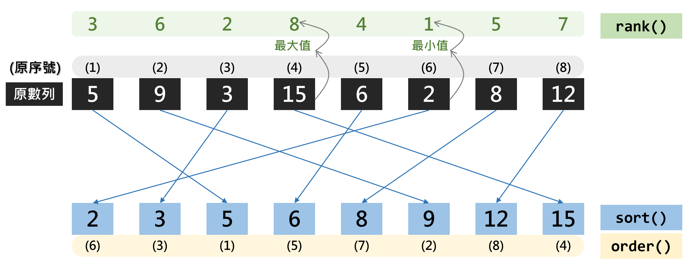
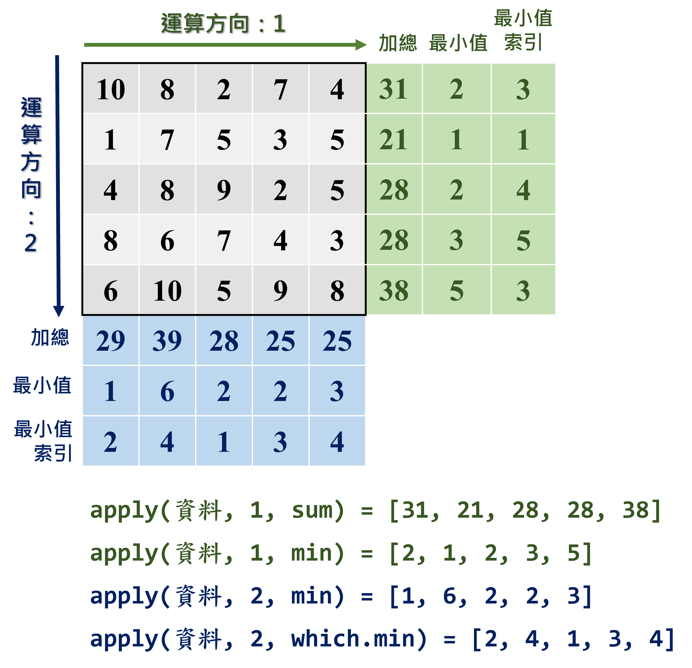

```{r setup1, include=FALSE}
knitr::opts_chunk$set(echo = TRUE)
library(dplyr)
library(data.table)
library(sf)
library(ggplot2)
library(ggsflabel)
library(ggspatial)
library(knitr)
library(kableExtra)
library(TDX)
library(DT)

Sys.setlocale(category = "LC_ALL", locale = "zh_TW.UTF-8")

windowsFonts(A=windowsFont("微軟正黑體"))

client_id=read.csv("./key.txt", header=F)[1,2]
client_secret=read.csv("./key.txt", header=F)[2,2]
access_token=get_token(client_id, client_secret)
```

# **R 語言基礎語法**
本章節系統性介紹 R 語言的重要語法和`dplyr`套件的功能及用法，請務必熟悉各函式，以便後續程式碼撰寫。  

## 物件（Object）
物件是 R 語言中構成資料的基本要素，常見者包含五大類：  

1.  向量（vector）  
2.  因子（factor）  
3.  矩陣（matrix）   
4.  資料框（data frame）  
5.  陣列（list）  

以下小節針對各基本要素的構建與運算詳細說明。

### 向量（Vector）
<p style="color:#003D79;font-size:18px;line-height:2">**⌾ 向量的性質**</p>  

* 一組值  
* 一維  
* 資料型態可為：數值、文字、邏輯值  

<p style="color:#003D79;font-size:18px;line-height:2">**⌾ 建立向量**</p>  

建立向量可利用`c()`函式建構。  

<p style="font-size:18px;line-height:1">**<u>數值向量</u>**</p>  
```{r vector1, echo=T, eval=F}
vec1=c(1,2,3,4,5)
```

```{r vector1-show, echo=F, eval=T}
vec1=c(1,2,3,4,5)
vec1
```

<p style="font-size:18px;line-height:1">**<u>文字向量</u>**</p>  
```{r vector2, echo=T, eval=F}
vec2=c("A","B","C","D","E")
```

```{r vector2-show, echo=F, eval=T}
vec2=c("A","B","C","D","E")
vec2
```

<p style="font-size:18px;line-height:1">**<u>邏輯向量</u>**</p>  
```{r vector3, echo=T, eval=F}
vec3=c(T,F,T,F,T)

#---或寫完整的邏輯值---#
# vec3=c(TRUE,FALSE,TRUE,FALSE,TRUE)
```

```{r vector3-show, echo=F, eval=T}
vec3=c(T,F,T,F,T)
vec3
```

<p style="color:#003D79;font-size:18px;line-height:2">**⌾ 擷取向量中特定元素**</p>  

<p style="font-size:18px;line-height:1">**<u>擷取單一元素</u>**</p>  
```{r vector-retrieve1, echo=T, eval=T}
vec2[3]
```

<p style="font-size:18px;line-height:1">**<u>擷取多個連續元素</u>**</p>  
```{r vector-retrieve2, echo=T, eval=T}
vec2[2:4]
```

<p style="font-size:18px;line-height:1">**<u>擷取多個非連續元素</u>**</p>  
```{r vector-retrieve3, echo=T, eval=T}
vec2[c(1,3,5)]
```

<p style="font-size:18px;line-height:1">**<u>以邏輯值擷取元素</u>**</p>  
請注意輸入的邏輯值向量長度必須與原向量相同！
```{r vector-retrieve4, echo=T, eval=T}
vec2[c(T,T,F,F,T)]
```


<p style="color:#003D79;font-size:18px;line-height:2">**⌾ 連續數值資料**</p> 
利用`seq()`函式建立連續數值，程式碼撰寫如下：
```{r vector-continuous0, echo=T, eval=F}
seq(from=開始數值, to=結束數值, by=遞增數值)
```

```{r vector-continuous1, echo=T, eval=T}
seq(from=2, to=20, by=2)
```

<p style="color:#003D79;font-size:18px;line-height:2">**⌾ 向量運算**</p>  

<p style="font-size:18px;line-height:1">**<u>統計運算</u>**</p>  

以下建立一個向量`vec4`作為範例，所有運算的程式碼與結果請參照表\@ref(tab:vector-operation-table)。
```{r vector-exg1, echo=T, eval=T}
vec4=c(5,9,3,15,6,2,8,12)
```


```{r vector-operation-table, echo=F, eval=T}
vector_operation=data.frame(ope_name=c("最大值","最小值","最大值索引","最小值索引","全域","總和","平均","中位數","乘積","變異數","標準差"), operation=c("`max(vec4)`","`min(vec4)`","`which.max(vec4)`","`which.min(vec4)`","`range(vec4)`","`sum(vec4)`","`mean(vec4)`","`median(vec4)`","`prod(vec4)`","`var(vec4)`","`sd(vec4)`"),
                         result=c(paste0("`", max(vec4), "`"), paste0("`", min(vec4), "`"), paste0("`", which.max(vec4), "`"), paste0("`", which.min(vec4), "`"), paste0("`", paste(range(vec4), collapse="  "), "`"), paste0("`", sum(vec4), "`"), paste0("`", mean(vec4), "`"), paste0("`", median(vec4), "`"), paste0("`", prod(vec4), "`"), paste0("`", round(var(vec4), 3), "`"), paste0("`", round(sd(vec4), 3), "`")))

colnames(vector_operation)=c("運算","程式碼","輸出結果")
kable(vector_operation, booktabs=T, caption="向量運算")%>%
  kable_styling(bootstrap_options=c("striped", "hover"), font_size=14)%>%
  column_spec(1, bold=T)%>%
  row_spec(0, bold=T, color="white", background="#8E8E8E")
```

<p style="font-size:18px;line-height:1">**<u>數學運算</u>**</p>  

以下利用`vec4`與新建向量`vec5`作為範例，所有運算的程式碼與結果請參照表\@ref(tab:vector-calculation-table)。。
```{r vector-exg2, echo=T, eval=T}
vec5=c(0.57,4.28,-1.23,6.58,-4.67,2.09)
```

```{r vector-calculation-table, echo=F, eval=T}
vector_calculation=data.frame(ope_name=c("絕對值","根號","四捨五入","取整函數","下取整函數","對數","指數","標準化","累積加總"), operation=c("`abs(vec5)`","`sqrt(vec4)`","`round(vec5, digits=1)`","`ceiling(vec5)`","`floor(vec5)`","`log(vec4)`","`exp(vec4)`","`scale(vec4)`","`cumsum(vec4)`"),
                         result=c(paste0("`", paste(abs(vec5), collapse=" "), "`"), paste0("`", paste(round(sqrt(vec4), 3), collapse=" "), "`"), paste0("`", paste(round(vec5, digits=1), collapse="  "), "`"), paste0("`", paste(ceiling(vec5), collapse=" "), "`"), paste0("`", paste(floor(vec5), collapse=" "), "`"), paste0("`", paste(round(log(vec4), 3), collapse=" "), "`"), paste0("`", paste(round(exp(vec4), 1), collapse=" "), "`"), paste0("`", paste(round(scale(vec4), 3), collapse=" "), "`"), paste0("`", paste(cumsum(vec4), collapse=" "), "`")))

colnames(vector_calculation)=c("運算","程式碼","輸出結果")
kable(vector_calculation, booktabs=T, caption="數學運算")%>%
  kable_styling(bootstrap_options=c("striped", "hover"), font_size=14)%>%
  column_spec(1, bold=T)%>%
  row_spec(0, bold=T, color="white", background="#8E8E8E")
```


<p style="color:#003D79;font-size:18px;line-height:2">**⌾ 向量長度**</p>  
計算向量中的元素個數。
```{r vector-length, echo=T, eval=T}
length(vec4)
```

<p style="color:#003D79;font-size:18px;line-height:2">**⌾ 向量統計**</p>  
統計向量中各元素的個數。
```{r vector-table, echo=T, eval=T}
vec_tab=c("A","C","B","D","E","C","E","B","A","E","E","B")
table(vec_tab)
```

<p style="color:#003D79;font-size:18px;line-height:2">**⌾ 向量排序**</p>  

* `sort()`函式直接將向量予以由小至大之排序  
* `order()`函式回傳向量由小至大排序所對應的原向量序號  
* `rank()`函式回傳向量中各元素由小至大之順序  

程式碼撰寫如下，請參照圖\@ref(fig:vector-sort-order-rank-fig)之示意圖。

```{r vector-sort-order-rank-fig, echo=F, eval=T, out.width="90%", fig.align="center", fig.cap="排序函式示意圖"}

```

```{r vector-sort-order-rank, echo=T, eval=T}
sort(vec4)
order(vec4)
rank(vec4)
```
 
由`sort()`的結果可知，其將`vec4`向量由小至大排序。`order()`則是回傳排序所對應至原向量的序號，例如回傳結果的最後一個值是`4`，表示該向量中最大的數值位於向量的第 4 個元素。根據上述，我們亦可透過如下程式碼達到與`sort()`相同的結果。

```{r vector-sort-order-eg, echo=T, eval=T}
vec4[order(vec4)]
```


<p style="color:#003D79;font-size:18px;line-height:2">**⌾ 向量唯一值**</p>  
去除重複的值。
```{r vector-unique, echo=T, eval=T}
vec_dup=c(1,9,5,2,6,1,8,5,2)
unique(vec_dup)
```


<p style="color:#003D79;font-size:18px;line-height:2">**⌾ 檢查使否存在 NA**</p>  
```{r vector-na, echo=T, eval=T}
vec_na=c(1,9,5,NA,6,NA)
is.na(vec_na)
```


<p style="color:#003D79;font-size:18px;line-height:2">**⌾ 向量四則運算**</p>  

以下範例使用`vec4`與新建立的`vec6`示範向量的四則運算。

```{r vector-vec5, echo=T, eval=T}
vec6=c(2,5,8,11,7,4,10,3)
```


<p style="font-size:18px;line-height:1">**<u>兩向量運算</u>**</p>  
兩向量運算時，兩組向量的長度（`length()`）務必相同！  
所有運算結果如表\@ref(tab:vector-arithmetic-table)。

```{r vector-arithmetic-table, echo=F, eval=T}
vector_arithmetic=data.frame(ope_name=c("","加法","減法","乘法","除法","取餘數","取除數","內積"), operation=c("", "`vec4+vec6`","`vec4-vec6`","`vec4*vec6`","`vec4/vec6`","`vec4 %% vec6`","`vec4 %/% vec6`","`vec4 %*% vec6`"), result=c("", paste0("`", paste(vec4+vec6, collapse=" "), "`"), paste0("`", paste(vec4-vec6, collapse=" "), "`"), paste0("`", paste(vec4*vec6, collapse=" "), "`"), paste0("`", paste(round(vec4/vec6, 3), collapse=" "), "`"), paste0("`", paste(vec4 %% vec6, collapse=" "), "`"), paste0("`", paste(vec4 %/% vec6, collapse=" "), "`"), paste0("`", paste(vec4 %*% vec6, collapse=" "), "`")))
vector_arithmetic$result[1]="**`vec4=c(5,9,3,15,6,2,8,12)`\\\n`vec6=c(2,5,8,11,7,4,10,3)`**"

colnames(vector_arithmetic)=c("運算","程式碼","輸出結果")
kable(vector_arithmetic, booktabs=T, caption="向量運算")%>%
  kable_styling(bootstrap_options=c("striped", "hover"), font_size=14)%>%
  column_spec(1, bold=T)%>%
  row_spec(0, bold=T, color="white", background="#8E8E8E")
```


<p style="font-size:18px;line-height:1">**<u>向量與元素運算</u>**</p>  
一組向量與一個元素之間的運算，即是將向量中的每一個元素分別與該元素運算。  

```{r vector-addition2, echo=T, eval=T}
vec6+5
vec6*5
```


<p style="color:#003D79;font-size:18px;line-height:2">**⌾ 轉換資料型態**</p>  

<p style="font-size:18px;line-height:1">**<u>文字轉換為數值</u>**</p>  
建立`vec_cha`文字資料

```{r vector-convert1, echo=T, eval=T}
vec_cha=c("1","2","3","4","5")
```

先利用`class()`函式檢查`vec_cha`資料型態
```{r vector-convert2, echo=T, eval=T}
class(vec_cha)
```

利用`as.numeric()`函式轉化為數值資料
```{r vector-convert3, echo=T, eval=T}
as.numeric(vec_cha)
```

<p style="font-size:18px;line-height:1">**<u>數值轉換為文字</u>**</p>  
另外，可利用`as.character()`函式轉化為文字資料
```{r vector-convert4, echo=T, eval=T}
vec_num=c(1,2,3,4,5)
as.character(vec_num)
```


<p style="color:#003D79;font-size:18px;line-height:2">**⌾ 建立重複資料**</p> 
利用`rep()`函式建立重複資料，該函式主要有兩大參數可以設定：  

* `each=`是設定每一個元素重複的次數
* `times=`是設定該向量整體循環的次數

以實際範例說明之，程式碼撰寫如下：
```{r vector-repeat, echo=T, eval=T}
vec6=c(2,5,8,11,7,4,10,3)

# 設定每一個元素重複的次數
rep(vec6, each=2)

# 設定向量整體重複的次數
rep(vec6, times=2)
```


<p style="color:#003D79;font-size:18px;line-height:2">**⌾ 回傳向量中 TRUE 索引值**</p>   
`which()`函式可用以回傳向量中 TRUE 的索引值。

<p style="font-size:18px;line-height:1">**<u>TRUE 索引值</u>**</p>  
```{r vector-which1, echo=T, eval=T}
vec3=c(T,F,T,F,T)
which(vec3)
```

由上述範例可知，TRUE 位於`vec3`向量的第 1、3、5 個元素。


<p style="font-size:18px;line-height:1">**<u>回傳符合條件索引值</u>**</p>  
除了上述基本案例外，通常我們會藉由運算子（`==`, `>`, `<`, ...）以尋找符合條件的元素，並進一步透過`which()`函式回傳結果為 TRUE 的索引值。範例如下。

```{r vector-which2, echo=T, eval=T}
vec6=c(2,5,8,11,7,4,10,3)

# vec6大於5的邏輯判斷
vec6>5

# 回傳vec6大於5的索引值
which(vec6>5)
```


### 因子（Factor）
<p style="color:#003D79;font-size:18px;line-height:2">**⌾ 因子的性質**</p>  

* 由文字向量建立  
* 須設定文字層級  
* 設立因子的延伸應用：  
  * 在`ggplot2`套件中調整圖例順序  
  * 在計量模型中建立啞變量（dummy variables）  


<p style="color:#003D79;font-size:18px;line-height:2">**⌾ 建立因子**</p>   
因子的建立可以使用`factor()`函式，其中必須透過`levels=`參數設定層級，程式碼建構如下：  

```{r factor1, echo=T, eval=F}
factor(文字向量, levels=期望的層級向量)
```

以下列簡單範例說明因子的功能，建立`school`之文字向量。

```{r factor2, echo=T, eval=T}
school=c("大學","幼稚園","國小","高中","國中")
```

若欲將`school`轉換為具有層級意義的因子，並依據學校層級排序，則程式碼撰寫如下：

```{r factor3, echo=T, eval=T}
school_fc=factor(school, levels=c("幼稚園","國小","國中","高中","大學"))
school_fc
```

由上述可發現，有別於文字向量，因子會另出現「Levels:」的訊息，表示文字具有層級意義。  
最後可利用`is.factor()`函式判斷一變數是否為因子，抑或利用`class()`函式逕查詢該變數的資料型態。  

```{r factor5, echo=T, eval=T}
is.factor(school_fc)
class(school_fc)
```

上述所建立的因子具有層級意義，故可以排序，可進一步利用`sort()`函式排序，程式碼如下：

```{r factor-sort, echo=T, eval=T}
sort(school_fc)
```

<p style="color:#003D79;font-size:18px;line-height:2">**⌾ 建立有序因子**</p>   
上述所建立的因子具有層級意義，可以排序，然而各元素間不具有大小意義，無法直接比較大小值。以`school_fc`為例，我們所設定的「大學」層級高於「幼稚園」，然而這不意謂著`大學>幼稚園`。因此若直接拿兩元素相比較大小，程式會出現警告（大小關係對因子無意義），且回傳`NA`，試驗如下：

```{r factor-error, echo=T, eval=T}
school_fc[1]>school_fc[2]
```

若欲建立具大小關係的因子，則需在`factor()`函式中設定`order=T`參數，以表達具有順序意義。

```{r factor-order1, echo=T, eval=T}
school_order=factor(school, levels=c("幼稚園","國小","國中","高中","大學"), order=T)
school_order
```

由輸出結果可發現，層級中具有「<」符號，用以表達有序之大小關係。

```{r factor-order2, echo=T, eval=T}
# 比較幼稚園與大學的大小關係
school_order[1]>school_order[2]
```

<p style="color:#003D79;font-size:18px;line-height:2">**⌾ 轉換資料型態**</p>   
可透過`as.character()`將因子轉換為單純的文字向量，亦可藉由`as.numeric()`將因子轉換為數值，而該數值乃依據層級的大小給定，層級越高（後）者，數值愈大。以上述`school_fc`為案例說明。

```{r factor-char-num, echo=T, eval=T}
# 轉換為文字向量
as.character(school_fc)

# 轉換為數值向量
as.numeric(school_fc)
```


### 矩陣（Matrix）
<p style="color:#003D79;font-size:18px;line-height:2">**⌾ 矩陣的性質**</p>  

* 二維  
* 含括多個橫列（rows）與直行（columns）  
* 可以組合相同資料型態的向量 (文字向量、數值向量、邏輯向量)  

<p style="color:#003D79;font-size:18px;line-height:2">**⌾ 建立矩陣**</p>  
利用`matrix()`函式建立矩陣，其中必須設定兩參數：  
 
* `nrow=` 設定矩陣的橫列數  
* `ncol=` 設定矩陣的直行數  

```{r matrix-function, echo=T, eval=F}
matrix(向量, nrow=, ncol=)
```

範例如下：
```{r matrix1, echo=T, eval=T}
mat1=matrix(c(1:15), nrow=3, ncol=5)
mat1
```

由回傳結果可發現，該矩陣是先由上至下，再由左至右填入向量。若希望矩陣的填法是先由左至右，再由上至下，則須設定參數`byrow=T`，程式碼撰寫如下。


```{r matrix2, echo=T, eval=T}
mat2=matrix(c(1:15), nrow=3, ncol=5, byrow=T)
mat2
```

<p style="color:#003D79;font-size:18px;line-height:2">**⌾ 查看矩陣的維度**</p>  
矩陣是二維的資料，若要進一步該二維資料中的橫列與直行個數，可利用`nrow()`與`ncol()`函式分別查看，或逕利用`dim()`函式查看之。

```{r matrix3, echo=T, eval=T}
nrow(mat2)
ncol(mat2)
dim(mat2)
```

<p style="color:#003D79;font-size:18px;line-height:2">**⌾ 回傳矩陣的特定元素**</p>  
利用中括號`[ , ]`可回傳特定元素的值，其中逗點前必須放置橫列的索引值，而逗點後則是直行的索引值。  
以第 2 橫列第 4 行為例，程式碼撰寫如下。  

```{r matrix4, echo=T, eval=T}
mat2[2, 4]
```

<p style="color:#003D79;font-size:18px;line-height:2">**⌾ 轉置矩陣**</p>  
藉由`t()`函式將矩陣予以轉置（transpose）。

```{r matrix5, echo=T, eval=T}
t(mat2)
```

<p style="color:#003D79;font-size:18px;line-height:2">**⌾ 矩陣運算**</p>  
矩陣的運算是 R 語言的利器，執行效率相當高，在許多統計模型背後的運算亦是牽涉複雜的矩陣運算。以下簡單介紹重要的運算函式。

<p style="font-size:18px;line-height:1">**<u>橫列與直行運算</u>**</p>  
橫列與直行的加總與平均值計算彙整如表\@ref(tab:matrix-operation-table)。

```{r matrix-operation-table, echo=F, eval=T}
matrix_operation=data.frame(TYPE=rep(c("橫列","直行"), each=2), sum=c("`rowSums(mat2)`", paste0("`", paste(rowSums(mat2), collapse=" "), "`"), "`colSums(mat2)`", paste0("`", paste(colSums(mat2), collapse=" "), "`")), ave=c("`rowMeans(mat2)`", paste0("`", paste(rowMeans(mat2), collapse=" "), "`"), "`colMeans(mat2)`", paste0("`", paste(colMeans(mat2), collapse=" "), "`")))

colnames(matrix_operation)=c("","加總","平均")
kable(matrix_operation, booktabs=T, caption="矩陣運算")%>%
  kable_styling(bootstrap_options=c("striped", "hover"), font_size=14)%>%
  column_spec(1, bold=T)%>%
  collapse_rows(c(1))%>%
  row_spec(0, bold=T, color="white", background="#8E8E8E")
```


<p style="font-size:18px;line-height:1">**<u>`apply()`函式應用</u>**</p>  
試想若沒有\@ref(tab:matrix-operation-table)中的各個函式用以處理矩陣資料，我們可以透過`for()`迴圈逐行或逐列針對矩陣運算，以橫列加總（rowSums）為例，程式碼撰寫如下。

```{r matrix-for-loop, echo=T, eval=T}
for(i in c(1:nrow(mat2))){
  cat(sum(mat2[i,]), " ")
}
```

然而如是的寫法效率極差，在 R 語言中類似 `for()` 迴圈的程序可以考慮更高效率的`apply()`函式取代之，程式語法如下：

```{r apply-fun, echo=T, eval=F}
apply(矩陣資料, 方向, 運算函式)
```

其中`方向`有兩種選擇：`1`表示逐列（row）運算；`2`表示逐行（column）運算。運算函式可為前述向量運算的任一函式。`apply()`函式的運算概念如圖\@ref(fig:apply-fig)之示意圖。

```{r apply-fig, echo=F, eval=T, out.width="80%", fig.align="center", fig.cap="排序函式示意圖"}

```

再次以`mat2`矩陣為範例，程式碼撰寫如下。

```{r matrix-apply-eg, echo=T, eval=T}
# 逐列加總 (=rowSums)
apply(mat2, 1, sum)

# 逐行平均 (=colMeans)
apply(mat2, 2, mean)

# 逐列尋找最大值索引值
apply(mat2, 1, which.max)

# 逐行計算標準差
apply(mat2, 1, sd)
```


### 資料框（Data Frame）


## `dplyr`資料處理


