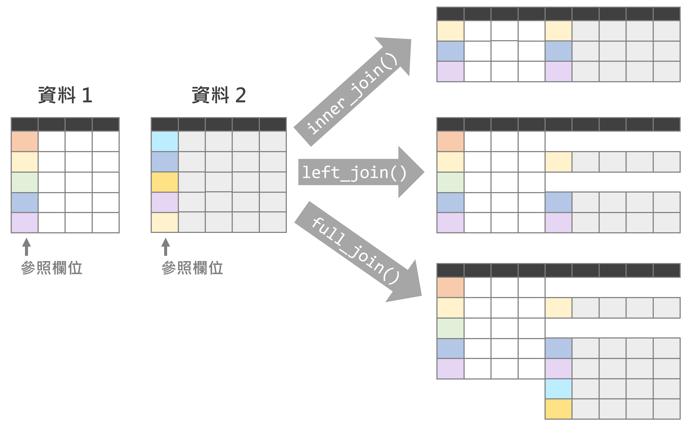

```{r setup1, include=FALSE}
knitr::opts_chunk$set(echo = TRUE)
library(dplyr)
library(data.table)
library(sf)
library(ggplot2)
library(ggsflabel)
library(ggspatial)
library(knitr)
library(kableExtra)
library(TDX)
library(DT)
library(stringr)
library(jsonlite)
library(xml2)

Sys.setlocale(category = "LC_ALL", locale = "zh_TW.UTF-8")

windowsFonts(A=windowsFont("微軟正黑體"))
```

# **資料清洗與處理**
資料清洗與處理是分析前的第一步，透過此一步驟可初步觀察資料的趨勢，並以圖表呈現敘述統計結果。此外，在經過完善的資料整理後，尚能進一步建構統計模型或數據分析工具以瞭解資料背後所衍伸之意涵。`dplyr`與`data.table`套件是 R 語言中兩大最常見的資料處理工具，請務必安裝並導入該套件。

資料清洗與處理常用之套件與函式彙整如表\@ref(tab:function-data-clean)。  

```{r function-data-clean, echo=F, eval=T}
fuc=data.frame(Package=c("`base`", rep("`dplyr`", 22), rep("`data.table`", 5)), Functions=c("[`merge()`](#連接資料)","[`bind_rows()`](#合併資料)","[`bind_cols()`](#合併資料)","[`select()`](#選取資料欄位)","[`filter()`](#依條件篩選資料)","[`mutate()`](#新增資料屬性)","[`group_by()`](#資料分群與統計)","[`summarise()`](#資料分群與統計)","[`reframe()`](#資料分群與統計)","[`slice()`](#資料分群與統計)","[`left_join()`](#連接資料)","[`inner_join()`](#連接資料)","[`full_join()`](#連接資料)","[`arrange()`](#資料排序)","`rename()`","`distinct()`","`intersect()`","`union()`","`union_all()`","`setdiff()`","`symdiff()`","`setequal()`","[`case_when()`](#條件判斷)","[`setDT()`](#data.frame-與-data.table)","[`setkey()`](#data.frame-與-data.table)","[`merge.data.table()`](##連接資料)","`dcast()`","`melt()`"), Usage=c("根據指定欄位連接兩資料", "合併橫列", "合併直行", "選取特定欄位", "根據條件篩選資料", "新增資料屬性（直行）",  "將資料依據特定欄位分群`", "將分群的資料予以計算", "將分群的資料予以計算", "依據分群擷取特定資料", "根據指定欄位連接兩資料（僅保留左側資料）", "根據指定欄位連接兩資料（擁有的資料皆須保留）", "根據指定欄位連接兩資料（僅保留共同擁有的資料）", "根據指定欄位將資料排序", "更改欄位名稱", "去除重複資料", "尋找兩資料中共同擁有的資料列（交集）", "保留所有擁有的資料列（聯集，去除重複者）", "保留所有擁有的資料列（聯集，保留重複者）", "尋找唯獨左側資料擁有的資料列（差集）", "尋找唯獨其中一份資料擁有的資料列（互斥）", "檢查兩資料是否完全相同（無論排序）", "條件判斷", "將資料轉換為`data.table`形式", "設定`data.table`資料的主鍵", "連接資料", "轉換長資料為寬資料", "轉換寬資料為長資料"))

colnames(fuc)=c("套件","函式","功能")

kbl(fuc, booktabs=T, escape=F, caption="資料處理重要函式")%>%
  kable_styling(bootstrap_options=c("striped", "hover"), font_size=14)%>%
  collapse_rows(1)%>%
  row_spec(0, bold=T, color="white", background="#8E8E8E")
```


為展示「資料清洗與處理」過程，後續範例中我們會使用的資料如下，請先讀取之。

```{r read-data-world, echo=T, eval=T}
# 世界國家資料
world=read.csv("https://raw.githubusercontent.com/ChiaJung-Yeh/Transport-Analysis/master/Data/world.csv")
```

```{r read-data-world-show, echo=F, eval=T, message=F, warning=F}
datatable(world, options=list(pageLength=5, scrollX=T, headerCallback = DT::JS(
    "function(thead) {",
    "  $(thead).css('font-size', '0.7em');",
    "}"
  )))%>%
  formatStyle(columns=c(1:ncol(world)), fontSize='12px')%>%
  formatRound(c("area_km2", "lifeExp","gdpPercap"), digits=2)
```

```{r read-data-coffee, echo=T, eval=T}
# 咖啡產量資料
coffee=read.csv("https://raw.githubusercontent.com/ChiaJung-Yeh/Transport-Analysis/master/Data/coffee.csv")
```

```{r read-data-coffee-show, echo=F, eval=T, message=F, warning=F}
datatable(coffee, options=list(pageLength=5, scrollX=T, headerCallback = DT::JS(
    "function(thead) {",
    "  $(thead).css('font-size', '0.7em');",
    "}"
  )))%>%
  formatStyle(columns=c(1:ncol(coffee)), fontSize='12px')
```

世界國家資料（`world`）中詳記各國資訊，包括人口數（pop）、面積（area_km2）、lifeExp（壽命）、gdpPerCap（人均 GDP）等；咖啡（`coffee`）資料中詳記世界各國 2016 與 2017 年的咖啡產量。

## data.frame 與 data.table
`dplyr`與`data.table`套件所提供的各函式大多功能皆相同，惟使用`data.table`套件的函式時，必須將資料型別新增 data.table 之格式，尚能正確分析。此外，`data.table`套件的執行效率通常較高，在大數據處理上極具優勢（依據實務經驗而論，若處理的資料筆數上達千萬筆，建議使用`data.table`套件），而若數據量較小時兩者的速度不相上下。關於兩資料分析套件的速度比較請參考以下文章：

* [Comparing Efficiency and Speed of `data.table`](https://tysonbarrett.com/jekyll/update/2019/10/06/datatable_memory/)  
* [data.table speed with dplyr syntax](https://towardsdatascience.com/data-table-speed-with-dplyr-syntax-yes-we-can-51ef9aaed585)  


<p style="color:#003D79;font-size:18px;line-height:2">**⌾ 新增 data.table 資料格式**</p>  

若欲針對原 data.frame 新增 data.table 之資料格式，可利用`setDT()`函式新增之，以`world`資料為例，程式碼撰寫如下。

```{r read-data-world-dt, echo=T, eval=T}
# 使用read.csv()讀取資料 -> data.frame()
world_DT=read.csv("https://raw.githubusercontent.com/ChiaJung-Yeh/Transport-Analysis/master/Data/world.csv")

# 查看資料型態
class(world_DT)

# setDT()函式新增data.table格式
setDT(world_DT)

# 再次查看資料型態
class(world_DT)
```


由最後輸出結果可知，`world_DT`資料經過`setDT()`函式設定後即新增 data.table 格式，同時亦會保留 data.frame 格式。

<p style="color:#003D79;font-size:18px;line-height:2">**⌾ 新增主鍵**</p>  

主鍵是資料中用以標示「關鍵的」屬性欄位，「關鍵」意謂該欄位具有唯一性，可以用其檢索整份資料，不會重複匹配至多比不同的資料。舉例而言，在考生成績的資料中，我們會利用學生的學號、姓名等作為主鍵，因為其具有代表性，可以表示特定資料；然而，我們不會利用學生的分數作為主鍵，因為分數值很可能是重複的，無法表示特定一筆資料。

根據上述，在 data.table 的資料格式中，主鍵是相當關鍵的要素，亦為使`data.table`套件效率甚高的其一原因。以`world_DT`資料為例，將「name_long」（國家名稱）設定為主鍵，函式撰寫如下。

```{r data-world-dt-key, echo=T, eval=T}
# 建立主鍵
setDT(world_DT, name_long)
```


## 合併資料
在第一章節中，我們曾提及資料框的[行列合併](#資料框data-frame)，包含`rbind()`與`cbind()`兩函式，而`dplyr`套件所提供的`bind_rows()`與`bind_cols()`其目的相同，前者用以合併橫列；後者用以合併直行。其中`bind_cols()`與`cbind()`兩者功能完全相同。惟`rbind()`函式的使用前提是，輸入的兩資料必須擁有完全相同的欄位，一旦其中一個欄位不符合即無法合併資料。`bind_rows()`函式則可較彈性合併資料，針對共同擁有的欄位予以合併，其他則忽略之。具體範例如下。

```{r rbind-bindrow1, echo=T, eval=T, error=T}
# 建立兩資料
score_data1=data.frame(Student=c("Robert", "Jessie", "Rose", "John"),
                       Class=c("A", "B", "D", "C"),
                       Score=c("80", "95", "70", "65"))

score_data2=data.frame(Student=c("Penny", "Ruby", "Tom"),
                       Score=c("90", "70", "50"))

rbind(score_data1, score_data2)
```

由以上`rbind()`函式之範例可知，由於`score_data1`含有「Class」欄位，而`score_data2`並不包含，故無法成功合併兩資料。此時可嘗試利用`bind_rows()`函式，程式碼撰寫如下。

```{r rbind-bindrow2, echo=T, eval=T}
bind_rows(score_data1, score_data2)
```

輸出結果中，`score_data2`雖並無「Class」欄位，仍可將兩資料予以合併，並在缺失的資料中填補`NA`。


## 選取資料欄位
在第一章節中，我們曾提及資料框選取欄位的方法，而`dplyr`套建亦提供相同功能的`select()`函式，函式撰寫如下。

```{r select-code, echo=T, eval=F}
select(資料, 欄位名稱1, 欄位名稱2, ...)
```


<p style="color:#003D79;font-size:18px;line-height:2">**⌾ 選取欄位**</p>  
以選取`world`資料中的「name_long」和「area_km2」兩欄位為例，程式碼撰寫如下。

```{r select-eg1, echo=T, eval=T}
# 選取name_long與area_km2兩欄位
world_sel1=select(world, name_long, area_km2)

# 查看前六筆資料
head(world_sel1)
```


:::strong
<p style="color:#750000;">使用`data.table`套件選取欄位，程式碼撰寫如下。</p>  

```{r select-eg1-dt, echo=T, eval=F}
world_DT[, .(name_long, area_km2)]
```
:::


其他寫法包括（請回顧[選取欄位](#資料框data-frame)章節）：

```{r select-eg2, echo=T, eval=F}
# 給定欄位索引
world[, c(1,7)]

# 給定欄位名稱
world[, c("name_long", "area_km2")]

# 回傳單一欄位
world$name_long
world$area_km2
```

此外，亦可將欲返回的欄位儲存於一文字向量中，並透過`all_of()`函式回傳之，程式碼撰寫如下。

```{r select-eg3, echo=T, eval=T}
# 選取name_long與area_km2兩欄位
sel_col_name=c("name_long", "continent", "subregion")

# 使用all_of()函式
world_sel2=select(world, all_of(sel_col_name))

# 查看前六筆資料
head(world_sel2)
```

:::strong
<p style="color:#750000;">使用`data.table`套件選取欄位，程式碼撰寫如下。</p>  

```{r select-eg3-dt, echo=T, eval=F}
world_DT[, ..sel_col_name]
```
:::


<p style="color:#003D79;font-size:18px;line-height:2">**⌾ 刪除欄位**</p>  

若欲刪除特定欄位，可利用`-`在欄位名稱前即可刪除之。

```{r select-eg4, echo=T, eval=T}
# 刪除continent、region_un、subregion、type欄位
world_sel3=select(world, -continent, -region_un, -subregion, -type)

# 查看前六筆資料
head(world_sel3)
```


:::strong
<p style="color:#750000;">使用`data.table`套件刪除欄位，程式碼撰寫如下。</p>  

```{r select-eg4-dt, echo=T, eval=F}
del_col_name=c("continent","region_un","subregion","type")
world_DT[, !..del_col_name]
```
:::


## 依條件篩選資料
條件篩選資料可以利用`filter()`函式達成之，函式撰寫如下。

```{r filter-code, echo=T, eval=F}
filter(資料, 條件1, 條件2, ...)
```

以上`條件1`與`條件2`是用以篩選資料中符合條件者，最終所回傳的資料必然符合函式內**所有**的條件。

<p style="color:#003D79;font-size:18px;line-height:2">**⌾ 數值向量篩選**</p>  

以篩選`world`資料中，人口數（`pop`）超過 1 億人者。

```{r filter-eg1, echo=T, eval=T}
# 篩選人口數超過1億的資料
world_fil1=filter(world, pop>100000000)

# 查看前六筆資料
head(world_fil1)

# 查看查看符合條件的總資料筆數（亦即國家數）
nrow(world_fil1)
```

:::strong
<p style="color:#750000;">使用`data.table`套件篩選資料，程式碼撰寫如下。</p>  

```{r filter-eg1-dt, echo=T, eval=F}
world_DT[pop>100000000]
```
:::


<p style="color:#003D79;font-size:18px;line-height:2">**⌾ 文字向量篩選**</p>  
通常文字篩選時會利用`%in%`以查看一向量各元素是否存在於另一向量中，請參照[向量 Vector](#向量vector)小節中「⌾ 檢查元素是否包含於向量」。
  
以篩選`world`資料中，所在洲隸屬於亞洲（Asia）以及歐洲（Europe）者。

```{r filter-eg2, echo=T, eval=T}
# filter data by population
world_fil2=filter(world, continent %in% c("Asia", "Europe"))

# check out the first 6 rows
head(world_fil2)
```

:::strong
<p style="color:#750000;">使用`data.table`套件篩選資料，程式碼撰寫如下。</p>  

```{r filter-eg2-dt, echo=T, eval=F}
world_DT[continent %in% c("Asia", "Europe")]
```
:::


<p style="color:#003D79;font-size:18px;line-height:2">**⌾ 多重條件篩選（AND）**</p>  

在`filter()`函式中所設定的諸多條件皆須滿足尚會進一步保留資料。以`world`資料為例，篩選洲隸屬於亞洲以及歐洲，且人口數超過 1 億者。程式碼撰寫如下。

```{r filter-eg3, echo=T, eval=T}
# 依條件篩選資料
world_fil3=filter(world, continent %in% c("Asia", "Europe"), pop>100000000)

# 查看前六筆資料
head(world_fil3)

# 查看查看符合條件的總資料筆數（亦即國家數）
nrow(world_fil3)
```

除可以直接以「逗號」分隔各項條件外，亦可利用「`&`」串接所有條件，程式碼撰寫如下。

```{r filter-eg4, echo=T, eval=F}
# 利用&串接所有條件
world_fil4=filter(world, continent %in% c("Asia", "Europe") & pop>100000000)
```

:::strong
<p style="color:#750000;">使用`data.table`套件篩選資料，程式碼撰寫如下。</p>  

```{r filter-eg4-dt, echo=T, eval=F}
world_DT[continent %in% c("Asia", "Europe") & pop>100000000]
```
:::


<p style="color:#003D79;font-size:18px;line-height:2">**⌾ 多重條件（OR）**</p>  

`filter()`函式係需要所有條件皆滿足尚會回傳資料，然而有時我們希望其一條件成立即可，此時可以將各項條件以「`|`」分開，程式碼撰寫如下。

```{r filter-eg5, echo=T, eval=T}
# 滿足其一條建篩選資料
world_fil5=filter(world, continent %in% c("Asia", "Europe") | pop>100000000)

# 查看查看符合條件的總資料筆數（亦即國家數）
nrow(world_fil5)
```


:::strong
<p style="color:#750000;">使用`data.table`套件篩選資料，程式碼撰寫如下。</p>  

```{r filter-eg5-dt, echo=T, eval=F}
world_DT[continent %in% c("Asia", "Europe") | pop>100000000]
```
:::


## 新增資料屬性
前面所提及的[`cbind()`與`bind_cols()`函式](#合併資料)可以將欄位予以合併，藉此擴充資料屬性。此外，於第一章節中所提及的向量「`$`」亦可新增資料屬性。除以上寫法外，可利用`dplyr`套件中的`mutate()`函式擴增資料屬性，且操作更具有彈性。函式撰寫如下。

```{r mutate-code, echo=T, eval=F}
mutate(資料, 新變數1=..., 新變數2=..., ...)
```

<p style="color:#003D79;font-size:18px;line-height:2">**⌾ 新增資料屬性**</p>  
以`world`資料為例，新增「各國人口密度(pop_dens)」之欄位（人口密度即總人口數除以面積），並新增一欄位串接 continent 和 subregion（使用[`paste0()`](#連接字串)函式串接向量）。程式碼撰寫如下。

```{r mutate-eg1, echo=T, eval=T}
# 新增人口密度屬性
world_mut=mutate(world, pop_dens=pop/area_km2,
                 district=paste0(continent, " (", subregion, ")"))

# 查看前六筆資料
head(world_mut[, c("name_long", "area_km2", "pop", "pop_dens")])
```


:::strong
<p style="color:#750000;">使用`data.table`套件新增資料屬性，程式碼撰寫如下。</p>  

```{r mutate-eg2, echo=T, eval=F}
# 新增一個變數時
world_mut=world_DT[, pop_dens := pop/area_km2]

# 新增多個變數時
world_mut=world_DT[, c("pop_dens", "district") := .(pop/area_km2, paste0(continent, " (", subregion, ")"))]
```

由以上程式碼可知，透過`data.table`套件新增欄位時，須利用「`:=`」定義運算方式，並將新增的欄位名稱置於其左側，而運算過程則放置於右側。
:::

其他寫法如下（請回顧[擴增資料欄（新增屬性）](#資料框data-frame)小節）：

```{r mutate-eg3, echo=T, eval=F}
# 利用$直接新增欄位
world$pop_dens=world$pop/world$area_km2
world$district=paste0(world$continent, " (", world$subregion, ")")
```


## 條件判斷

<p style="color:#003D79;font-size:18px;line-height:2">**⌾ 使用`ifelse()`函式判斷**</p>  

於前一章中有提及「[邏輯判斷](#邏輯判斷)」的流程控制方法，其中`ifelse()`函式可大幅縮減程式碼。在此亦可透過`mutate()`函式搭配`ifelse()`函式建立邏輯判斷的結果。以`world`資料為例，新增一欄位判斷國家面積的大小，若國家面積大於整體資料中位數，標記為「L」；否則記錄為「S」。程式碼撰寫如下。

```{r ifelse-eg1, echo=T, eval=T}
# 先計算面積中位數
area_med=median(world$area_km2)

# 利用ifelse函式判斷類群
world_ifel=mutate(world, TYPE=ifelse(area_km2>=area_med, "L", "S"))

# 查看六筆資料
head(world_ifel[, c("name_long", "area_km2", "TYPE")])
```


<p style="color:#003D79;font-size:18px;line-height:2">**⌾ 使用`case_when()`函式判斷**</p>  

`ifelse()`函式較適合應用於單純的邏輯判斷，若涉及多項判斷式可能須建立巢狀迴圈，使程式碼變得甚為複雜。此時我們可應用`dplyr`套件中的`case_when()`函式，並同樣搭配[`mutate()`](#新增資料屬性)函式以新增欄位。`case_when()`函式撰寫架構如下：

```{r case-when-code, echo=T, eval=F}
case_when(欄位, 
          條件1 ~ 結果1, 
          條件2 ~ 結果2, 
          TRUE ~ 結果3,
          ...)
```

其中的「`TRUE`」意謂著若前面所有條件皆「不成立」時，則回傳`TRUE`賦予的結果。

再次以`world`資料為例，若欲將所有國家依據面積及人口數予以分類，並藉由中位數劃分數值高低，最後分為「面積大人口多（LALP）」、「面積大人口少（LASP）」、「面積小人口多（SALP）」與「面積小人口少（SASP）」四者。程式碼撰寫如下。

```{r case-when-eg1, echo=T, eval=T}
# 先計算面積與人口數中位數
area_med=median(world$area_km2)
pop_med=median(world$pop, na.rm=T) # 由於人口數中含有NA值，故設定na.rm=T以移除NA值後再計算

# 使用case_when()函式新增分類
world_casewhen=mutate(world, TYPE=case_when(
  area_km2>=area_med & pop>=pop_med ~ "LALP",
  area_km2>=area_med & pop<pop_med ~ "LASP",
  area_km2<area_med & pop>=pop_med ~ "SALP",
  TRUE ~ "SASP"
))

# 查看六筆資料
head(world_casewhen[, c("name_long", "area_km2", "pop", "TYPE")])
```


## 資料排序

<p style="color:#003D79;font-size:18px;line-height:2">**⌾ 資料排序（正序）**</p>  

在第一章節中我們提及許多排序的方法，包含[向量排序](#向量-vector)（`sort()`、`order()`、`rank()`）與[文字排序](#文字排序)（`str_sort()`、`str_order()`）。而在此我們可以進一步藉由`dplyr`套件中的`arrange()`函式排序資料，其函式撰寫架構如下。

```{r arrange-code, echo=T, eval=F}
arrange(資料, 待排序欄位)
```

以`world`資料為例，若欲將所有國家依人口數由少至多排列，程式碼撰寫如下。

```{r arrange-eg1, echo=T, eval=T}
world_arr1=arrange(world, pop)

# 查看前六筆資料
head(world_arr1[, c("name_long", "continent", "pop")])
```

:::strong
<p style="color:#750000;">使用`data.table`套件排序，函式撰寫架構如下。</p>  

```{r arrange-code-dt, echo=T, eval=F}
資料[order(待排序欄位)]
```

以`world`資料，依人口數由少至多排列為例，程式碼撰寫如下
```{r arrange-eg1-dt, echo=T, eval=F}
world_DT[order(pop)]
```
:::


<p style="color:#003D79;font-size:18px;line-height:2">**⌾ 資料排序（倒序）**</p>  

須注意的是`arrange()`函式預設為由小到大（正序）排列，故若欲「倒序」排列，可在`待排序欄位`引數前面加上「`-`」即可，抑或使用`desc(待排序欄位)`函式。以`world`資料依人口數由多至少排列為例，程式碼撰寫如下。

```{r arrange-eg2, echo=T, eval=T}
world_arr2=arrange(world, -pop)

# 或使用desc()函式倒序排列
world_arr2=arrange(world, desc(pop))

# 查看前六筆資料
head(world_arr2[, c("name_long", "continent", "pop")])
```

:::strong
<p style="color:#750000;">使用`data.table`套件倒序排列資料，程式碼撰寫如下。</p>  

```{r arrange-eg2-dt, echo=T, eval=F}
world_DT[order(-pop)]
```
:::


## 資料分群與統計

<p style="color:#003D79;font-size:18px;line-height:2">**⌾ 將資料依據特定欄位分群**</p>  

```{r groupby-code, echo=T, eval=F}
group_by(資料, 分群欄位)
```

利用`group_by()`函式分群後，資料並不會有任何變化，必須再搭配其他函式才能發揮分群的效果。


<p style="color:#003D79;font-size:18px;line-height:2">**⌾ 分群篩選資料（`filter()`）**</p>  

透過分群篩選資料，可篩選各群組符合條件者，函式撰寫架構如下。

```{r groupby-filter-code, echo=T, eval=F}
group_by(資料, 分群欄位)%>%
  filter(條件)
```

以`world`資料為例，先將資料依據洲（continent）分群，而後篩選出各洲資料中面積最大者，程式碼撰寫如下。

```{r groupby-filter-eg, echo=T, eval=T}
world_gro1=group_by(world, continent)%>%
  filter(area_km2==max(area_km2))

# 查看資料
world_gro1[, c("continent","name_long","area_km2")]
```


<p style="color:#003D79;font-size:18px;line-height:2">**⌾ 分群篩選資料（`slice()`）**</p>  

`slice()`函式用以回傳指定條件的索引值，故搭配`group_by()`時可以篩選各分群中的指定橫列位。函式撰寫架構如下。

```{r groupby-slice-code, echo=T, eval=F}
group_by(資料, 分群欄位)%>%
  slice(索引值)
```

舉例而言，若欲回傳`world`資料中各分群內的第一筆資料，程式碼撰寫如下。

```{r groupby-slice-eg1, echo=T, eval=T}
world_gro2=group_by(world, continent)%>%
  slice(1)

# 查看資料
world_gro2[, c("continent","name_long","area_km2","pop","lifeExp","gdpPercap")]
```

:::strong
<p style="color:#750000;">使用`data.table`套件分群統計，程式碼撰寫如下。</p>  

<p style="color:#4D0000;">**函式架構：**</p>  
```{r groupby-slice-code-dt, echo=T, eval=F}
資料[, .SD[索引值], by=分群欄位]
```

回傳`world`資料中各分群內的第一筆資料。
```{r groupby-slice-eg1-dt, echo=T, eval=F}
world_DT[, .SD[1], by=continent]
```
:::


此外，亦可擷取多個索引值的資料，舉例而言，若欲回傳`world`資料中各分群內的第一筆與最後一筆資料，程式碼撰寫如下。

```{r groupby-slice-eg2, echo=T, eval=T}
world_gro3=group_by(world, continent)%>%
  slice(1, n())

# 查看資料
world_gro3[, c("continent","name_long")]
```

:::strong
<p style="color:#750000;">使用`data.table`套件分群統計，程式碼撰寫如下。</p>  

回傳`world`資料中各分群（洲）內的第一筆與最後一筆資料。
```{r groupby-slice-eg2-dt, echo=T, eval=F}
world_DT[, .SD[c(1, .N)], by=continent]
```

上述程式碼中的`.N`意同`dplyr`套件中的`n()`。
:::


`group_by() %>% slice()`函式亦可與`arrange()`函式結合，以擷取排序後特定序位的資料。再以`world`資料為例，若欲擷取每個洲前三大面積的國家，可以先利用[`arrange()`](#資料排序)函式將所有資料依據面積（area_km2）排列，而後再透過`group_by() %>% slice()`函式擷取需要的索引值（即`1:3`）。程式碼撰寫如下。

```{r groupby-slice-eg3, echo=T, eval=T}
world_gro4=arrange(world, desc(area_km2))%>%
  group_by(continent)%>%
  slice(1:3)

# 查看資料
world_gro4[, c("continent","name_long","area_km2","pop","lifeExp","gdpPercap")]
```


:::strong
<p style="color:#750000;">使用`data.table`套件分群統計，程式碼撰寫如下。</p>  

回傳`world`資料中各分群（洲）面積前三大的資料。
```{r groupby-slice-eg3-dt, echo=T, eval=F}
world_DT[order(-area_km2)]%>%
  .[, .SD[c(1:3)], by=continent]
```

與`dplyr`套件的撰寫方式相同，若欲串接不同的函式，可透過 pipe (`%>%`) 連接。另外請注意此回傳結果會保留所有匹配與未匹配的資料，例如`world_DT`資料中 Antarctica 僅有一個區域，而由於我們尋找前六筆資料，此函式會回傳所有六筆結果，未匹配者則在其他筆資料中顯示`NA`。
:::


`group_by() %>% filter()`函式無法透過多個條件設定，回傳符合各個不同條件的資料。然而實務上有時候希望擷取滿足多個不同條件的資料，此時可以利用`group() %>% slice()`達成目的。

以`world`資料為例，先將資料依據洲（continent）分群，而後篩選出各洲資料中面積最大與最小者，程式碼撰寫如下。

```{r groupby-slice-eg4, echo=T, eval=T}
world_gro5=group_by(world, continent)%>%
  slice(which.max(area_km2),
        which.min(area_km2))

# 查看所有資料
world_gro5[, c("continent","name_long","area_km2")]
```

以上程式碼中`which.max()`函式用以尋找最大值的索引；`which.min()`則尋找最小值之索引。此時利用`group_by() %>% slice()`函式可同時回傳符合不同特定條件者。綜上所述，`group_by() %>% slice()`函式的使用上相當具彈性。

:::strong
<p style="color:#750000;">使用`data.table`套件分群統計，程式碼撰寫如下。</p>  

回傳`world`資料中各分群（洲）面積最大與最小的資料。
```{r groupby-slice-eg4-dt, echo=T, eval=F}
world_DT[, .SD[c(which.min(area_km2), which.max(area_km2))], by=continent]
```
:::


<p style="color:#003D79;font-size:18px;line-height:2">**⌾ 分群統計資料（`summarise()`）**</p>  

分群統計資料可針對各群組內的欄位做運算，如最大值、最小值、加總、平均...等，抑或使用自定義函式。分群統計資料的函式撰寫架構如下。

```{r groupby-summarise-code, echo=T, eval=F}
group_by(資料, 分群欄位)%>%
  summarise(運算函式)
```

以`world`資料為例，先將資料依據洲（continent）分群，而後統計各洲總人口數與國家數，程式碼撰寫如下。

```{r groupby-summarise-eg, echo=T, eval=T}
world_gro6=group_by(world, continent)%>%
  summarise(pop=sum(pop, na.rm=T),
            County_N=n())

# 輸出資料
world_gro6
```

請注意於本範例中由於總人口數（pop）欄位中含有部分 NA，故為避免計算結果有誤，須在`sum()`函式中設定`na.rm=T`引數。此外，由輸出結果可發現，有別於`group_by() %>% filter()`函式會回傳所有的資料欄位，`group_by() %>% summarise()`函式僅回傳指定的統計資料欄位。另外`n()`函式表示計算各分群內的總資料筆數。


:::strong
<p style="color:#750000;">使用`data.table`套件分群統計，程式碼撰寫如下。</p>  

<p style="color:#4D0000;">**函式架構：**</p>  
```{r groupby-summarise-code-dt, echo=T, eval=F}
資料[, .(運算函式), by=分群欄位]
```

回傳`world`資料中各分群（洲）總人口數與國家個數。
```{r groupby-summarise-eg-dt, echo=T, eval=F}
world_DT[, .(pop=sum(pop, na.rm=T), County_N=.N), by=continent]
```
:::


<p style="color:#003D79;font-size:18px;line-height:2">**⌾ 分群統計資料（`reframe()`）**</p>  

除了`group_by() %>% summarise()`以外，亦可使用`group_by() %>% reframe()`達到相同目的，且適用的彈性更大。如以上的範例，`group_by() %>% summarise()`回傳的是統計後的結果，通常`運算函式`僅回傳一個值，如`sum()`是針對所有群組內的特定變數做加總。然而有時候`運算函式`可能並非單純回傳一個值，例如`range()`函式回傳的是兩個值，包括最小值與最大值，此時使用`group_by() %>% summarise()`雖能得到結果，但會出現警告訊息，而使用`group_by() %>% reframe()`則可在無警告之下得到正確結果。`group_by() %>% reframe()`的函式撰寫架構如下，與`group_by() %>% summarise()`相同。

```{r groupby-reframe-code, echo=T, eval=F}
group_by(資料, 分群欄位)%>%
  reframe(運算函式)
```

再次以`world`資料為例，將資料依據洲（continent）分群，而後統計各洲人均 GDP（gdpPercap）的範圍，程式碼撰寫如下。

```{r groupby-reframe-eg, echo=T, eval=T, warning=F}
world_gro7=group_by(world, continent)%>%
  reframe(gdpPercap=range(gdpPercap, na.rm=T))

# 輸出資料
world_gro7
```

由以上程式碼可知各洲人均 GDP 的範圍。另須注意的是，由於「Antarctica」中所有國家並無人均 GDP 的資料，故回傳之上下界為 Inf 與 -Inf。

:::strong
<p style="color:#750000;">使用`data.table`套件分群統計，程式碼撰寫如下。</p>  

回傳`world`資料中各分群（洲）總人口數與國家個數。
```{r groupby-reframe-eg-dt, echo=T, eval=F}
world_DT[, .(pop=sum(pop, na.rm=T), County_N=.N), by=continent]
```
:::


## 連接資料
[`cbind`與`bind_cols()`](#合併資料)函式是將兩份相同橫列數的資料直接予以合併，以連結兩份資料。不過在資料分析時，我們往往會有許多來源與目的不同的資料，而若希望將其合併，則必須依據「參照欄位」貼附。具體而論，`world`資料中記錄世界各國的詳細資訊，而`coffee`資料中則記錄世界各國的咖啡產量，若我們想同時知道各國的面積與咖啡產量，勢必需要將這兩份資料合併在一起，而合併的原則須依據「國家名稱」以貼附資料。

在`dplyr`套件中可以利用`join`相關函式，包括<A href="#left-join">`left_join()`</A>、<A href="#full-join">`full_join()`</A>與<A href="#inner-join">`inner_join()`</A>。

`left_join()`是只保留**第一份（左側）**所有資料，並依據參照欄位貼附第二份（右側）資料；`full_join()`是指所有**兩份資料皆須保留**，並進一步依據參照欄位相互貼附；`inner_join()`則是指保留兩份資料**共同擁有**的參照欄位，並依此相互貼附。

在`base`套件中與在`data.table`套件中，無論是何種形式的連接資料方式，皆可分別利用`merge()`與`merge.data.table()`函式達成目的，其中可透過設定引數（`all=`與`all.x=`）之方式決定連接資料的方式。

關於連接資料的概念詳見圖\@ref(fig:join-fig)之示意圖，而以上三套件連接資料的函式彙整如表\@ref(tab:join-table)。

```{r join-fig, echo=F, eval=T, out.width="80%", fig.align="center", fig.cap="join 示意圖"}

```

```{r join-table, echo=F, eval=T, fig.cap="join 示意圖"}
join_table=data.frame(method=c("<A href='#left-join'>以第一份（左側）資料為基準</A>","<A href='#full-join'>保留資料1與資料2所有資料</A>","<A href='#inner-join'>保留共同擁有的參照欄位之資料</A>"),
                      func_dplyr=c("`left_join(資料1, 資料2)`","`full_join(資料1, 資料2)`","`inner_join(資料1, 資料2)`"),
                      func_base=c("`merge(資料1, 資料2, all.x=T)`","`merge(資料1, 資料2)`","`merge(資料1, 資料2, all=T)`"),
                      func_datatable=c("`merge.data.table(資料1, 資料2, all.x=T)`","`merge.data.table(資料1, 資料2)`","`merge.data.table(資料1, 資料2, all=T)`"))

kbl(join_table, booktabs=T, escape=F, caption="連接資料函式彙整", col.names=c("資料連接方式","`dplyr`套件","`base`套件","`data.table`套件"))%>%
  kable_styling(bootstrap_options=c("striped", "hover"), font_size=14)%>%
  row_spec(0, bold=T, color="black", background="#8E8E8E")%>%
  column_spec(1, bold=T, color="white", background="#8E8E8E")
```


<H2 id="left-join"><p style="color:#003D79;font-size:18px;line-height:2">**⌾ 以第一份（左側）資料為基準**</p></H2>  

`1eft_join()`的函式撰寫架構如下。

```{r leftjoin-code, echo=T, eval=F}
1eft_join(資料1, 資料2, by="參照欄位")
```

函式中的`by=`引數用以設定「參照欄位」，亦即若兩份資料的參照欄位內容是相同者，便將`資料2`的欄位貼附於`資料1`後。`1eft_join()`函式是保留`資料1`的所有資料，故若參照欄位的內容於`資料2`找不到相對應者，則該列貼附的結果會直接回傳「NA」。

另外需注意的是，`by=`引數可以不用設定，而此時該函式預設在兩份資料中尋找所有相同欄位名稱者作為參照欄位。而若兩份資料內欲參照的欄位名稱不相同時，引數設定須為`by=c(資料1參照欄位=資料2參照欄位)`。若有多個參照欄位，各欄位的名稱須以向量表達，如`by=c("參照欄位1", "參照欄位2")`。

以學生資料（`StuInfo`）與學生分數紀錄（StuScore）作為範例，程式碼撰寫如下。

```{r leftjoin-eg1, echo=T, eval=T}
# 建立學生資料與分數資料
StuInfo=data.frame(StudentID=c("ID1","ID2","ID3","ID4","ID5","ID6"),
                   Class=c("A","B","A","C","D","A"),
                   Name=c("Bob","Mary","Robert","Jason","Jane","Jessie"))
StuScore=data.frame(StudentID=c("ID1","ID2","ID4","ID5","ID6","ID7"),
                    Score=c(60,80,40,50,100,90))

# 連接兩份資料
left_join(StuInfo, StuScore, by="StudentID")
```

以上程式碼中`by="StudentID"`即為兩份資料的共同參照欄位，由於兩參照欄位正好名稱相同，故若未設定此一引數亦可。另外從回傳結果可發現，由於資料 1（`StuInfo`）中並無學生代碼「ID7」，故該欄位的資料 2（`StuScore`）屬性皆為`NA。`

:::strong
<p style="color:#750000;">使用`base`與`data.table`套件連接資料，程式碼撰寫如下。</p>  
在此二套件中，若連接方式為「以第一份（左側）資料為基準」，必須設定引數`all.x=T`。函式中的`by=`引數用以設定「參照欄位」，而若兩資料的參照欄位名稱不同時，需進一步設定`by.x=`與`by.y=`兩引數，分別為左側資料的參照欄位名稱與右側資料的欄位名稱。函式撰寫架構如下：

```{r merge-code-dt, echo=T, eval=F}
# 若兩資料的參照欄位名稱不同
merge(資料1, 資料2, all.x=T, by="參照欄位")
merge.data.table(資料1, 資料2, all.x=T, by="參照欄位")

# 若兩資料的參照欄位名稱不同
merge(資料1, 資料2, all.x=T, by.x="資料1參照欄位", by.y="資料2參照欄位")
merge.data.table(資料1, 資料2, all.x=T, by.x="資料1參照欄位", by.y="資料2參照欄位")

```

以連接`StuInfo`與`StuScore`兩資料為例，參照欄位為「StudentID」。
```{r merge-eg1-dt, echo=T, eval=F}
StuInfo_DT=data.table(StudentID=c("ID1","ID2","ID3","ID4","ID5","ID6"),
                      Class=c("A","B","A","C","D","A"),
                      Name=c("Bob","Mary","Robert","Jason","Jane","Jessie"))
StuScore_DT=data.table(StudentID=c("ID1","ID2","ID4","ID5","ID6","ID7"),
                       Score=c(60,80,40,50,100,90))

# base套件
merge(StuInfo, StuScore, all.x=T, by="StudentID")

# data.table套件
merge.data.table(StuInfo_DT, StuScore_DT, all.x=T, by="StudentID")
```
:::


利用前述`world`與`coffee`兩資料依據國家名稱相連接為例，在`world`資料中貼附各國咖啡的產量。程式碼撰寫如下。

```{r leftjoin-eg2, echo=T, eval=T}
left_join(world, coffee, by="name_long")
```

請注意由於此範例中，`world`資料內的國家名稱欄位與`coffee`資料內的國家名稱相同，皆為「name_long」，故若不設定`by=`引數，亦可得到相同結果。


<H2 id="full-join"><p style="color:#003D79;font-size:18px;line-height:2">**⌾ 保留資料1與資料2所有資料**</p></H2>  


<H2 id="inner-join"><p style="color:#003D79;font-size:18px;line-height:2">**⌾ 保留共同擁有的參照欄位之資料**</p></H2>  


## 去除重複資料


## 資料集合


## 資料型態轉換


