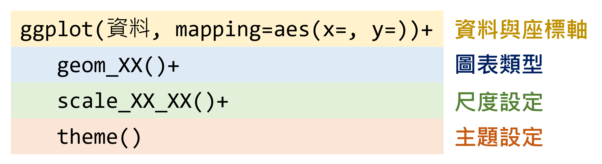

```{r setup1, include=FALSE}
knitr::opts_chunk$set(echo = TRUE)
library(dplyr)
library(data.table)
library(sf)
library(ggplot2)
library(ggsflabel)
library(ggspatial)
library(knitr)
library(kableExtra)
library(TDX)
library(DT)
library(stringr)
library(jsonlite)
library(xml2)
library(tidyr)
library(ggridges)
library(TWspdata)
library(treemapify)
library(ggsankey)
library(ggradar)

Sys.setlocale(category = "LC_ALL", locale = "zh_TW.UTF-8")
windowsFonts(A=windowsFont("Taipei Sans TC Beta"))
```

# **資料視覺化**
資料視覺化是分析資料前相當重要的步驟，能夠將雜論無章的數據彙整為具有統計意義的圖，進而觀察資料趨勢與潛在的意涵；同時也是在資料分析後，用以呈現產出結果的重要手段，進而貫串整個分析的主題與故事。本章節介紹 R 語言中資料視覺化的方法，其中側重於`ggplot2`套件的使用，分別介紹不同圖表的應用與程式撰寫方式，並詳述圖表細節之設定，進而使圖表的呈現更加細緻與客製化。

`ggplot2`套件是在 R 語言中最為常見的繪圖工具，此名稱中的「gg」意謂著「**G**rammar of **G**raphics」，亦即使用此套件繪圖時乃依據特定的規則，如同語言中的「文法」。`ggplot2`套件提供多種不同的函式可繪製各類型圖表，並可進一步細緻調整圖表樣式，提升資料之可視性。

`ggplot2`繪圖方法主要由四個元素構成：資料與座標軸、圖表類型、尺度設定、主題設定，繪圖架構如圖\@ref(fig:ggplot2-fig)所示。

```{r ggplot2-fig, echo=F, eval=T, out.width="50%", fig.align="center", fig.cap="`ggplot2`繪圖架構"}

```

以圖\@ref(fig:fig-exp)為例，各元素所控制的圖片要素彙整如下：  

* <span style="color:#BF9000">**資料與座標軸：**</span> 所輸入的資料為鳶尾花（iris）資料、設定花萼的長度（Sepal.Length）為橫軸；花萼的寬度（Sepal.Width）為縱軸  
* <span style="color:#002060;">**圖表類型：**</span> 使用點子圖  
* <span style="color:#548235;">**尺度設定：**</span> 將花瓣的寬度（Petal.Width）給定漸層顏色、將花瓣的長度（Petal.Length）給定點子大小  
* <span style="color:#C55A11;">**主題設定：**</span> 設定座標軸文字的顏色與大小、設定圖例的文字大小、粗細與背景顏色  

```{r fig-exp, echo=F, eval=T, out.width="60%", fig.align="center", fig.cap="繪圖範例"}
ggplot(data=iris, aes(x=Sepal.Length, y=Sepal.Width, color=Petal.Width, size=Petal.Length))+
  geom_point()+
  scale_color_distiller(palette="YlOrRd", direction=1)+
  scale_size_continuous(range=c(1,5))+
  theme(axis.title=element_text(size=15, color="#600000"),
        axis.text=element_text(size=12, color="#600000"),
        legend.key=element_blank(),
        legend.title=element_text(face="bold"),
        legend.background=element_rect(fill=NA),
        legend.box.background=element_rect(fill=alpha("#E0E0E0", 0.8), color="#ADADAD"))
```

本章節僅介紹常見的圖表，並系統性彙整`ggplot2`套件的作圖概念，惟無法涵蓋所有圖表繪製與細節調整，建議可以直接在網路上利用關鍵字（盡可能用英文關鍵字，所得到的回饋會更多、更完整）搜索，藉此模仿他人的程式碼，並從中學習作圖技巧。此外，以下羅列非常豐富的 R 繪圖相簿，內含完整的程式碼可供觀摩：

* [The R Graph Gallery](https://r-graph-gallery.com/index.html)
* [R CHARTS](https://r-charts.com/)


## 圖表類型
本節彙整常見的圖表類型，並介紹各圖表繪製方法，利用不同的資料視覺化呈現。


```{r fig-export-plot, echo=F, eval=T, out.width="60%"}
ggplot_summary=read.csv("./Data/ggplot Summary.csv")
temp=paste0("./figure/ggplot/", ggplot_summary$Figure, ".png")
ggplot_summary$Figure=""
kable(ggplot_summary, booktabs=T, escape=F, caption="圖表類型彙整", col.names=c("圖表類型","應用時機","圖示"), align=c("llc"))%>%
  kable_styling(bootstrap_options=c("striped", "hover"), font_size=14)%>%
  column_spec(1:2 ,extra_css="vertical-align:middle;")%>%
  column_spec(3, image=spec_image(temp, 450, 300))%>%
  row_spec(0, bold=T, color="white", background="#8E8E8E")
```


### 散佈圖


### 折線圖


### 長條圖


### 直方圖


### 密度圖


### 圓餅圖


### 盒狀圖


### 小提琴圖


### 氣泡圖


### 山脊圖


### 熱力圖


### 矩形式樹狀圖


### 桑基圖


### 雷達圖


### 三元圖


### 直線、曲線與線段


## 繪圖設定

### 尺度設定

#### 顏色漸層

#### 大小尺度

#### 粗細尺度


### 主題設定

#### 主題模板


#### 圖例設定


#### 圖軸設定


## 圖表文字與插圖
<!-- geom_text() -->
<!-- geom_label() -->
<!-- ggtext -->
<!-- ggrepel -->
<!-- ggimage -->


### 標註文字

### 標註標籤


### 標註圖片


## 其他應用

### 合併多圖

### GIF 繪製


