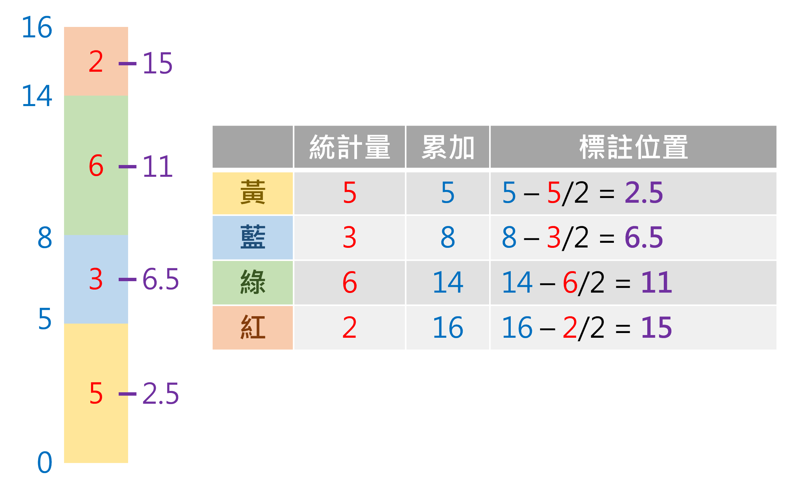
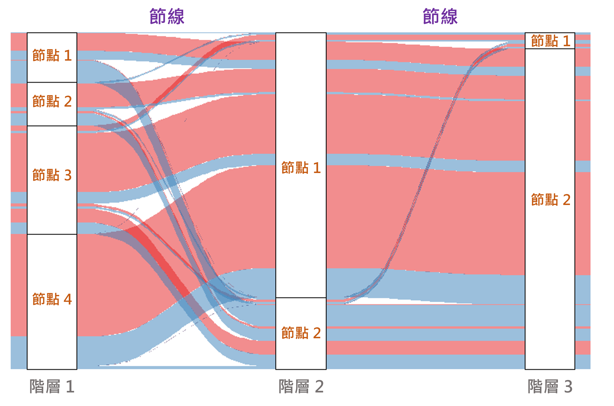
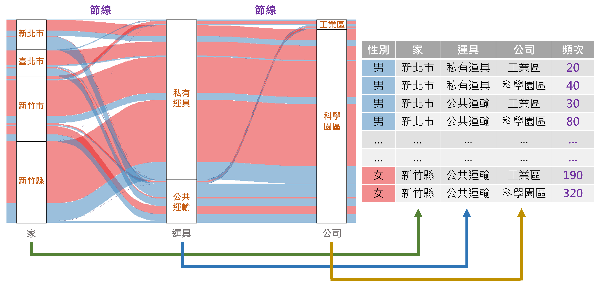
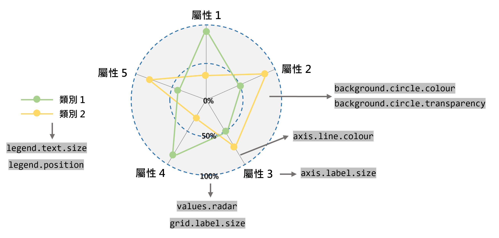
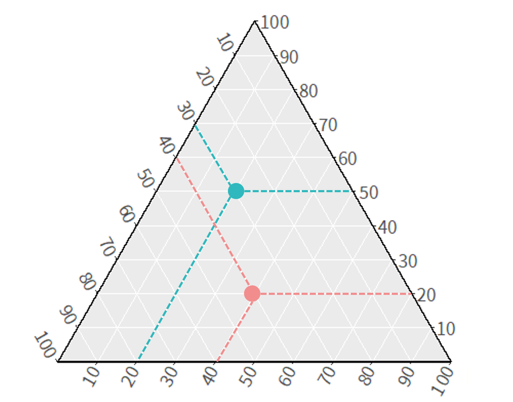

```{r setup1, include=FALSE}
knitr::opts_chunk$set(echo = TRUE)
library(dplyr)
library(data.table)
library(sf)
library(ggplot2)
library(ggsflabel)
library(ggspatial)
library(knitr)
library(kableExtra)
library(TDX)
library(DT)
library(stringr)
library(jsonlite)
library(xml2)
library(tidyr)
library(ggridges)
library(TWspdata)
library(treemapify)
library(ggsankey)
library(ggradar)
library(ggtext)
library(corrplot)
library(ggalluvial)
library(fmsb)
library(ggtern)
library(ggrepel)
library(ggtext)
library(ggimage)

Sys.setlocale(category = "LC_ALL", locale = "zh_TW.UTF-8")
windowsFonts(A=windowsFont("Taipei Sans TC Beta"))
windowsFonts(B=windowsFont("Consolas"))
```

# **資料視覺化**
資料視覺化是分析資料前相當重要的步驟，能夠將雜亂無章的數據彙整為具有統計意義的圖，進而觀察資料趨勢與潛在的意涵；同時也是在資料分析後，用以呈現產出結果的重要手段，進而貫串整個分析的主題與故事。本章節介紹 R 語言中資料視覺化的方法，其中側重於`ggplot2`套件的使用，分別介紹不同圖表的應用與程式撰寫方式，並詳述圖表細節之設定，進而使圖表的呈現更加細緻與客製化。

`ggplot2`套件是在 R 語言中最為常見的繪圖工具，此名稱中的「gg」意謂著「**G**rammar of **G**raphics」，亦即使用此套件繪圖時乃依據特定的規則，如同語言中的「文法」。`ggplot2`套件提供多種不同的函式可繪製各類型圖表，並可進一步細緻調整圖表樣式，提升資料之可視性。

`ggplot2`繪圖方法主要由四個元素構成：資料與座標軸、圖表類型、尺度設定、主題設定，繪圖架構如圖\@ref(fig:ggplot2-fig)所示。

```{r ggplot2-fig, echo=F, eval=T, out.width="50%", fig.align="center", fig.cap="`ggplot2`繪圖架構"}
include_graphics("./figure/ggplot2.png")
```

以圖\@ref(fig:fig-exp)為例，各元素所控制的圖片要素彙整如下：  

* <span style="color:#BF9000">**資料與座標軸：**</span> 所輸入的資料為鳶尾花（iris）資料、設定花萼的長度（Sepal.Length）為橫軸；花萼的寬度（Sepal.Width）為縱軸  
* <span style="color:#002060;">**圖表類型：**</span> 使用點子圖  
* <span style="color:#548235;">**尺度設定：**</span> 將花瓣的寬度（Petal.Width）給定漸層顏色、將花瓣的長度（Petal.Length）給定點子大小  
* <span style="color:#C55A11;">**主題設定：**</span> 設定座標軸文字的顏色與大小、設定圖例的文字大小、粗細與背景顏色  

```{r fig-exp, echo=F, eval=T, out.width="60%", fig.align="center", fig.cap="繪圖範例"}
ggplot(data=iris, aes(x=Sepal.Length, y=Sepal.Width, color=Petal.Width, size=Petal.Length))+
  geom_point()+
  scale_color_distiller(palette="YlOrRd", direction=1)+
  scale_size_continuous(range=c(1,5))+
  theme(axis.title=element_text(size=15, color="#600000"),
        axis.text=element_text(size=12, color="#600000"),
        legend.key=element_blank(),
        legend.title=element_text(face="bold"),
        legend.background=element_rect(fill=NA),
        legend.box.background=element_rect(fill=alpha("#E0E0E0", 0.8), color="#ADADAD"))
```

本章僅介紹常見的圖表，並系統性彙整`ggplot2`套件的作圖概念，惟無法涵蓋所有圖表繪製與細節調整，建議可以直接在網路上利用關鍵字（盡可能用英文關鍵字，所得到的回饋會更多、更完整）搜索，藉此模仿他人的程式碼，並從中學習作圖技巧。此外，以下羅列非常豐富的 R 繪圖相簿，內含完整的程式碼可供觀摩：

* [The R Graph Gallery](https://r-graph-gallery.com/index.html)
* [R CHARTS](https://r-charts.com/)
* [from Data to Viz](https://www.data-to-viz.com/)
* [Visual Vocabulary](https://journalismcourses.org/wp-content/uploads/2020/07/Visual-vocabulary.pdf)


## 圖表類型

<!-- <p style="color:#003D79;font-size:18px;line-height:2">**⌾ 圖表類型彙整**</p>   -->
### **圖表類型彙整** {-}
本節彙整常見的圖表類型（如表\@ref(tab:tab-export-plot)），並介紹各圖表繪製方法，利用不同的資料視覺化呈現。

```{r tab-export-plot, echo=F, eval=T}
ggplot_summary=read.csv("./Data/ggplot Summary.csv")
temp1=paste0("./figure/ggplot/", ggplot_summary$Figure, ".png")
ggplot_summary$Figure=""
temp2=strsplit(ggplot_summary$Package, "\n")
temp2=mapply(function(y) mapply(function(x) paste0("`", temp2[[y]][x], "`"), c(1:length(temp2[[y]]))), c(1:length(temp2)))
temp2=mapply(function(x) paste(temp2[[x]], collapse="<br>"), c(1:length(temp2)))
temp2=gsub("\\*\\*\\`", "\\`\\*\\*", temp2)
temp2=gsub("\\`\\*\\*g", "\\*\\*\\`g", temp2)
temp2=gsub("\\`\\*\\*t", "\\*\\*\\`t", temp2)
ggplot_summary$Package=temp2
ggplot_summary$Function=paste0("`", ggplot_summary$Function, "`")

kable(ggplot_summary, booktabs=T, escape=F, caption="圖表類型彙整", col.names=c("圖表類型","特徵/應用","套件","函式","圖示"), align=c("llc"))%>%
  kable_styling(bootstrap_options=c("striped", "hover"), font_size=14)%>%
  column_spec(5, width="4.5cm")%>%
  column_spec(1:5, extra_css="vertical-align:middle;")%>%
  column_spec(5, image=spec_image(temp1, 375, 250))%>%
  row_spec(0, bold=T, color="white", background="#8E8E8E")%>%
  footnote("套件欄位中的**粗體字**為可以與`ggplot2`套件整合者")
```

### **初始化** {-}
如前文所提，`ggplot2`是依循著繪圖文法的套件，其最基礎的元素即是**資料與座標軸**，也就是繪製各類型圖表前的「畫布」，可利用`ggplot()`函式生成之，函式撰寫架構如下。

```{r ggplot-code, echo=T, eval=F}
ggplot(資料, aes(x=, y=))
```

以`iris`鳶尾花資料為例建立畫布，並以 Sepal.Length 為橫軸、Sepal.Width 為縱軸，設定最基礎的畫布，程式碼撰寫如下。

```{r ggplot-code-eg, echo=T, eval=T, out.width="70%", fig.align="center"}
ggplot(iris, aes(x=Sepal.Length, y=Sepal.Width))
```


<H2 id="ggplot-aes"><p style="color:#003D79;font-size:18px;line-height:2">**⌾ `aes()`函式功能**</p></H2>  

`aes`表示「aesthetics（美學）」，用以定義圖表中「隨著資料有所變動」的資訊。舉例而言，繪製圖表的點與線時必須根據資料的座標而定，因此`x=`與`y=`兩引數務必放置於`aes()`函式中。而若希望不同資料點或線具有不同顏色（`color=`）、大小（`size=`）、粗細（`linewidth=`）、線條樣式（`linetype=`）等，則須透過資料控制之，此時亦應在該函式中設定各設計的細節。總結而論，**「隨著資料而有所變動的引數」必須放置於`aes()`函式內，「在圖表中皆固定者」必須放置於`aes()`函式外。**


<H2 id="ggplot-data"><p style="color:#003D79;font-size:18px;line-height:2">**⌾ 資料與座標軸**</p></H2>  
**請特別注意，設定資料與座標軸並不一定要放在`ggplot()`函式中，亦可置於`geom_XX()`的圖表類型函式內，效果完全相同！**如以下程式碼中的寫法所得到的結果一致。

```{r geom-setting-data, echo=T, eval=F}
# 放置於ggplot()函式內
ggplot(資料, aes(x=, y=))+
  geom_XX()

# 放置於geom_XX()函式內
ggplot()+
  geom_XX(data=資料, aes(x=, y=))
```

在疊圖的時候，若不同類型的圖表所使用的資料與座標軸完全相同時，可直接放置於`ggplot()`函式內即可；然若疊加的圖表所使用的資料與座標軸不一致，建議應個別在`geom_XX()`設定圖表類型時，逐一重新設置之。


### **圖示設定** {-}
在 R 語言中各類型圖表皆可能需要設定其形狀（`shape`）、線條樣式（`linetype`）、顏色（`color`）等，以下簡介各設定之代碼。

點的形狀在 R 語言中共 26 個預設代碼，詳列如圖\@ref(fig:geom-setting-shape)，可直接設定數字使用符號。此外，亦可自訂代碼，如設定「`"X"`」，即表示使用「X」符號。

<H2 id="geom-setting-shape"></H2>
```{r geom-setting-shape, echo=F, eval=T, out.width="65%", fig.align="center", fig.cap="點形狀代碼"}
temp=data.frame(id=c(0:25))%>%
  mutate(x=(id)%%6+1, y=5-(id)%/%6+1)
ggplot()+
  geom_point(data=temp, aes(x=x, y=y, shape=as.character(id)), stroke=1, size=6, fill="#FFFF37", show.legend=F)+
  scale_shape_manual(limits=factor(temp$id), values=temp$id)+
  geom_text(data=temp, aes(x=x, y=y+0.3, label=id), family="A", size=4.5)+
  theme_void()
```

線條樣式在 R 語言中共 7 個預設代碼，詳列如圖\@ref(fig:geom-setting-linetype)。

<H2 id="geom-setting-linetype"></H2>
```{r geom-setting-linetype, echo=F, eval=T, out.width="70%", fig.align="center", fig.cap="線條樣式代碼"}
temp=data.frame(id=rep(c(0:6), each=2), linetype=rep(c("blank","solid","dashed","dotted","dotdash","longdash","twodash"), each=2), x=rep(c(1,2), times=7))
ggplot()+
  geom_line(data=temp, aes(x=x, y=id, group=id, linetype=factor(id)), linewidth=1, show.legend=F)+
  scale_linetype_manual(values=c(0:6))+
  geom_text(data=temp, aes(x=1.5, y=id+0.3, label=paste0(id, " - ", linetype)), family="A", size=4.5)+
  theme_void()
```

在 R 語言中顏色的設定可以直接輸入預設的顏色名稱，詳列如圖\@ref(fig:geom-setting-color)，抑或直接透過十六進位值色碼，請參考[色碼表](https://www.ifreesite.com/color/)。

<H2 id="geom-setting-color"></H2>
```{r geom-setting-color, echo=F, eval=T, out.width="90%", fig.align="center", fig.cap="顏色代碼"}
temp=data.frame(color=grDevices::colors())%>%
  filter(!grepl("[0-9]", color))%>%
  mutate(id=c(1:nrow(.)))%>%
  mutate(x=(id-1)%%6+1, y=floor(nrow(.)/6)-(id-1)%/%6+1,
         seq=paste0(str_pad(x, 2, "left", 0), "-", str_pad(y, 2, "left", 0)))%>%
  arrange(seq)
temp=cbind(temp, data.frame(t(col2rgb(temp$color))))%>%
  mutate(Luminance=0.2126*red+0.7152*green+0.0722*blue,
         fontcolor=ifelse(Luminance>100, "black", "white"))
ggplot(temp, aes(x=x, y=y, fill=color)) +
  geom_tile(show.legend=F)+
  scale_fill_manual(limits=temp$color, values=temp$color)+
  geom_text(aes(label=color, color=fontcolor), family="A", size=2.5, show.legend=F)+
  scale_color_manual(values=c("black"="black", "white"="white"))+
  theme_void()
```

有了上述對於圖表設定的基本認識後，接下來就讓我們用各種不同資料與案例說明各圖表的功能及程式撰寫方式。


### 散布圖
散布圖（Scatter Plot）應用於表達兩個連續變數之間的關係，橫軸與縱軸分別代表不同的連續變數，並利用點表示此二連續變數在二維空間的分布，可利用`geom_point()`函式達成之，函式撰寫架構如下。

```{r geom-point-code, echo=T, eval=F}
geom_point(color=, shape=, size=, stroke=, fill=, alpha=)
```

以上各引數的功能彙整如表\@ref(tab:geom-point-code-tab)。

```{r geom-point-code-tab, echo=F, eval=T}
gp_code=data.frame(argument=c("`color=`","`shape=`","`size=`","`stroke=`","`fill=`","`alpha=`"),
                   setting=c("設定點的顏色","設定點的形狀","設定點的大小","設定點外圍框線的粗細","設定點內部的顏色","設定點的透明度"), explain=c("請參考<A href='#geom-setting-color'>顏色設定</A>","請參考<A href='#geom-setting-shape'>形狀設定</A>","數值","數值","請參考<A href='#geom-setting-color'>顏色設定</A>，僅有空心形狀者（如<A href='#geom-setting-shape'>形狀設定</A>為 21~25 者）尚有效","數值，介於 0（完全透明）與 1（完全不透明）間"))

kable(gp_code, booktabs=T, escape=F, caption="`geom_point()`函式引數設定", col.names=c("引數","功能設定","說明"))%>%
  kable_styling(bootstrap_options=c("striped", "hover"), font_size=14)%>%
  row_spec(0, bold=T, color="white", background="#8E8E8E")
```


<p style="color:#003D79;font-size:18px;line-height:2">**⌾ 基礎散布圖**</p>  
以`iris`資料為例，以花萼的長度（Sepal.Length）為橫軸，花萼的寬度（Sepal.Width）為縱軸，繪製散布圖，程式碼撰寫如下。

```{r geom-point-eg1, echo=T, eval=T, out.width="70%", fig.align="center"}
ggplot(iris, aes(x=Sepal.Length, Sepal.Width))+
  geom_point()
```

<p style="color:#003D79;font-size:18px;line-height:2">**⌾ 修正散布圖樣式**</p>  
若希望更動點的樣式，可利用表\@ref(tab:geom-point-code-tab)的引數控制之。

```{r geom-point-eg2, echo=T, eval=T, out.width="70%", fig.align="center"}
ggplot(iris, aes(x=Sepal.Length, Sepal.Width))+
  geom_point(color="red", shape=23, size=3, stroke=1, fill="#AE57A4", alpha=0.5)
```

<p style="color:#003D79;font-size:18px;line-height:2">**⌾ 漸層樣式散布圖**</p>  
散布圖一般而言僅能表示二維的數據，且大多是連續變數，然而若能在點子上給定顏色或大小，則可進一步顯示更多維度的資料。漸層樣式散布圖中，須**依據資料隨之變動**的樣式，其引數設定亦須置於<A href="#ggplot-aes">`aes()`</A>函式**內**；反之，若樣式不會隨資料變動，則須放置於<A href="#ggplot-aes">`aes()`</A>函式**外**。

承繼上述案例，若希望用顏色表示品種（Species），並以點子的大小表示花瓣的長度（Petal.Width），而點子的形狀皆固定為圓點（引數需置於<A href="#ggplot-aes">`aes()`</A>函式**外**），程式碼撰寫如下。

```{r geom-point-eg3, echo=T, eval=T, out.width="70%", fig.align="center"}
ggplot(iris, aes(x=Sepal.Length, Sepal.Width))+
  geom_point(aes(color=Species, size=Petal.Width), shape=20)
```

圖中「品種」為類別型資料；「花瓣的寬度」為連續型資料，透過漸層樣式散布圖可表達更多維度的資料，添增資訊的豐富度。觀察出圖結果可發現，setosa 類別（ <span style="color:#F8766D">紅色點子</span>）的花瓣寬度（點子大小）與花萼長度（橫軸）相較於另兩品種偏小，有相當明顯的區別。因此透過漸層樣式散布圖可初步觀察對於資料分類的重要影響變數，為資料科學的關鍵步驟。

若欲修正顏色漸層，請參考[此](#顏色漸層)；若欲修正點子大小之漸層，請參考[此](#大小尺度)。


<p style="color:#003D79;font-size:18px;line-height:2">**⌾ 漸層樣式散布圖--修正圖例順序**</p>  
關於圖例修正的順序請先參考[此](#調整圖例名稱順序)。在預設情況下，圖例是依據字母順序排列，而若欲修正圖例順序為指定的格式，須利用[`factor()`](#因子factor)函式定義類別的層級。舉例而言，若希望將圖例順序修正為「virginica, versicolor, setosa」，程式碼撰寫如下。

```{r geom-point-eg4, echo=T, eval=T, out.width="70%", fig.align="center"}
iris_rev=iris
iris_rev$Species=factor(iris_rev$Species, c("virginica","versicolor","setosa"))
ggplot(iris_rev, aes(x=Sepal.Length, Sepal.Width))+
  geom_point(aes(color=Species, size=Petal.Width), shape=20)
```


<p style="color:#003D79;font-size:18px;line-height:2">**⌾ 加入文字或標籤**</p>  
關於圖表中插入文字，應利用`geom_text()`函式，請先參考[此](#標註文字)。以加入各品種（Species）分群中心點的名稱為例，以下程式碼先行透過`group_by() %>% summarise()`計算各分群的中心點位置，最後再添上文字。

```{r geom-point-eg5, echo=T, eval=T, out.width="70%", fig.align="center"}
# 統計各品種的中心點
iris_sum=group_by(iris, Species)%>%
  summarise_at(c("Sepal.Length", "Sepal.Width"), mean)

# 加入文字
ggplot()+
  geom_point(data=iris, aes(x=Sepal.Length, Sepal.Width, color=Species, size=Petal.Width), shape=20, alpha=0.5)+
  geom_text(data=iris_sum, aes(x=Sepal.Length, y=Sepal.Width, color=Species, label=Species), size=5)
```

抑或使用`geom_label()`建立標籤，程式碼撰寫如下。

```{r geom-point-eg6, echo=T, eval=T, out.width="70%", fig.align="center"}
# 加入文字
ggplot()+
  geom_point(data=iris, aes(x=Sepal.Length, Sepal.Width, color=Species, size=Petal.Width), shape=20, alpha=0.5)+
  geom_label(data=iris_sum, aes(x=Sepal.Length, y=Sepal.Width, color=Species, label=Species), size=4)
```


<p style="color:#003D79;font-size:18px;line-height:2">**⌾ 加入趨勢線**</p>  
點子圖通常用以表示兩連續變數的關係，可從中推敲其趨勢，繪圖時可另考量繪製趨勢線，有助於引導閱讀者瞭解變數間的關係。趨勢線可透過`geom_smooth()`繪製，函式撰寫架構如下。

```{r geom-smooth-code, echo=T, eval=F}
geom_smooth(method, se=, span=, level=, color=, linetype=, linewidth=, fill=, alpha=)
```

以上各引數的功能彙整如表\@ref(tab:geom-smooth-code-tab)。

```{r geom-smooth-code-tab, echo=F, eval=T}
gs_code=data.frame(argument=c("`method=`","`formula=`","`se=`","`level=`","`span=`","`color=`","`linetype=`","`linewidth=`","`fill=`","`alpha=`"),
                   setting=c("設定趨勢線迴歸模型","設定迴歸函式","設定是否回傳趨勢線的標準誤","設定信心水準","設定迴歸的區間","設定趨勢線顏色","設定趨勢線樣式","設定趨勢線粗細","設定趨勢線標準誤範圍的顏色","設定趨勢線標準誤範圍的透明度"), explain=c("可使用線性迴歸（`lm`）或一般化線性迴歸（`glm`）","預設為`y~x`","預設為`T`，若不希望有標準誤，須設定`F`","預設為 95% (`0.95`) 之信心水準","迴歸區間，若區間愈大，線條愈平滑；若區間愈小，線條愈趨近原資料分布","請參考<A href='#geom-setting-color'>顏色設定</A>","請參考<A href='#geom-setting-linetype'>線條樣式設定</A>","數值","請參考<A href='#geom-setting-color'>顏色設定</A>","數值，介於 0（完全透明）與 1（完全不透明）間"))

kable(gs_code, booktabs=T, escape=F, caption="`geom_smooth()`函式引數設定", col.names=c("引數","功能設定","說明"))%>%
  kable_styling(bootstrap_options=c("striped", "hover"), font_size=14)%>%
  column_spec(2, width="6.5cm")%>%
  row_spec(0, bold=T, color="white", background="#8E8E8E")
```

以加入線性的趨勢線為例，此時`method=`引數設定為`lm`，即線性迴歸（linear model），而公式則為$y=\beta x$（`y~x`），程式碼撰寫如下。另請注意在線性迴歸時，即無須另設定用於曲線的`span=`引數。

```{r geom-smooth-eg1, echo=T, eval=T, out.width="70%", fig.align="center"}
ggplot(iris, aes(x=Sepal.Length, Sepal.Width))+
  geom_point()+
  geom_smooth(method=lm, formula=y~x, color="#CE0000", fill="#FF7575", alpha=0.2)
```

繪製曲線之趨勢線時，不同的`span=`引數所繪製的趨勢圖亦有所不同，如圖\@ref(fig:geom-smooth-eg2)所示，可發現當所設定的數值愈大時，趨勢線愈加平滑。

```{r geom-smooth-eg2, echo=F, eval=T, out.width="85%", fig.align="center", fig.cap="趨勢線中的`span=`引數", warning=F, message=F}
plot_list=list()
all_span=c(0.2,0.5,0.8,1,1.5,2)
for(i in c(1:length(all_span))){
 temp=ggplot(iris, aes(x=Sepal.Length, Sepal.Width))+
   geom_point()+
   geom_smooth(color="#CE0000", fill="#FF7575", alpha=0.2, span=all_span[i])+
   labs(title=paste0("<span style='font-family: B;'>span=", all_span[i], "</span>"))+
   theme(plot.title=element_markdown(hjust=0.5, fill="#F0F0F0", padding=margin(0,5,0,0, unit="pt")))
 plot_list[[i]]=temp
}
theme1=theme(axis.text.y=element_blank(),
             axis.ticks.y=element_blank(),
             axis.title.y=element_blank())
theme2=theme(axis.text.x=element_blank(),
             axis.ticks.x=element_blank(),
             axis.title.x=element_blank())
theme3=theme(axis.text=element_blank(),
             axis.ticks=element_blank(),
             axis.title=element_blank())
cowplot::plot_grid(plot_list[[1]]+theme2, plot_list[[2]]+theme3, plot_list[[3]]+theme3, plot_list[[4]], plot_list[[5]]+theme1, plot_list[[6]]+theme1, align="hv", ncol=3)
```


<p style="color:#003D79;font-size:18px;line-height:2">**⌾ 加入跳點**</p>  
有時資料點會重疊，導致肉眼無法觀察，更難以判斷資料的集中程度（重疊後變成單一點，反而會將群聚的點誤判為稀疏），此一情境即常發生於具有整數或類別型的資料。如以下案例，利用`mpg`資料，以汽缸數（cyl）為橫軸；以每加侖英里數（hwy）為縱軸，繪製散布圖如下。

```{r geom-point-eg7, echo=T, eval=T, out.width="70%", fig.align="center"}
ggplot(mpg, aes(cyl, hwy))+
  geom_point()
```

由於汽缸數與每加侖英里數在該資料中皆為正整數，導致有許多資料是重疊的，不易觀察。此時可以利用`geom_jitter()`加入亂數，使資料跳動至鄰近的座標點上，得以較明確觀察資料間的散布情形，且不影響原資料的分布。`geom_jitter()`函式的撰寫架構如下。

```{r geom-jitter-code, echo=T, eval=F}
geom_jitter(width=, height=)
```

其中，`width=`引數表示橫軸變動的幅度，如`width=0.1`，表示針對橫軸向左與右隨機變動 10% 以內。`height=`引數則表示橫軸變動的幅度。

另外`geom_point()`內部的所有引數皆可套用至`geom_jitter()`函式中，如需設定顏色、大小等，皆可使用表\@ref(tab:geom-point-code-tab)的引數。

```{r geom-jitter-eg, echo=T, eval=T, out.width="70%", fig.align="center"}
# 先利用duplicated()函式檢查重複資料的筆數
sum(duplicated(mpg[, c("cyl","hwy")]))

# 繪製具有跳點的散布圖
ggplot(mpg, aes(cyl, hwy))+
  geom_jitter(width=0.2, height=0.2)
```

由出圖結果可知，使用`geom_jitter()`可使資料更容易辨識，惟須注意的是，`width=`與`height=`引數對於圖表的視覺化程度有相當大的影響，若數值設定的愈大，資料連續性的情況就會越明顯，但可能過度偏離實際情況。因此針對不同資料，此二引數的調整需多次嘗試，尋找最佳可視化且不影響原始資料分布的繪圖方式。此外，由於`geom_jitter()`的跳動是隨機的，若欲每次輸出的結果是相同的，可設定隨機亂數（[`set.seed()`](https://r-coder.com/set-seed-r/)）在每次繪圖前執行之，以確保使用相同的隨機種子。


### 折線圖
折線圖（Line Chart）應用於表達兩連續變數的趨勢，或一連續變數隨時間變化的趨勢，可利用`geom_line()`函式達成之，函式撰寫架構如下。

```{r geom-line-code, echo=T, eval=F}
geom_line(color=, linetype=, linewidth=, alpha=, group=)
```

函式中各引數的功能彙整如表\@ref(tab:geom-line-code-tab)。

```{r geom-line-code-tab, echo=F, eval=T}
gl_code=data.frame(argument=c("`color=`","`linetype=`","`linewidth=`","`alpha=`","`group=`"),
                   setting=c("設定線條的顏色","設定線條樣式","設定線條的粗細","設定線條的透明度","設定線條的分群"), explain=c("請參考<A href='#geom-setting-color'>顏色設定</A>","請參考<A href='#geom-setting-linetype'>線條樣式設定</A>","數值","數值，介於 0（完全透明）與 1（完全不透明）間","設定分群欄位名稱（若設定為 1，表示將資料全部連成一折線）"))

kable(gl_code, booktabs=T, escape=F, caption="`geom_line()`函式引數設定", col.names=c("引數","功能設定","說明"))%>%
  kable_styling(bootstrap_options=c("striped", "hover"), font_size=14)%>%
  row_spec(0, bold=T, color="white", background="#8E8E8E")
```

<p style="color:#003D79;font-size:18px;line-height:2">**⌾ 基礎折線圖**</p>  

以`airquality`（空氣品質）資料為例，以日期（Month & Day）為橫軸，溫度（Temp）為縱軸，繪製折線圖，程式碼撰寫如下。其中利用[`as.Date()`](#日期與時間)函式建立日期資料，並透過[`str_pad()`](#文字處理)函式建立相同長度的文字。而在`geom_line()`函式中必須設定`group=1`之引數，用以表達將所有資料連貫為一條折線。

```{r geom-line-eg1, echo=T, eval=T, out.width="70%", fig.align="center"}
# 先處理airquality資料(建立日期)
airquality_new=airquality
airquality_new$Date=as.Date(paste0(str_pad(airquality_new$Month, 2, "left", 0), "-", str_pad(airquality_new$Day, 2, "left", 0)), format="%m-%d")

ggplot(data=airquality_new, aes(x=Date, y=Temp))+
  geom_line(group=1, color="red")
```

圖中的橫軸為日期資料，而若欲修正時間軸的日期顯示方式，請參考[此](#座標軸尺度)。

<p style="color:#003D79;font-size:18px;line-height:2">**⌾ 多線折線圖**</p>  
以上的折線圖僅顯示單一條線，而有時我們希望在同一張圖表達多條折線，可藉此必較不同區間的資料，此時必須在`geom_line()`函式中設定`group=`函數為指定的分群欄位。

再次以`airquality`（空氣品質）資料為例，若希望根據月份繪製不同折線，並給定不同顏色，此時`group=`引數即須設定為「Month」，並置於<A href="#ggplot-aes">`aes()`</A>函式中，表示須根據不同類別而使設定有所更動者。由於不同折線將賦予不同顏色，故`color=`引數必須置於<A href="#ggplot-aes">`aes()`</A>函式內。最後，若折線的粗細為一固定值，則必須將`linewidth=`引數置於<A href="#ggplot-aes">`aes()`</A>函式外。根據上述繪圖邏輯，程式碼撰寫如下。

```{r geom-line-eg2, echo=T, eval=T, out.width="70%", fig.align="center"}
ggplot(data=airquality, aes(x=Day, y=Temp))+
  geom_line(aes(group=Month, color=as.factor(Month)), linewidth=1)
```

請注意以上程式碼中，由於需依據月份分類繪圖，故將 Month 轉換為文字或因子形式。

若欲修正顏色漸層，請參考[此](#顏色漸層)。


<p style="color:#003D79;font-size:18px;line-height:2">**⌾ 折線圖與散布圖疊合**</p>  
通常表達數據的趨勢，除了使用折線圖外，為了使資料的座標更為清晰，會另將散布圖疊在其上，以`airquality`資料為例，程式碼撰寫如下。程式碼中另將不同月份賦予不同點子的形狀，故此時`geom_point()`函式中的`shape=`引數亦須放置於<A href="#ggplot-aes">`aes()`</A>函式內。而點子的大小不會因為不同月份而有所變動，在圖表中皆為固定者，故須置於<A href="#ggplot-aes">`aes()`</A>函式外。

```{r geom-line-eg3, echo=T, eval=T, out.width="70%", fig.align="center"}
ggplot(data=airquality, aes(x=Day, y=Temp))+
  geom_line(aes(group=Month, color=as.factor(Month)), linewidth=1)+
  geom_point(aes(group=Month, color=as.factor(Month), shape=as.factor(Month)), size=2)
```


### 長條圖
長條圖（Bar Chart）用以表達各類別的統計量，例如各月份的總收入、各學生的成績等，用以比較類別間的差異。此外，長條圖亦可應用於時間序列上，表達隨著時間變動的趨勢。在`ggplot2`套件中，長條圖可以利用`geom_bar()`與`geom_col()`繪製，前者會自動計算資料中各類別的數量，僅需輸入需要統計的類別即可；後者則是在已統計完成的資料中，給定橫軸與縱軸。兩函式的撰寫架構如下。

```{r geom-bar-code, echo=T, eval=F}
geom_bar(stat=, position=, color=, linetype=, linewidth=, fill=, alpha=)
geom_col(position=, color=, linetype=, linewidth=, fill=, alpha=)
```

以上各引數的功能彙整如表\@ref(tab:geom-bar-code-tab)。

```{r geom-bar-code-tab, echo=F, eval=T}
gb_code=data.frame(argument=c("`stat=`","`position=`","`color=`","`linetype=`","`linewidth=`","`fill=`","`alpha=`"),
                   setting=c("設定統計方法","設定子類別的長條為疊加或並排","設定條狀外圍顏色","設定條狀外圍線條樣式","設定條狀外圍線條粗細","設定條狀內部填色","設定條狀內部填色透明度"), explain=c("`count`:統計類別的個數<br>`identity`:依據給定資料繪製","`stack`:將不同子類別疊加<br>`dodge`:將不同子類別並排","請參考<A href='#geom-setting-color'>顏色設定</A>","請參考<A href='#geom-setting-linetype'>線條樣式設定","數值","請參考<A href='#geom-setting-color'>顏色設定</A>","數值，介於 0（完全透明）與 1（完全不透明）間"))

kable(gb_code, booktabs=T, escape=F, caption="`geom_bar()`與`geom_col()`函式引數設定", col.names=c("引數","功能設定","說明"))%>%
  kable_styling(bootstrap_options=c("striped", "hover"), font_size=14)%>%
  column_spec(1:3 ,extra_css="vertical-align:middle;")%>%
  row_spec(0, bold=T, color="white", background="#8E8E8E")
```

<p style="color:#003D79;font-size:18px;line-height:2">**⌾ 基本統計圖（自動統計）**</p>  
`geom_bar()`函式在預設情況下，`stat=`引數為`count`，故可直接輸入欲統計的變數（通常是類別變數），該函式會自動計算各類別的資料筆數，並依此繪製長條圖。以下以`mpg`資料為例，設定橫軸為汽車廠牌（manufacturer）的類別變數，在預設情況下，會自動統計該欄位的個數，程式碼撰寫如下。

```{r geom-bar-eg1, echo=T, eval=T, out.width="70%", fig.align="center"}
ggplot(mpg, aes(x=manufacturer))+
  geom_bar()
```

<p style="color:#003D79;font-size:18px;line-height:2">**⌾ 基本統計圖（既有統計資料）**</p>  
若已有統計資料，單純僅須設定橫軸為類別，縱軸為統計量（個數），則須在`geom_bar()`函式中設定`stat="identity"`之引數，表示直接給定數量，不須另行統計（`count`）。再次以`mpg`資料為例，先行透過[`group_by() %>% summarise()`](#資料分群與統計)函式計算各群組（manufacturer）的數量，最後再利用`geom_bar()`函式繪圖。程式碼撰寫如下。

```{r geom-bar-eg2, echo=T, eval=T, out.width="70%", fig.align="center"}
# 先統計數量
mpg_sum=group_by(mpg, manufacturer)%>%
  summarise(Count=n())

# 繪製長條圖
ggplot(data=mpg_sum, aes(x=manufacturer, y=Count))+
  geom_bar(stat="identity")
```

若欲更換橫軸類別變數的順序，請參考[此](#調整座標軸名稱順序)。

此外，`geom_col()`則提供更直接的方式繪製此類型的長條圖，無須額外設定引數。以上述`mpg_sum`資料為例，程式碼撰寫如下。

```{r geom-bar-eg3, echo=T, eval=T, out.width="70%", fig.align="center"}
# 繪製長條圖
ggplot(data=mpg_sum, aes(x=manufacturer, y=Count))+
  geom_col()
```


資料的形式也可能更加複雜，而根據不同的原始資料，可能需要先利用第二章的[資料處理套件](#資料清洗與處理)將原始資料彙整為具有統計量的資訊，再依此進一步繪製長條圖。舉例而言，使用[`TWspdata`套件](#安裝套件)中的`taiwan_school`為例，若欲統計臺北市各行政區不同類型學校的數量，則必須先針對原始資料的學校名稱欄位（name）建立標籤，給定各學校不同的層級（以下範例中分為五類：國小、國中、高中、大學、其他），並擷取地址欄位（address）中的行政區資訊。最後再依據行政區與學校層級，透過[`group_by() %>% summarise()`](#資料分群與統計)函式計算各群組內的總數量。

以下程式碼先行建立以臺北市各行政區為橫軸，各行政區學校數量為縱軸的長條圖。

<H2 id="tp-school"></H2>  

```{r geom-bar-eg4, echo=T, eval=T, out.width="70%", fig.align="center", message=F}
# 將所有學校予以分類，並擷取其所在行政區
tp_school=filter(taiwan_school, grepl("臺北市", address))%>%
  mutate(TYPE=case_when(
    grepl("國小|附設國小|實小|國\\(中\\)小|小學|附小", name) ~ "國小",
    grepl("國中|附設國中", name) & !grepl("建國中學", name) ~ "國中",
    grepl("高級中學|附中|高中|中學|女中|家商|工農|工商|餐飲|高工|護家|藝校|高商", name) ~ "高中",
    grepl("大學|專科|學院", name) ~ "大學",
    TRUE ~ "其他"
  ),
  District=substr(address, regexpr("市", address)+1, regexpr("區", address)-1))

# 依據行政區，統計學校數量
tp_school_sum1=group_by(tp_school, District)%>%
  summarise(Count=n())

# 繪製長條圖
ggplot(data=tp_school_sum1, aes(x=District, y=Count))+
  geom_col()
```

關於程式碼中的重要函式彙整如下，請回顧前二章的相關函式：

* [`case_when()`](#條件判斷)：給定符合條件的情況特定指令  
* [`grepl()`](#搜尋字元)：判別是否包含特定字元  
* [`substr()`](#擷取與取代字元)：依據索引擷取字串中的字元  
* [`regexpr()`](#搜尋字元)：尋找特定字元所在的索引  
* [`group_by() %>% summarise()`](#資料分群與統計)：依據分群統計數量  

綜上範例，繪製圖表並非單純地將資料直接套入`ggplot2`套件即可，有時候為擷取重要資訊，必須先行資料清洗與統計，故在掌握繪圖的技巧前，請務必熟悉資料處理的函式。


<p style="color:#003D79;font-size:18px;line-height:2">**⌾ 子類別疊加長條圖**</p>  

有時我們會希望在每一根長條上利用不同顏色標示出各「子類別」的資訊，此時可以利用`fill=`引數，以針對不同子類別設定不同填色。而若欲將不同的子類別疊加顯示，可使用`position="stack"`之引數（預設為此，故無需額外設定）。承繼前述範例，以行政區為橫軸；並在每一長條上分別利用不同填色表示學校層級，此時應在`geom_col()`函式中另設定填色（`fill=`）引數，且該引數務必置於<A href="#ggplot-aes">`aes()`</A>函式內，表示其會隨著資料有所改變。程式碼撰寫如下。

```{r geom-bar-eg5, echo=T, eval=T, out.width="70%", fig.align="center", message=F}
# 依據行政區與學校層級，統計學校數量
tp_school_sum2=group_by(tp_school, District, TYPE)%>%
  summarise(Count=n())

# 繪製長條圖
ggplot(data=tp_school_sum2, aes(x=District, y=Count))+
  geom_col(aes(fill=TYPE))
```


<p style="color:#003D79;font-size:18px;line-height:2">**⌾ 子類別疊加長條圖--調整圖例順序**</p>  

若欲修正長條疊圖的順序以及圖例中排列的順序，請先參考[此](#調整圖例名稱順序)。如將學校層級由小至大依序排列，程式碼撰寫如下。

```{r geom-bar-eg6, echo=T, eval=T, out.width="70%", fig.align="center", message=F}
# 修正層級
tp_school_sum2$TYPE=factor(tp_school_sum2$TYPE, levels=c("國小","國中","高中","大學","其他"))

# 繪製長條圖
ggplot(data=tp_school_sum2, aes(x=District, y=Count))+
  geom_col(aes(fill=TYPE))
```

若欲將上圖中的「國小」置於圖表最下方，「其他」置於最上方，則僅需在`factor()`函式中將`levels=`引數倒序排列即可。


<p style="color:#003D79;font-size:18px;line-height:2">**⌾ 子類別並排長條圖**</p>  
在預設情況下若有多個類別繪製長條圖，係將其垂直疊加，然若希望將所有子類別的長條圖以並排方式呈現，則需另在`geom_col()`函式中設定`position="dodge"`。再次以前述`tp_school_sum2`的資料為例，程式碼撰寫如下。

```{r geom-bar-eg7, echo=T, eval=T, out.width="70%", fig.align="center", message=F}
ggplot(data=tp_school_sum2, aes(x=District, y=Count))+
  geom_col(position="dodge", aes(fill=TYPE))
```


<p style="color:#003D79;font-size:18px;line-height:2">**⌾ 加入文字或標籤**</p>  
關於圖表中插入文字，應利用`geom_text()`函式，請先參考[此](#標註文字)。在繪製長條圖時，有時會希望在長條圖上標註類別或數字，以明確顯示充分的資訊，增加可讀性。以前文`mpg_sum`資料為例，將各廠牌（manufacturer）類別的統計數量（Count）標註於長條的頂端。程式碼中在設定文字的標註位置時，將縱軸設定為各數量再加一，以避免與頂端的邊界重疊而影響判讀。

```{r geom-bar-eg8, echo=T, eval=T, out.width="70%", fig.align="center"}
ggplot()+
  geom_col(data=mpg_sum, aes(x=manufacturer, y=Count))+
  geom_text(data=mpg_sum, aes(x=manufacturer, y=Count+1, label=Count), color="blue")
```

若欲在子類別疊加長條圖中，各類別的區塊標註文字，需特別注意文字標註的縱軸位置，其必須依據不同群組累積加總統計數量，尚能正確表達位置。而分群累積加總，請參考[資料分群與統計](#資料分群與統計)一節中的「**分群新增資料屬性（`mutate()`）**」之內容，而標記的縱軸位置計算方式詳如圖\@ref(fig:geom-bar-cumsum-fig)之示意圖所示。此外在標註時須注意原始資料的排序，務必利用[`arrange()`](#資料排序)函式針對特定類別先行**倒序排列（`desc()`）**。

```{r geom-bar-cumsum-fig, echo=F, eval=T, out.width="60%", fig.align="center", fig.cap="子類別疊加長條圖 標註文字方法"}

```

再次以`tp_school_sum2`資料為例，若欲在子類別長條圖（疊圖）上標註各行政區各學校層級的統計量數值，程式碼撰寫如下。

```{r geom-bar-eg9, echo=T, eval=T, out.width="70%", fig.align="center", message=F}
# 務必設定層級
tp_school_sum2$TYPE=factor(tp_school_sum2$TYPE, levels=c("國小","國中","高中","大學","其他"))

# 將tp_school_sum2資料依據學校層級排序(倒序排列)後，計算標註的縱軸位置
tp_school_sum2_cum=group_by(tp_school_sum2, District)%>%
  arrange(District, desc(TYPE))%>%
  mutate(Count_cum=cumsum(Count))

# 計算邏輯請參考以上示意圖
tp_school_sum2_cum$lab_y=tp_school_sum2_cum$Count_cum-tp_school_sum2_cum$Count/2

# 繪製長條圖
ggplot()+
  geom_col(data=tp_school_sum2, aes(x=District, y=Count, fill=TYPE))+
  geom_text(data=tp_school_sum2_cum, aes(x=District, y=lab_y, label=Count))
```


### 直方圖
直方圖（Histogram）與長條圖非常相像，然而長條圖的橫軸多用於類別變數或時間、整數，而直方圖的橫軸多用於連續變數，該函式撰寫架構如下。

```{r geom-histogram-code, echo=T, eval=F}
geom_histogram(binwidth=, bins=, color=, linetype=, linewidth=, fill=, alpha=, position=, group=)
```

以上各引數的功能彙整如表\@ref(tab:geom-histogram-code-tab)。

```{r geom-histogram-code-tab, echo=F, eval=T}
gh_code=data.frame(argument=c("`binwidth=`","`bins=`","`color=`","`linetype=`","`linewidth=`","`fill=`","`alpha=`","`position=`","`group=`"),
                   setting=c("設定分群寬度","設定分群總數","設定條狀外圍顏色","設定條狀外圍線條樣式","設定條狀外圍線條粗細","設定條狀內部填色","設定條狀內部填色透明度","設定子類別的長條為疊加或並排","設定分群欄位名稱"), explain=c("數值","數值<br>當`binwidth=`引數有被設定時，即忽略`bins=`的設定","請參考<A href='#geom-setting-color'>顏色設定</A>","請參考<A href='#geom-setting-linetype'>線條樣式設定","數值","請參考<A href='#geom-setting-color'>顏色設定</A>","數值，介於 0（完全透明）與 1（完全不透明）間","`stack`:將不同子類別疊加<br>`identity`:將不同子類別重疊","若欲針對不同子類別繪製直方圖於同一張圖表中，必須設定子類別欄位"))

kable(gh_code, booktabs=T, escape=F, caption="`geom_histogram()`函式引數設定", col.names=c("引數","功能設定","說明"))%>%
  kable_styling(bootstrap_options=c("striped", "hover"), font_size=14)%>%
  column_spec(1:3 ,extra_css="vertical-align:middle;")%>%
  row_spec(0, bold=T, color="white", background="#8E8E8E")
```

<p style="color:#003D79;font-size:18px;line-height:2">**⌾ 基礎直方圖（設定分群寬度）**</p>  
以`airquality`資料為例，依據溫度繪製直方圖，程式碼撰寫如下。

```{r geom-histogram-eg1, echo=T, eval=T, out.width="70%", fig.align="center"}
ggplot(data=airquality, aes(x=Temp))+
  geom_histogram(binwidth=5)
```

出圖結果中，每一個長條的寬度即為橫軸的 5 單位（`binwidth=5`）。


<p style="color:#003D79;font-size:18px;line-height:2">**⌾ 基礎直方圖（設定分群總數）**</p>  

```{r geom-histogram-eg2, echo=T, eval=T, out.width="70%", fig.align="center"}
ggplot(data=airquality, aes(x=Temp))+
  geom_histogram(bins=10, color="red", linewidth=1, fill="pink", alpha=0.5)
```

出圖結果中，圖表的長條總數為 10 個（`bins=10`）。

由上述兩範例可知，分群的總數與分群寬度之設定會影響肉眼觀察，挑選合適的值是資料視覺化的關鍵，以避免透過圖表誤導閱聽者。


<p style="color:#003D79;font-size:18px;line-height:2">**⌾ 多類別直方圖**</p>  
有時我們會希望觀察不同類別間的分布情形，故在同一張圖表上繪製多組資料的直方圖，以觀察分布情形，此時可以透過不同的填色（`fill=`）表達各類別的資料。再次以`airquality`的資料為例，若欲觀察五月與八月這兩個月份的溫度分布情形，將兩月份的溫度直方圖同時繪製於同一張圖表上，此時由於填色（`fill=`）會依據不同的資料而有所變動，故必須置於<A href="#ggplot-aes">`aes()`</A>函式內，另外必須設置`position="identity"`引數，以確保繪製時將不同的類別分開呈現。程式碼撰寫如下。

```{r geom-histogram-eg3, echo=T, eval=T, out.width="70%", fig.align="center"}
airquality58=filter(airquality, Month %in% c(5,8))
ggplot(data=airquality58, aes(x=Temp))+
  geom_histogram(aes(fill=as.factor(Month), group=as.factor(Month)), bins=10, color="grey", alpha=0.3, position="identity")
```

請注意以上程式碼中，由於需依據月份分類繪圖，故將 Month 轉換為文字或[因子](#因子factor)形式。

重疊時縱然使用透明度以增加可識別性，然而可能還是不夠清楚，此時可以將各類別的直方圖分別繪製，並上下交錯排列，以增加視覺的辨識性。如上相同案例，修正為上下倒置的直方圖，程式碼撰寫如下。

```{r geom-histogram-eg4, echo=T, eval=T, out.width="70%", fig.align="center"}
ggplot()+
  geom_histogram(data=filter(airquality, Month==5), aes(x=Temp, y=after_stat(count)), bins=10, color="grey", fill="pink")+
  geom_histogram(data=filter(airquality, Month==8), aes(x=Temp, y=-after_stat(count)), bins=10, color="grey", fill="powderblue")
```

請注意在此由於兩個直方圖分開繪製，故建議應<A href='#ggplot-data'>個別在`geom_XX()`函式中設定資料與座標軸</A>。另外程式碼中的`after_stat(count)`表示計算分群後的資料筆數，在該函式前方設定負號「-」，即可將計算結果倒置。


### 密度圖
密度圖（Density Plot）與直方圖的功能相同，皆用以表示資料分布的情況。密度圖的橫軸一樣是連續型變數，而縱軸則為密度，將該密度曲線下的面積加總所得結果必然為 1。在`ggplot2`套件中，可以利用`geom_density()`繪製密度圖，函式撰寫架構如下。

```{r geom-density-code, echo=T, eval=F}
geom_density(color=, linetype=, linewidth=, fill=, alpha=, group=)
```

以上各引數的功能彙整如表\@ref(tab:geom-density-code-tab)。

```{r geom-density-code-tab, echo=F, eval=T}
gd_code=data.frame(argument=c("`color=`","`linetype=`","`linewidth=`","`fill=`","`alpha=`", "`group=`"),
                   setting=c("設定密度曲線顏色","設定密度曲線樣式","設定密度曲線粗細","設定密度曲線下面積之填色","設定密度曲線下面積之填色透明度","設定分群欄位名稱"), explain=c("請參考<A href='#geom-setting-color'>顏色設定</A>","請參考<A href='#geom-setting-linetype'>線條樣式設定","數值","請參考<A href='#geom-setting-color'>顏色設定</A>","數值，介於 0（完全透明）與 1（完全不透明）間","若欲針對不同子類別繪製密度圖於同一張圖表中，必須設定子類別欄位"))

kable(gd_code, booktabs=T, escape=F, caption="`geom_density()`函式引數設定", col.names=c("引數","功能設定","說明"))%>%
  kable_styling(bootstrap_options=c("striped", "hover"), font_size=14)%>%
  column_spec(1:3 ,extra_css="vertical-align:middle;")%>%
  row_spec(0, bold=T, color="white", background="#8E8E8E")
```

<p style="color:#003D79;font-size:18px;line-height:2">**⌾ 基礎密度圖**</p>  

以`airquality`資料為例，繪製溫度的密度圖，程式碼撰寫如下。

```{r geom-density-eg1, echo=T, eval=T, out.width="70%", fig.align="center"}
ggplot(airquality, aes(x=Temp))+
  geom_density(color="#004B97", fill="#D2E9FF", alpha=0.5)
```


<p style="color:#003D79;font-size:18px;line-height:2">**⌾ 多類別密度圖**</p>  

多類別的密度圖可以觀察不同子類別的分布趨勢，以瞭解資料的集中性。相較於直方圖而言，密度圖在多類別的繪製上能夠更清楚表達，不會因過度重疊而難以辨識。建立多類別的密度圖時，若欲使用曲線顏色、曲線下面積填色等表達不同類別，則應將該引數置於<A href="#ggplot-aes">`aes()`</A>函式內。

```{r geom-density-eg2, echo=T, eval=T, out.width="70%", fig.align="center"}
ggplot(airquality, aes(x=Temp))+
  geom_density(aes(color=as.factor(Month), fill=as.factor(Month), group=as.factor(Month)), alpha=0.4)
```

### 圓餅圖
圓餅圖（Pie Chart）用於表達各類別的比例，可瞭解類別變數在資料中分布的狀況。相較於長條圖而言，圓餅圖較能夠觀察出各類別間的占比關係。在`ggplot2`套件中並無特定繪製圓餅圖的函式，而是藉由`geom_bar()`或`geom_col()`函式，並將座標軸轉換為圓軸的方式，函式撰寫架構如下。

```{r geom-pie-code, echo=T, eval=F}
geom_bar(stat=, color=, linetype=, linewidth=, fill=, alpha=)+
  coord_polar(theta="y", start=, direction=)
```

關於`geom_bar()`函式的設定請參考表\@ref(tab:geom-bar-code-tab)，而`coord_polar()`函式則是將長條圖轉變為圓軸，該函式所需設定之引數彙整如表\@ref(tab:geom-pie-code-tab)所示。

```{r geom-pie-code-tab, echo=F, eval=T}
gp_code=data.frame(argument=c("`theta=`","`start=`","`direction=`"),
                   setting=c("設定圓餅圖的角度依據","座標軸旋轉角度","座標軸旋轉方向與圓餅圖各區塊排列方向"), explain=c('在圓餅圖中一致設定為`"y"`',"弧度（radius），上方為 0 ，90 度為 $pi/2$","`1`:順時針<br>`-1`:逆時針"))

kable(gp_code, booktabs=T, escape=F, caption="`coord_polar()`函式引數設定", col.names=c("引數","功能設定","說明"))%>%
  kable_styling(bootstrap_options=c("striped", "hover"), font_size=14)%>%
  column_spec(1:3 ,extra_css="vertical-align:middle;")%>%
  row_spec(0, bold=T, color="white", background="#8E8E8E")
```


<p style="color:#003D79;font-size:18px;line-height:2">**⌾ 基礎圓餅圖**</p>  
繪製圓餅圖前，務必先計算各分群所佔的比例，累積的比例值將用於縱軸。以<A href="#tp-school">臺北市學校資料（`tp_school`）</A>為例，依據學校層級（TYPE）透過`group_by() %>% summarise()`函式統計各學校的數量，並繪製圓餅圖，程式碼撰寫如下。

```{r geom-pie-eg1, echo=T, eval=T, out.width="70%", fig.align="center"}
# 依學校層級統計學校數目
tp_school_sum3=group_by(tp_school, TYPE)%>%
  summarise(Count=n())

# 計算各分群的比例、累積比例與縱軸數值
tp_school_sum3=mutate(tp_school_sum3,
                      Count_per=Count/sum(Count)*100)   # 計算各分群占整體的比例

# 繪製圓餅圖
ggplot(tp_school_sum3, aes(x="", y=Count_per))+
  geom_col(aes(fill=TYPE))+
  coord_polar("y", direction=1)

tp_school_sum3$ymax=cumsum(tp_school_sum3$Count_per)
tp_school_sum3$ymin=c(0, head(tp_school_sum3$ymax, n=-1))
```

以上程式碼中，由於希望圖表能夠依據不同學校層級填色（`fill=`），故必須在`geom_col()`函式中將該引數放置於<A href="#ggplot-aes">`aes()`</A>函式內。另外須注意的是，以上出圖結果是順時針排列，由圖例中的最底部（國中）順時針排列至最上方（大學）。


<p style="color:#003D79;font-size:18px;line-height:2">**⌾ 基礎圓餅圖--調整座標軸**</p>  
若欲調整座標軸的旋轉角度與方向，需另外在`coord_polar()`函式中分別設定`start=`與`direction=`兩引數。承繼以上`tp_school_sum3`資料之案例，上圖中在預設情況下會以 0 度（`start=0`）為起始位置順時針（`direction=1`）排列各圖例，然若欲將整個座標軸「逆時針（`direction=-1`）」旋轉「90 度角（`start=pi/2`）」，並將各區塊逆時針排列，程式碼撰寫如下。

```{r geom-pie-eg2, echo=T, eval=T, out.width="70%", fig.align="center"}
# 繪製圓餅圖
ggplot(tp_school_sum3, aes(x="", y=Count_per))+
  geom_col(aes(fill=TYPE))+
  coord_polar("y", start=pi/2, direction=-1)
```

請特別注意，以上出圖結果是逆時針排列，由圖例中的最底部（國中）逆時針排列至最上方（大學）。


<p style="color:#003D79;font-size:18px;line-height:2">**⌾ 基礎圓餅圖--修正圖例順序**</p>  
以上圓餅圖的繪製並非依據學校層級排列，若希望圓餅圖各區塊及圖例係依據學校層級排列，應先利用[`factor()`](#因子factor)函式控制之。以`tp_school_sum3`統計資料為例，程式碼撰寫如下。

```{r geom-pie-eg3, echo=T, eval=T, out.width="70%", fig.align="center"}
tp_school_sum3_lev1=tp_school_sum3

# 建立學校層級因子
tp_school_sum3_lev1$TYPE=factor(tp_school_sum3_lev1$TYPE, levels=c("國小","國中","高中","大學","其他"))

# 繪製圓餅圖
ggplot(tp_school_sum3_lev1, aes(x="", y=Count_per))+
  geom_col(aes(fill=TYPE))+
  coord_polar("y", direction=-1)
```

另特別注意，以上出圖結果是逆時針排列（`direction=-1`），由圖例中的最底部（其他）逆時針排列至最上方（國小）。


而有時候我們希望圖表的順序須依據比例的大小排列，此時必須再計算完各類別的比例後，再透過[`factor()`](#因子factor)函式控制類別的順序，再次以`tp_school_sum3`統計資料為例，程式碼撰寫如下。

```{r geom-pie-eg4, echo=T, eval=T, out.width="70%", fig.align="center"}
# 先依據比例大小排序
tp_school_sum3_lev2=arrange(tp_school_sum3, desc(Count_per))

# 建立學校層級因子
tp_school_sum3_lev2$TYPE=factor(tp_school_sum3_lev2$TYPE, levels=tp_school_sum3_lev2$TYPE)

# 繪製圓餅圖
ggplot(tp_school_sum3_lev2, aes(x="", y=Count_per))+
  geom_col(aes(fill=TYPE))+
  coord_polar("y")
```


<p style="color:#003D79;font-size:18px;line-height:2">**⌾ 加入文字或標籤**</p>  

關於圖表中插入標籤，應利用`geom_text()`函式，請先參考[此](#標註文字)。而若欲在圓餅圖各區塊上分別標註文字，請參考圖\@ref(fig:geom-bar-cumsum-fig)關於縱軸數值計算邏輯之示意圖。另外，請務必在計算累積比例與縱軸數值前，先將資料**依據圖例層級排列**，否則標註的文字或標籤將無法座落於正確的位置上。

```{r geom-pie-eg5, echo=T, eval=T, out.width="70%", fig.align="center"}
# 透過factor()函式固定圖例的排列順序
tp_school_sum3_lev3=tp_school_sum3

# 務必給定類別層級
tp_school_sum3_lev3$TYPE=factor(tp_school_sum3_lev3$TYPE, levels=c("國小","國中","高中","大學","其他"))

# 先將層級倒序排列，並計算各分群的比例、累積比例與縱軸數值
tp_school_sum3_lev3=arrange(tp_school_sum3_lev3, desc(TYPE))%>%
  mutate(Count_per_cum=cumsum(Count_per),   # 計算累積比例
         lab_y=Count_per_cum-Count_per/2)   # 計算縱軸數值)

# 繪製圓餅圖
ggplot()+
  geom_col(data=tp_school_sum3_lev3, aes(x="", y=Count_per, fill=TYPE))+
  geom_text(data=tp_school_sum3_lev3, aes(x="", y=lab_y, label=paste0(round(Count_per, 1), "%")))+
  coord_polar("y")
```


### 盒狀圖
盒狀圖（Box Plot）係用以表達各類別的連續變數分布情形，與直方圖和密度圖的功能類似，惟盒狀圖更適合應用在橫軸為類別變數時，且可清楚觀察資料的四分位數。盒狀圖的基本要素如圖\@ref(fig:geom-boxplot-fig)所示。

```{r geom-boxplot-fig, echo=F, eval=T, out.width="70%", fig.align="center", fig.cap="盒狀圖基本要素"}

```

在`ggplot2`套件中可利用`geom_boxplot()`函式繪製盒狀圖，該函式撰寫架構如下。

```{r geom-box-code, echo=T, eval=F}
geom_boxplot(group=, color=, linetype=, linewidth=, fill=, alpha=)
```

以上各引數的功能彙整如表\@ref(tab:geom-box-code-tab)。

```{r geom-box-code-tab, echo=F, eval=T}
gb_code=data.frame(argument=c("`group=`","`color=`","`linetype=`","`linewidth=`","`fill=`","`alpha=`"),
                   setting=c("設定分群欄位名稱","設定盒狀外圍顏色","設定盒狀外圍線條樣式","設定盒狀外圍線條粗細","設定盒狀內部填色","設定盒狀內部填色透明度"), explain=c("若欲針對不同類別繪製盒狀圖於同一張圖表中，必須設定分群欄位","請參考<A href='#geom-setting-color'>顏色設定</A>","請參考<A href='#geom-setting-linetype'>線條樣式設定","數值","請參考<A href='#geom-setting-color'>顏色設定</A>","數值，介於 0（完全透明）與 1（完全不透明）間"))

kable(gb_code, booktabs=T, escape=F, caption="`geom_boxplot()`函式引數設定", col.names=c("引數","功能設定","說明"))%>%
  kable_styling(bootstrap_options=c("striped", "hover"), font_size=14)%>%
  column_spec(1:3 ,extra_css="vertical-align:middle;")%>%
  row_spec(0, bold=T, color="white", background="#8E8E8E")
```

除上述引數外，`geom_boxplot()`函式亦可調整離群值（outlier）的樣式設定，引數名稱為`outlier.XXX=`。如調整離群值形狀的引數為`outlier.shape=`，而調整其顏色的引數為`outlier.color=`，其他則以此類推。


<p style="color:#003D79;font-size:18px;line-height:2">**⌾ 單一變量盒狀圖**</p>  
在單一變量盒狀圖中，須設定縱軸或橫軸為特定連續資料，其一即可，以表示盒狀圖的呈現方式。以`airquality`資料為例，繪製溫度（Temp）的盒狀圖，程式碼撰寫如下。

```{r geom-box-eg1, echo=T, eval=T, out.width="70%", fig.align="center"}
ggplot(airquality, aes(y=Temp))+
  geom_boxplot(fill="#ECF5FF", color="#004B97")
```

上圖中的橫軸並不具有任何意義，可透過[細節樣式設定](#細節樣式設定)去除之。


<p style="color:#003D79;font-size:18px;line-height:2">**⌾ 雙變量盒狀圖**</p>  
除針對單一變量盒狀圖外，有時我們會希望同時呈現不同類別的盒狀圖，以同時比較資料分布的差異。再次以`airquality`資料為例，若欲瞭解不同月份的溫度分布情形，除可透過前述所提及的直方圖、密度圖外，亦可透過盒狀圖呈現之。其中必須注意的是，在多類別變量的盒狀圖中，須同時設定橫軸與縱軸，其中一軸為類別資料（即分群的變數），另一則為連續型資料，並另在`geom_boxplot()`函式中設定`group=`引數，以確保資料會依據特定類別分群。以`airquality`資料為例，若欲將不同月份的溫度盒狀圖繪製在同一張圖表上，程式碼撰寫如下。

```{r geom-box-eg2, echo=T, eval=T, out.width="70%", fig.align="center"}
ggplot(airquality, aes(x=Month, y=Temp))+
  geom_boxplot(aes(group=Month))
```


<p style="color:#003D79;font-size:18px;line-height:2">**⌾ 多變量盒狀圖**</p>  
雙變量可以同時呈現不同類別間的資料分布，而若希望多增加一個子類別，使圖表呈現的資訊更加豐富，可以考慮透過填色（`fill=`）增加資料欄位。以`mpg`資料為例，若欲瞭解不同汽車類型的每加侖英里數分布情形，並依據不同年度分類繪製，程式碼撰寫如下。其中新增填色（`fill=`）引數為「年度（year）」。

```{r geom-box-eg3, echo=T, eval=T, out.width="70%", fig.align="center"}
ggplot(mpg, aes(x=class, y=hwy))+
  geom_boxplot(aes(fill=as.character(year)), outlier.shape="X")
```


<p style="color:#003D79;font-size:18px;line-height:2">**⌾ 盒狀圖與散布圖疊合**</p>  
有時我們會希望把原始的資料散布在盒狀圖上，以更清楚瞭解資料分布及集中的趨勢，此時可以利用`geom_point()`呈現之，然而由於通常盒狀圖其中一軸為類別變數，將導致許多資料點重疊而影響視覺判斷，因此可以藉由`geom_jitter()`之函式生成跳動點。以`airquality`資料為例，若欲將不同月份的溫度盒狀圖繪製於同一張圖表，且同時呈現原始資料點的分布，程式碼撰寫如下。

```{r geom-box-eg4, echo=T, eval=T, out.width="70%", fig.align="center"}
ggplot()+
  geom_boxplot(data=airquality, aes(x=Month, y=Temp, group=Month), outlier.color="red", outlier.shape="X", outlier.size=3)+
  geom_jitter(data=airquality, aes(x=Month, y=Temp), width=0.2, alpha=0.4, color="#005AB5")
```


### 小提琴圖
小提琴圖（Violin Plot）與盒狀圖相似，接用以呈現資料的分布情形，惟小提琴圖可進一步呈現資料的密度分布。在`ggplot2`套件中可利用`geom_violin()`函式建立小提琴圖，函式撰寫架構如下。

```{r geom-violin-code, echo=T, eval=F}
geom_violin(trim=, scale=, group=, color=, linetype=, linewidth=, fill=, alpha=)
```

以上函式中的引數設定彙整如表\@ref(tab:geom-violin-code-tab)。

```{r geom-violin-code-tab, echo=F, eval=T}
gv_code=data.frame(argument=c("`trim=`","`scale=`","`group=`","`color=`","`linetype=`","`linewidth=`","`fill=`","`alpha=`"),
                   setting=c("是否要將圖的兩端點以全距表示","縮放面積設定","設定分群欄位名稱","設定盒狀外圍顏色","設定盒狀外圍線條樣式","設定盒狀外圍線條粗細","設定盒狀內部填色","設定盒狀內部填色透明度"), explain=c("`T`:兩端點以全距表示<br>`F`:兩端匯聚於一點","`area`（預設）:所有小提琴的面積相同<br>`count`:小提琴的面積依據類別的樣本數而定<br>`width`:所有小提琴面積皆相同","若欲針對不同類別繪製小提琴圖於同一張圖表中，必須設定分群欄位","請參考<A href='#geom-setting-color'>顏色設定</A>","請參考<A href='#geom-setting-linetype'>線條樣式設定","數值","請參考<A href='#geom-setting-color'>顏色設定</A>","數值，介於 0（完全透明）與 1（完全不透明）間"))

kable(gv_code, booktabs=T, escape=F, caption="`geom_violin()`函式引數設定", col.names=c("引數","功能設定","說明"))%>%
  kable_styling(bootstrap_options=c("striped", "hover"), font_size=14)%>%
  column_spec(1:3 ,extra_css="vertical-align:middle;")%>%
  row_spec(0, bold=T, color="white", background="#8E8E8E")
```


<p style="color:#003D79;font-size:18px;line-height:2">**⌾ 單一變量小提琴圖**</p>  
繪製小提琴圖與繪製盒狀圖的邏輯相當，對於單一變量而言，僅需於橫軸或縱軸其一設定變量即可。舉例而言，若欲瞭解`airquality`資料的分布情形，程式碼撰寫如下。另需特別注意的是，在函式中`x=`與`y=`引數皆須設置，其中一個設定欲繪製的變量，另一者則直接空白。

```{r geom-violin-eg1, echo=T, eval=T, out.width="70%", fig.align="center"}
ggplot(airquality, aes(x="", y=Temp))+
  geom_violin(color="red", fill="pink", alpha=0.5)
```

而若希望兩端點能夠聚會於一點，不以全距呈現之，則應設定`trim=F`之引數，程式碼撰寫如下。

```{r geom-violin-eg2, echo=T, eval=T, out.width="70%", fig.align="center"}
ggplot(airquality, aes(x="", y=Temp))+
  geom_violin(color="red", fill="pink", alpha=0.5, trim=F)
```


<p style="color:#003D79;font-size:18px;line-height:2">**⌾ 雙變量小提琴圖**</p>  
此外亦可建立雙變量的小提琴圖，亦即使用其他類別變數予以分類，以觀察不同類別間的連續變量分布差異。此時可以在`geom_violin()`函式中另外設定`group=`引數，用以分類不同的月份。再次以`airquality`資料為例，將月份作為分群變數（須設定`group=`引數），繪製各月份小提琴圖，程式碼撰寫如下。

```{r geom-violin-eg3, echo=T, eval=T, out.width="70%", fig.align="center"}
ggplot(airquality, aes(x=Month, y=Temp))+
  geom_violin(aes(group=Month))
```


<p style="color:#003D79;font-size:18px;line-height:2">**⌾ 多變量小提琴圖**</p>  
若希望增加另一個類別變量，以呈現更豐富的圖表資訊，則可以透過不同的填色（`fill=`）表示之，程式碼撰寫如下。以`mpg`資料為例，若欲瞭解不同汽車類型的每加侖英里數分布情形，並依不同年度並列繪製，程式碼撰寫如下。其中新增填色（`fill=`）引數為「年度（year）」。

```{r geom-violin-eg4, echo=T, eval=T, out.width="70%", fig.align="center"}
ggplot(mpg, aes(x=class, y=hwy))+
  geom_violin(aes(fill=as.character(year)))
```


<p style="color:#003D79;font-size:18px;line-height:2">**⌾ 小提琴圖與散布圖疊合**</p>  
若欲將原始資料散於小提琴圖上，以瞭解原始資料分布及集中的趨勢，可利用`geom_jitter()`函式生成跳動點。以`airquality`資料為例，若欲將不同月份的溫度小提琴圖繪製於同一張圖表，且同時呈現原始資料點的分布，程式碼撰寫如下。

```{r geom-violin-eg5, echo=T, eval=T, out.width="70%", fig.align="center"}
ggplot()+
  geom_violin(data=airquality, aes(x=Month, y=Temp, group=Month, fill=as.factor(Month)), alpha=0.2)+
  geom_jitter(data=airquality, aes(x=Month, y=Temp, group=Month, color=as.factor(Month)), width=0.2)
```


<p style="color:#003D79;font-size:18px;line-height:2">**⌾ 小提琴圖與盒狀圖疊合**</p>  
小提琴圖與盒狀圖本質上是相同的東西，惟小提琴圖可另提供密度的訊息，而盒狀圖可另提供四分位數，故在不影響視覺判讀的情況下，亦能整併兩圖表。以`airquality`資料為例，若欲將不同月份的溫度小提琴圖繪製於同一張圖表，且同時以小提琴圖與盒狀圖表達之，程式碼撰寫如下。

```{r geom-violin-eg6, echo=T, eval=T, out.width="70%", fig.align="center"}
ggplot()+
  geom_violin(data=airquality, aes(x=Month, y=Temp, group=Month, fill=as.factor(Month)), alpha=0.2)+
  geom_boxplot(data=airquality, aes(x=Month, y=Temp, group=Month, color=as.factor(Month)), width=0.2, outlier.shape="X", outlier.size=3)
```


### 氣泡圖
氣泡圖（Bubble）事實上是一種散布圖，並透過顏色與大小表示橫軸與縱軸以外的資訊。我們在[散布圖](#散布圖)的章節中已繪製過此類型圖表，再次以其他範例說明之。以`world`資料為例，以平均壽命（lifeExp）為橫軸；人均 GDP（gdpPercap）為縱軸，並利用人口數作為點的大小依據，而不同的填色用以表示不同的洲。

```{r geom-bubble-eg, echo=T, eval=T, out.width="70%", fig.align="center", warning=F}
# 讀取world資料
world=read.csv("https://raw.githubusercontent.com/ChiaJung-Yeh/Transport-Analysis/master/Data/world.csv")

# 將world資料依據人口數由多至少排列(可避免小點被大點遮蔽)
world=arrange(world, desc(pop))

# 繪製氣泡圖
ggplot(data=world, aes(x=lifeExp, y=gdpPercap))+
  geom_point(aes(size=pop/100000, fill=continent), alpha=0.5, shape=21)+
  scale_size_continuous(range=c(.1, 10), breaks=round(classInt::classIntervals(world$pop, n=5, style="fisher")$brks, -5)/100000, name="Population (100K)")+
  scale_fill_brewer(palette="Set2")
```

程式碼中[`scale_size_continuous()`](#大小尺度)函式控制點子大小；[`scale_fill_brewer()`](#顏色漸層)函式則設計點子的填色。透過顏色、大小的設計調整，可使資料更視覺化，易於讀者觀察圖表，也可更客製化設計圖表樣式。所有關於圖表的設計請參考[尺度設定](#尺度設定)章節。


### 山脊圖
山脊圖（Ridgeline Plot）與密度圖非常相似，可表達許多不同類別的連續資料分布情形，而山脊圖可將不同類別的資料平行並列，以較容易觀察類別間的差異。繪製山脊圖可利用`ggridges`套件中的`geom_density_ridges()`與`stat_density_ridges()`函式，其撰寫架構如下。

```{r geom-ridgeline-code, echo=T, eval=F}
geom_density_ridges(group=, color=, linetype=, size=, fill=, alpha=, jittered_points=)
stat_density_ridges(group=, color=, linetype=, size=, fill=, alpha=, quantile_lines=, quantiles=)
```

以上函式中的引數設定彙整如表\@ref(tab:geom-ridgeline-code-tab)。

```{r geom-ridgeline-code-tab, echo=F, eval=T}
gr_code=data.frame(argument=c("`color=`","`linetype=`","`size=`","`fill=`","`alpha=`","`jittered_points=`","`quantile_lines=`","`quantiles=`"),
                   setting=c("設定山脊圖外圍顏色","設定山脊圖外圍線條樣式","設定山脊圖外圍線條粗細","設定山脊圖內部填色","設定山脊圖內部填色透明度","是否加入跳點（用以顯示原始資料分布）","是否加入分位數線段","分位數"), explain=c("請參考<A href='#geom-setting-color'>顏色設定</A>","請參考<A href='#geom-setting-linetype'>線條樣式設定","數值","請參考<A href='#geom-setting-color'>顏色設定</A>","數值，介於 0（完全透明）與 1（完全不透明）間","`T`:加入跳點<br>`F`:不加入跳點","`T`:加入分位數線段<br>`F`:不加入分位數線段","數值（預設為四分位數）"))

kable(gr_code, booktabs=T, escape=F, caption="`geom_boxplot()`函式引數設定", col.names=c("引數","功能設定","說明"))%>%
  kable_styling(bootstrap_options=c("striped", "hover"), font_size=14)%>%
  column_spec(1:3 ,extra_css="vertical-align:middle;")%>%
  row_spec(0, bold=T, color="white", background="#8E8E8E")
```


<p style="color:#003D79;font-size:18px;line-height:2">**⌾ 基礎山脊圖**</p>  
前文中提及多類別的密度圖，可藉以瞭解資料的集中性，然不同類別間往往因重疊而使圖表難以判讀。此時可利用山脊圖呈現多個類別間的密度分布關係，其橫軸通常是一個連續數值，縱軸則為密度。建立山脊圖時若欲利用曲線顏色、曲線下面積填色等表達不同類別，則應將相對應的引數置於<A href="#ggplot-aes">`aes()`</A>函式內。以`airquality`資料為例，繪製山脊圖的程式碼撰寫如下。

```{r geom-ridgeline-eg1, echo=T, eval=T, out.width="70%", fig.align="center", message=F}
ggplot(airquality, aes(x=Temp, y=as.factor(Month)))+
  geom_density_ridges(aes(fill=as.factor(Month), group=as.factor(Month)))
```


<p style="color:#003D79;font-size:18px;line-height:2">**⌾ 山脊圖加入跳點**</p>  
跳點可用以表示原始資料的分布情形，輔助圖表的判讀，如同`geom_jitter()`函式之功能。在`geom_density_ridges()`函式中可利用`jittered_points=`參數設定是否回傳跳點。

```{r geom-ridgeline-eg2, echo=T, eval=T, out.width="70%", fig.align="center", message=F}
ggplot(airquality, aes(x=Temp, y=as.factor(Month)))+
  geom_density_ridges(aes(fill=as.factor(Month), group=as.factor(Month)), jittered_points=T)
```


<p style="color:#003D79;font-size:18px;line-height:2">**⌾ 山脊圖加入分位數**</p>  
分位數在統計上亦能夠顯示資料分布的情形，最常見的如四分位數（`quantile=4`，預設）、十分位數（`quantile=10`），而其落處於正中間的線段即為中位數。若欲建立具有分位數的山脊圖，可利用`stat_density_ridges()`函式，並透過`quantile_lines=T`設定回傳分位數，而`quantiles=`引數則可進一步設定分位數。再次以`airquality`資料為例，程式碼撰寫如下。

```{r geom-ridgeline-eg3, echo=T, eval=T, out.width="70%", fig.align="center", message=F}
ggplot(airquality, aes(x=Temp, y=as.factor(Month)))+
  stat_density_ridges(aes(fill=as.factor(Month), group=as.factor(Month)), quantile_lines=T, quantiles=10)
```


### 熱力圖
熱力圖（Heat Plot）有兩種主要功能，其一是表達資料數值的相對大小，另一則是表達變數間的關係，並透過顏色深淺表達數值大小，以視覺化呈現資料的分布情形。在`ggplot2`套件中可利用`geom_tile()`函式建立熱力圖，該函式撰寫架構如下。

```{r geom-heatmap-code, echo=T, eval=F}
geom_tile(color=, linetype=, linewidth=, fill=, alpha=, )
```

以上函式中的引數設定彙整如表\@ref(tab:geom-violin-code-tab)。

```{r geom-heatmap-code-tab, echo=F, eval=T}
gt_code=data.frame(argument=c("`color=`","`linetype=`","`linewidth=`","`fill=`","`alpha=`"),
                   setting=c("設定每一方框顏色","設定每一方框外圍線條樣式","設定每一方框外圍線條粗細","設定每一方框內部填色","設定每一方框內部填色透明度"), explain=c("請參考<A href='#geom-setting-color'>顏色設定</A>","請參考<A href='#geom-setting-linetype'>線條樣式設定","數值","請參考<A href='#geom-setting-color'>顏色設定</A>","數值，介於 0（完全透明）與 1（完全不透明）間"))

kable(gt_code, booktabs=T, escape=F, caption="`geom_tile()`函式引數設定", col.names=c("引數","功能設定","說明"))%>%
  kable_styling(bootstrap_options=c("striped", "hover"), font_size=14)%>%
  column_spec(1:3 ,extra_css="vertical-align:middle;")%>%
  row_spec(0, bold=T, color="white", background="#8E8E8E")
```

<p style="color:#003D79;font-size:18px;line-height:2">**⌾ 二維資料熱力圖**</p>  

二維資料可直接利用熱力圖表達，其中縱軸與橫軸為二維資料表達座標位置的資料，熱力圖的顏色則須依據數值大小填色（`fill=`）。以`airquality`資料為例，若希望建立每日的溫度熱力圖，此時可以將「月份（Month）」縱軸；「日期（Day）」為橫軸，而矩陣內各方框則利用溫度數值（Temp）填色。程式碼撰寫如下。

```{r geom-heatmap-eg1, echo=T, eval=T, out.width="70%", fig.align="center"}
ggplot(airquality, aes(x=Day, y=Month))+
  geom_tile(aes(fill=Temp))
```

然由上圖可見，該顏色分布並不直覺，數值小的為深色，數值大的卻為淺色，但實際上人類的直覺感受理應相反，故可進一步透過[顏色漸層之尺度設定](#顏色漸層)調整之。程式碼撰寫如下。

```{r geom-heatmap-eg2, echo=T, eval=T, out.width="70%", fig.align="center"}
ggplot(airquality, aes(x=Day, y=Month))+
  geom_tile(aes(fill=Temp))+
  scale_fill_distiller(palette="YlOrRd", direction=1)
```


<p style="color:#003D79;font-size:18px;line-height:2">**⌾ 標準化熱力圖**</p>  

針對原始資料繪製熱力圖時，有時可能會呈現多個變數，此時若各欄位的數據量級差異甚大，將會使顏色過於兩極，而難以呈現漸層差異。在此情況下，我們通常會將所有的數值予以標準化，如是可以藉由顏色分布瞭解數值**相對大小關係**。以`mtcars`資料為例，資料中每個欄位所代表的意義、單位、量級皆有所不同，故先透過標準化（`scale()`）將資料以相對數值呈現。而後再透過[`melt()`](#資料型態轉換)函式將資料依據車種羅列各變數的數值，將原寬資料轉換為長資料，並依此繪製熱力圖。程式碼撰寫如下。

先標準化並透過`row.names()`函式萃取橫列的名稱。

```{r geom-heatmap-eg3, echo=T, eval=T, out.width="70%", fig.align="center", warning=F}
# 數據標準化
mtcars_scale=data.frame(scale(mtcars))

# 增加車種名稱欄位
mtcars_scale$Cars=row.names(mtcars_scale)

# 查看原始資料
head(mtcars_scale)
```

再透過`melt()`函式設定`id.vars=`為車種，`measure.vars=`為其他所有欄位（以下程式碼中係設定欄位索引值）。

```{r geom-heatmap-eg4, echo=T, eval=T, out.width="70%", fig.align="center", warning=F}
# 將寬資料轉換為長資料
mtcars_scale=melt(mtcars_scale, id.vars="Cars", measure.vars=c(1:(ncol(mtcars_scale)-1)))

# 查看轉換後的資料
head(mtcars_scale)

# 繪製熱力圖
ggplot(mtcars_scale, aes(x=variable, y=Cars))+
  geom_tile(aes(fill=value))+
  scale_fill_distiller(palette="YlOrRd", direction=1)
```


<p style="color:#003D79;font-size:18px;line-height:2">**⌾ 變數關係熱力圖**</p>  

在 R 語言中的原生`base`套件亦提供`heatmap()`函式，其中可輸入欲繪製的資料（必須為[`matrix`](#矩陣matrix)格式），而其回傳結果可用以表示各變數的相對大小關係，同時透過樹狀圖（Dendrogram）呈現各變數之間的相關性。以`mtcars`資料為例，將該資料先行透過`as.matrix()`函式轉換為矩陣資料，並將其置於`heatmap()`函式中，程式碼撰寫如下。

```{r geom-heatmap-eg5, echo=T, eval=T, out.width="80%", fig.align="center", warning=F}
heatmap(as.matrix(mtcars), scale="column")
```


<p style="color:#003D79;font-size:18px;line-height:2">**⌾ 相關係數熱力圖**</p>  

除了可以利用`heatmap()`中的樹狀圖表達變數之間的相關性外，亦可先行計算相關係數，而後透過`corrplot`套件中的`corrplot()`函式繪製相關係數熱力圖。請注意為使用此一函式，請務必先行下載`corrplot`套件。`corrplot()`函式的撰寫架構與主要引數設定如下。

```{r geom-corrplot-code, echo=T, eval=F}
corrplot(相關係數矩陣, method=, type=)
```

以上函式中的引數設定彙整如表\@ref(tab:geom-corrplot-code-tab)。

```{r geom-corrplot-code-tab, echo=F, eval=T}
gc_code=data.frame(argument=c("`method=`","`type=`"),
                   setting=c("相關係數呈現樣式","矩陣呈現方式"), explain=c("`circle`:以圓點顏色與大小呈現（預設）<br>`square`:以正方形顏色與大小呈現<br>`ellipse`:以橢圓顏色與大小呈現<br>`number`:以數字及其顏色呈現<br>`shade`:以顏色與格紋呈現<br>`color`:單純以顏色呈現<br>`pie`:以圓餅圖及其點顏色呈現","`full`:呈現所有相關係數矩陣（預設）<br>`lower`:呈現左下半部分相關係數矩陣<br>`upper`:呈現右上部分相關係數矩陣"))

kable(gc_code, booktabs=T, escape=F, caption="`corrplot()`函式引數設定", col.names=c("引數","功能設定","說明"))%>%
  kable_styling(bootstrap_options=c("striped", "hover"), font_size=14)%>%
  column_spec(1:3 ,extra_css="vertical-align:middle;")%>%
  row_spec(0, bold=T, color="white", background="#8E8E8E")
```


再次以`mtcars`資料為例，先藉由`cor()`函式計算各變數間相關係數的矩陣，並置於`corrplot()`函式中，程式碼撰寫如下。

```{r geom-corrplot-eg1, echo=T, eval=T, out.width="70%", fig.align="center", warning=F}
corrplot(cor(mtcars))
```


### 矩形式樹狀圖
矩形式樹狀圖（Treemap）可用以視覺化呈現不同類別間的占比，亦可同時表現分類架構。在 R 語言中可另安裝`treemapify`套件繪製矩形式樹狀圖，該套件所提供的函式彙整如表\@ref(tab:geom-treemap-code1-tab)。另建議所有引數皆設定於`ggplot()`函式中，以便建立不同階層的樹狀圖，函式撰寫架構如下。

```{r geom-treemap-code, echo=T, eval=F}
ggplot(資料, aes(area=, color=, fill=, linetype=, alpha=, subgroup=, subgroup2=, subgroup3=))
```

以上函式中的引數設定彙整如表\@ref(tab:geom-treemap-code2-tab)。

```{r geom-treemap-code2-tab, echo=F, eval=T}
gt_code=data.frame(argument=c("`area=`","`color=`","`fill=`","`linetype=`","`linewidth=`","`alpha=`","`label=`"),
                   setting=c("設定矩形面積","設定矩形外框顏色","設定矩形填色","設定矩形外框樣式","設定矩形外框粗細","設定矩形填色透明度","設定每一矩形上標記的文字"), explain=c("通常設定為面積所參考的變量","通常設定固定顏色（請參考<A href='#geom-setting-color'>顏色設定</A>），抑或設定為顏色所參考的變量","通常設定為填色所參考的變量","通常為固定樣式（請參考<A href='#geom-setting-linetype'>線條樣式設定）","通常為固定數值","通常為固定數值，介於 0（完全透明）與 1（完全不透明）間","欲標記文字的欄位"))

kable(gt_code, booktabs=T, escape=F, caption="矩形式樹狀圖相關函式引數設定", col.names=c("引數","功能設定","說明"))%>%
  kable_styling(bootstrap_options=c("striped", "hover"), font_size=14)%>%
  column_spec(1:3 ,extra_css="vertical-align:middle;")%>%
  row_spec(0, bold=T, color="white", background="#8E8E8E")
```


```{r geom-treemap-code1-tab, echo=F, eval=T}
temp=data.frame(fun=c("`geom_treemap()`","`geom_treemap_subgroup_border()`","`geom_treemap_text()`","`geom_treemap_subgroup_text()`"), use=c("建立樹狀圖","設定樹狀圖子類別間線條樣式","設定樹狀圖文字樣式","設定樹狀圖子類別文字樣式"), para=c(rep("引數設定承襲於`ggplot()`函式內各引數（表\\@ref(tab:geom-treemap-code2-tab)）", 2), rep("`color`:文字顏色<br>`size`:文字大小<br>`alpha`:文字透明度<br>`family`:文字字型<br>`fontface`:文字樣式<br>`angle`:文字角度<br>`place`:文字位置（`bottom`、`topleft`、`top`、`topright`...）<br>`grow`:將文字壓縮於矩形內", 2)))

kable(temp, booktabs=T, escape=F, caption="`treemapify`重要函式", col.names=c("函式","功能","引數"))%>%
  kable_styling(bootstrap_options=c("striped", "hover"), font_size=14)%>%
  column_spec(1:2 ,extra_css="vertical-align:middle;")%>%
  collapse_rows(3)%>%
  row_spec(0, bold=T, color="white", background="#8E8E8E")%>%
  footnote("`geom_treemap_subgroup`後面可接數字，表示各子類別的層級，包含：`geom_treemap_subgroup2_XX`與`geom_treemap_subgroup3_XX`")
```


<p style="color:#003D79;font-size:18px;line-height:2">**⌾ 基礎矩形式樹狀圖**</p>  
以`TWspdata`套件中的`taiwan_village_pop`資料為例，先行統計（利用[`group_by() %>% summarise()`](#資料分群與統計)函式）各縣市行政區的總人口數，並依據其區位劃分為：北部、中部、南部、東部（利用[`case_when()`](#條件判斷)函式），以及標記各行政區是否為直轄市。藉由矩形式樹狀圖，我們可以利用顏色表達區域劃分的分群結果，並利用面積大小象徵人口數多寡。利用`geom_treemap()`函式繪製矩形式樹狀圖的程式碼撰寫如下，其中必須設定`subgroup=`引數為區域劃分（District），便可將相同區域的縣市繪製在同一個區塊。

```{r geom-treemap-eg1, echo=T, eval=T, out.width="70%", fig.align="center", warning=F}
# 人口數統計與區域劃分
tw_pop=mutate(taiwan_village_pop, COUNTYNAME=substr(site_id, 1, 3))%>%
  group_by(COUNTYNAME)%>%
  summarise(people_total=sum(people_total))%>%
  mutate(District=case_when(
    COUNTYNAME %in% c("臺北市","新北市","基隆市","桃園市","宜蘭縣","新竹縣","新竹市") ~ "北部",
    COUNTYNAME %in% c("苗栗縣","臺中市","彰化縣","南投縣","雲林縣") ~ "中部",
    COUNTYNAME %in% c("嘉義市","嘉義縣","臺南市","高雄市","屏東縣") ~ "南部",
    COUNTYNAME %in% c("花蓮縣","臺東縣") ~ "東部",
    TRUE ~ "離島"
  ),
  Type=case_when(
    COUNTYNAME %in% c("臺北市","新北市","桃園市","臺中市","臺南市","高雄市") ~ "直轄市",
    TRUE ~ "縣市"
  ))

# 繪製矩形式樹狀圖
ggplot(tw_pop, aes(area=people_total, fill=District, subgroup=District))+
  geom_treemap()
```


<p style="color:#003D79;font-size:18px;line-height:2">**⌾ 矩形式樹狀圖加上文字標記**</p>  
若欲在樹狀圖加上文字標記，需透過`geom_treemap_text()`函式標記之，此外務必在`ggplot()`函式中設定`label=`引數為欲標記的欄位名稱。承繼前一範例，若欲在矩形式樹狀圖上標註縣市名稱，須先行在`ggplot()`函式中設定`label=COUNTYNAME`，並額外連結`geom_treemap_text()`函式。程式碼撰寫如下。

```{r geom-treemap-eg2, echo=T, eval=F, out.width="70%", fig.align="center", warning=F}
ggplot(tw_pop, aes(area=people_total, fill=District, label=COUNTYNAME, subgroup=District))+
  geom_treemap()+
  geom_treemap_text(size=15, color="#3C3C3C", alpha=0.5, fontface="bold")
```

```{r geom-treemap-eg2-fig, echo=F, eval=T, out.width="70%", fig.align="center", warning=F}
ggplot(tw_pop, aes(area=people_total, fill=District, label=COUNTYNAME, subgroup=District))+
  geom_treemap()+
  geom_treemap_text(family="A", size=15, color="#3C3C3C", alpha=0.5, fontface="bold")
```

此外，若欲一併標記各類別的名稱，如以上範例中「區域劃分」的類別名稱，程式碼撰寫如下。

```{r geom-treemap-eg3, echo=T, eval=F, out.width="70%", fig.align="center", warning=F}
ggplot(tw_pop, aes(area=people_total, fill=District, label=COUNTYNAME, subgroup=District))+
  geom_treemap()+
  geom_treemap_text(size=15, color="#3C3C3C", alpha=0.5, fontface="bold")+
  geom_treemap_subgroup_text(grow=T, color="white", alpha=0.3, fontface="bold", place="center")
```

```{r geom-treemap-eg3-fig, echo=F, eval=T, out.width="70%", fig.align="center", warning=F}
ggplot(tw_pop, aes(area=people_total, fill=District, label=COUNTYNAME, subgroup=District))+
  geom_treemap()+
  geom_treemap_text(size=15, color="#3C3C3C", alpha=0.5, fontface="bold", family="A")+
  geom_treemap_subgroup_text(grow=T, color="white", alpha=0.3, fontface="bold", place="center", family="A")
```

由於在樹狀圖中已透過文字標記顯示「區域劃分」，圖例的存在甚為冗贅，故可在`geom_treemap()`函式中設定`show.legend=F`引數消除之。


<p style="color:#003D79;font-size:18px;line-height:2">**⌾ 矩形式樹狀圖加上子類別**</p>  
若欲新增不同的子類別，可以利用`subgroup2=`、`subgroup3=`（最多僅能共出現三個類別）引數新增之。承繼以上範例，若希望另外表達各縣市是否為直轄市，並藉由`geom_treemap_subgroup2_border()`函式設定各子類別的分界線樣式；透過`geom_treemap_subgroup2_text()`函式設定各子類別的文字標記樣式，以在各區域劃分中明確顯示子分類。

```{r geom-treemap-eg4, echo=T, eval=F, out.width="70%", fig.align="center", warning=F}
ggplot(tw_pop, aes(area=people_total, fill=District, label=COUNTYNAME, subgroup=District, subgroup2=Type))+
  geom_treemap(show.legend=F)+
  geom_treemap_text(size=15, color="#3C3C3C", alpha=0.5, fontface="bold")+
  geom_treemap_subgroup_text(grow=T, color="white", alpha=0.3, fontface="bold", place="center")+
  geom_treemap_subgroup2_border(color="#003D79", linetype="dashed", size=2, show.legend=F)+
  geom_treemap_subgroup2_text(size=10, color="#003D79", alpha=0.5, fontface="bold", place="bottomright")
```

```{r geom-treemap-eg4-fig, echo=F, eval=T, out.width="70%", fig.align="center", warning=F}
ggplot(tw_pop, aes(area=people_total, fill=District, label=COUNTYNAME, subgroup=District, subgroup2=Type))+
  geom_treemap(show.legend=F)+
  geom_treemap_text(size=15, color="#3C3C3C", alpha=0.5, fontface="bold", family="A")+
  geom_treemap_subgroup_text(grow=T, color="white", alpha=0.3, fontface="bold", place="center", family="A")+
  geom_treemap_subgroup2_border(color="#003D79", linetype="dashed", size=2, show.legend=F)+
  geom_treemap_subgroup2_text(size=10, color="#003D79", alpha=0.5, fontface="bold", place="bottomright", family="A")
```

由上述案例可發現，透過`treemapify`套件可相當有彈性地建立矩形式樹狀圖，然必須注意的是，同時繪製過多階層的樹狀圖可能會使圖表過於雜亂而影響視覺判讀，故在圖表設計上須考量其複雜程度。


### 桑基圖
桑基圖（Sankey Diagram）可用以表達系統內各階層的流動，圖表係由節點與節線構成。節點用以表示狀態或屬性，其寬度可表示該狀態的占比；節線用以表示狀態之間轉移的流動，其線條粗細可表示流動量，而線條顏色則可表示所屬的類別。以圖\@ref(fig:geom-sankey-fig1)之示意圖為例，階層 1 含有四個狀態，故會包含 4 個節點，而階層 1 會透過節線流動至階層 2，並含有兩個狀態，其他則以此類推。

```{r geom-sankey-fig1, echo=F, eval=T, out.width="60%", fig.align="center", fig.cap="桑基圖架構示意圖"}

```

在 R 語言中，可透過`ggalluvial`套件繪製桑基圖，使用此套件時，須建立由節點所組成的欄位，表達節點間的流動方向，而另有一欄位記錄出現的頻次（Frequency），以表達流動量。以圖\@ref(fig:geom-sankey-fig2)為例，此桑基圖用以表示各家戶所在縣市使用不同運具抵達公司所在地的通勤行為。於本案例中會出現三個階層，含括：家、運具、公司，各**階層必須記錄於資料中的「表頭」**。而以「運具」階層為例，其中包含兩種狀態：私有運具、公共運輸，故該階層下會出現兩個節點，各**節點則詳細記錄於所屬階層的欄位中**。最後必須要有一欄位記錄每個階層間流動的量，如圖\@ref(fig:geom-sankey-fig2)中的「頻次」欄位。

```{r geom-sankey-fig2, echo=F, eval=T, out.width="90%", fig.align="center", fig.cap="桑基圖範例"}

```

在繪製桑基圖時，可以透過`ggplot()`函式設定各階層與流動量，引數設定如表\@ref(tab:geom-sankey-code-tab)所示。

```{r geom-sankey-code-tab, echo=F, eval=T}
gs_code=data.frame(argument=c("`axis[1-9]=`","`y=`"), setting=c("設定階層","設定流動量"), explain=c("`axis1=欄位名稱`,`axis2=欄位名稱`,...","`y=流動量欄位`"))

kable(gs_code, booktabs=T, escape=F, caption="桑基圖引數設定", col.names=c("引數","功能設定","說明"))%>%
  kable_styling(bootstrap_options=c("striped", "hover"), font_size=14)%>%
  column_spec(1:3 ,extra_css="vertical-align:middle;")%>%
  row_spec(0, bold=T, color="white", background="#8E8E8E")
```

除上述的階層與流動量設定外，`geom_alluvium()`函式可用以設定節線的樣式；`geom_stratum()`函式則用以設定節點樣式，函式中的引數設定與其他圖表雷同，而通常會設定`fill=`引數依據不同類別填色。綜上所論，繪製桑基圖的程式撰寫架構如下。

```{r geom-sankey-code, echo=T, eval=F}
ggplot(data=資料, aes(axis1=階層1, axis2=階層2, ...., y=頻次))+   # 設定階層與頻次
  geom_alluvium()+                                                # 設定節線樣式
  geom_stratum()                                                  # 設定節點樣式
```


<p style="color:#003D79;font-size:18px;line-height:2">**⌾ 基礎桑基圖**</p>  
桑基圖有利於表達階層間的流動，以下範例以`HairEyeColor`資料展示桑基圖，該資料中詳細記載各眼睛的顏色（Eye）、髮色（Hair）、性別（Sex）及其總數量（Freq）。程式碼撰寫如下，首先透過`ggplot()`函式設定各階層（`axis[1-9]=`）與流動量（`y`），並利用`geom_alluvium()`函式設定節線樣式，以性別（Sex）予以填色，而後`geom_stratum()`函式則設定節點樣式。

```{r geom-sankey-eg1, echo=T, eval=T, out.width="70%", fig.align="center", warning=F}
hair_eye=data.frame(HairEyeColor)

# 查看前六筆資料
head(hair_eye)

ggplot(data=hair_eye, aes(axis1=Hair, axis2=Eye, y=Freq))+
  geom_alluvium(aes(fill=Sex))+
  geom_stratum()
```

以上出圖結果雖能呈現節點與節線，惟無法清楚瞭解各節點內容與階層名稱。桑基圖的橫軸理應設定階層名稱，且在節點上應標註文字，尚能清楚各狀態間的轉移，程式碼修正如下。

```{r geom-sankey-eg2, echo=T, eval=T, out.width="70%", fig.align="center", warning=F}
ggplot(data=hair_eye, aes(axis1=Hair, axis2=Eye, y=Freq))+
  geom_alluvium(aes(fill=Sex))+
  geom_stratum()+
  geom_text(stat="stratum", aes(label=after_stat(stratum)))+
  scale_x_discrete(limits=c("Hair","Eye"), expand=c(0.2, 0.05))
```

關於`geom_text()`函式在圖表上加註文字，請參考[此](#標註文字)；透過`scale_x_discrete()`函式調整座標軸名稱，請參考[此](#調整座標軸名稱順序)。


<p style="color:#003D79;font-size:18px;line-height:2">**⌾ 彙整資料後繪製桑基圖**</p>  
有時候資料型態並不見得如同前面的範例，將所有節點逐欄羅列並給予統計量，此時我們必須預先處理資料尚能繪製桑基圖。以 2023 年臺灣直轄市間的<H2 id="scmig"><p style="color:#003D79;font-size:18px;line-height:2">社會遷入與遷出資料（scmig）</p></H2>  為例，其資料記錄結構如下。

```{r geom-sankey-eg3, echo=T, eval=T, out.width="70%", fig.align="center", warning=F}
# 讀取資料
scmig=read.csv("https://raw.githubusercontent.com/ChiaJung-Yeh/Transport-Analysis/master/Data/social_migration.csv")

# 查看資料
scmig
```

以上資料中最左側欄位記錄的是遷出的行政區（From），而最上排則記錄遷入的行政區（To）。例如依據上表，由臺北市遷徙至新北市的總人數為 46741 人。

接著利用[`melt()`](#資料型態轉換)函式將資料轉換為長資料，以第一個欄位（X）為**保留欄位**；其他欄位則為**參照欄位**，如是可建立 From 與 To 兩個新欄位分別記錄遷出與遷入的行政區，而最後一個欄位則展開為移動的人口數（Migration）。程式碼撰寫如下。

```{r geom-sankey-eg4, echo=T, eval=T, out.width="70%", fig.align="center", warning=F}
# 將資料修正為長資料
scmig=melt(scmig, id.vars="X", measure.vars=2:7, variable.name="To", value.name="Migration")%>%
  rename(From=X)%>%
  filter(!is.na(Migration))

# 查看新資料
head(scmig)

ggplot(data=scmig, aes(axis1=From, axis2=To, y=Migration))+
  geom_alluvium(aes(fill=From), show.legend=F)+
  geom_stratum(width=0.2)+
  geom_text(stat="stratum", aes(label=after_stat(stratum)))+
  scale_x_discrete(limits=c("遷出","遷入"), expand=c(0.2, 0.05))
```


### 雷達圖
雷達圖（Radar Chart）可用於比較不同類別間的在各屬性上表現的狀況，並比較各類別間的相對優勢與劣勢。該圖通常是由多邊形或圓形所構成，其中心點代表最低數值，多邊形的頂點或圓形的邊界意謂各屬性的最大值。在 R 語言中可以透過`ggradar`與`fmsb`兩套件繪製雷達圖，其安裝方式如下。

```{r geom-radar-package, echo=T, eval=F}
# 安裝ggradar
devtools::install_github("ricardo-bion/ggradar")

# 安裝fmsb
install.packages("fmsb")
```

在`ggradar`套件中繪製雷達圖，僅須透過`ggradar()`函式即可建立之，該函式中的重要引數設定詳如表\@ref(tab:geom-radar-code-tab)，並請參見圖\@ref(fig:geom-radar-fig)之示意圖，而其他細節引數設定請透過`?ggradar`查看。

```{r geom-radar-code-tab, echo=F, eval=T}
gr_code=data.frame(argument=c("`values.radar=`","`grid.label.size=`","`axis.label.size=`","`axis.line.colour=`","`legend.text.size=`","`legend.position=`","`background.circle.colour=`","`background.circle.transparency=`"),
                   setting=c("雷達圈的文字標記","雷達圈的文字大小","雷達屬性文字大小","雷達射線顏色","圖例文字大小","圖例位置","雷達背景顏色","雷達背景透明度"), explain=c("預設為 0%、50%、100%，且僅能設定三個標記","數值","數值","請參考<A href='#geom-setting-color'>顏色設定</A>","數值","`top`、`bottom`、`right`、`left`（預設）","請參考<A href='#geom-setting-color'>顏色設定</A>","數值，介於 0（完全透明）與 1（完全不透明）間"))

kable(gr_code, booktabs=T, escape=F, caption="`ggradar()`函式引數設定", col.names=c("引數","功能設定","說明"))%>%
  kable_styling(bootstrap_options=c("striped", "hover"), font_size=14)%>%
  column_spec(1:3 ,extra_css="vertical-align:middle;")%>%
  row_spec(0, bold=T, color="white", background="#8E8E8E")
```

```{r geom-radar-fig, echo=F, eval=T, out.width="85%", fig.align="center", fig.cap="雷達圖重要元素與`ggradar()`函式引數設定"}

```

<p style="color:#003D79;font-size:18px;line-height:2">**⌾ 基礎雷達圖**</p>  
透過`ggradar()`函式繪製雷達圖時，所輸入的資料請務必符合以下原則：  

* 各類別必須放置在第一直行  
* 各屬性必須由第二直行始逐行建立  
* 所有的數值必須位於同一個區間（介於 0 與 1 之間，若非介於此區間會自動轉換）  

根據以上原則，以下以各科成績為例，建立學科分數雷達圖，程式碼撰寫如下。

```{r geom-radar-eg1, echo=T, eval=T, out.width="70%", fig.align="center", warning=F}
# 建議學科分數資料
StuScore1=data.frame(Name=c("Joe","Mary","Robert"),
                     Math=c(80,90,70),
                     English=c(45,90,65),
                     Chemistry=c(95,60,80), 
                     Biology=c(60,85,50),
                     Physics=c(95,80,55))

# 轉換數值至0與1間
StuScore1=mutate_at(StuScore1, 2:6, function(x) x/100)

# 繪製雷達圖
ggradar(StuScore1, legend.text.size=10, grid.label.size=4, axis.label.size=5, background.circle.transparency=0)
```

請注意此一範例中，所有學生（Name）必須放置於資料的第一直行，而分數屬性則羅列於第二直行後，並確保分數的數值必須介於 0 與 1 間，故以上程式碼中透過[`mutate_at()`](#新增資料屬性)函式統一修正（除以 100）數值。


除`ggradar`套件外，亦可透過`fmsb`套件中的`radarchart()`函式繪製雷達圖。該函式所需輸入的資料必須符合以下原則：  

* 各類別必須放置在直行名稱  
* 第一橫列必須放置最大值  
* 第二橫列必須放置最小值  
* 所有的屬性由第三橫列開始記錄，並確保其屬同一層級  

此一函式有非常多的引數可供設定，提升視覺效果之呈現，惟在此無法逐一羅列，請參見`?radarchart`。以下範例中再次以學生分數資料為例，程式碼撰寫如下。

```{r geom-radar-eg2, echo=T, eval=T, out.width="70%", fig.align="center", warning=F}
# 先建立分數資料
StuScore2=data.frame(Math=c(80,90,70),
                     English=c(45,90,65),
                     Chemistry=c(95,60,80), 
                     Biology=c(60,85,50),
                     Physics=c(95,80,55))

# 第一橫列補上最大值；第二橫列補上最小值
StuScore2=rbind(100, 0, StuScore2)

# 繪製雷達圖
library(fmsb)
radarchart(StuScore2,
           cglty="dashed",                          # 雷達圖線條樣式
           cglcol="#9D9D9D",                        # 雷達圖線條顏色
           pcol=c("#46A3FF","#00DB00","#EA0000"),   # 各類別顏色
           plwd=2,                                  # 各類別線條寬度
           plty=1)                                  # 各類別線條樣式
```


<p style="color:#003D79;font-size:18px;line-height:2">**⌾ 標準化雷達圖**</p>  
雷達圖會呈現不同類別間多個屬性的關係，惟各屬性的數值大小不一、量級不同、單位不一致，無法直接將原始數值做比較，故在`ggradar`套件中，通常會將數據標準化再繪製雷達圖。以`mtcars`資料為例，先將各屬性的數值標準化後再繪製雷達圖，程式碼撰寫如下。

```{r geom-radar-eg3, echo=T, eval=T, out.width="70%", fig.align="center", warning=F}
# 取前五筆資料繪製雷達圖
mtcars_part=mtcars[1:5,]
mtcars_part$Car=row.names(mtcars_part)

# 擷取需要的屬性繪製雷達圖，並將各屬性標準化
mtcars_part=select(mtcars_part, Car, mpg, disp, hp, wt, qsec)%>%
  mutate_at(vars(-Car), scales::rescale)

# 繪製雷達圖
ggradar(mtcars_part, legend.text.size=10, grid.label.size=4, axis.label.size=5, background.circle.transparency=0)
```


### 三元圖
三元圖（Ternary Plot）用於表達三個類別之間的比例關係，圖中每一點所對應至座標軸的數值加總必為 100，如圖\@ref(fig:geom-ternary-fig)之示意圖所示。

```{r geom-ternary-fig, echo=F, eval=T, out.width="45%", fig.align="center", fig.cap="三元圖示意圖"}

```

在 R 語言中可以透過`ggtern`套件中的`ggtern()`函式建立三元圖，並利用`geom_point()`函式將點繪製其上，程式撰寫架構如下。

```{r geom-ternary-code, echo=T, eval=F}
ggtern(data=資料, aes(x=變數1, y=變數2, z=變數3))+
  geom_point()
```

<p style="color:#003D79;font-size:18px;line-height:2">**⌾ 基礎三元圖**</p>  
三元圖可以表達不同的三個類別之間的比例關係，以臺灣 2024 年總統選舉為例，有三個政黨推派候選人，故相當適合透過三元圖表達投票結果。以下程式碼中先行讀取全臺各鄉鎮的總統投票結果資料（tw_vote），其中記錄總票數（Votes_Total），以及各政黨的得票率，其中包含 KMT（國民黨）、DPP（民進黨）、TPP（民眾黨）三者。

```{r geom-ternary-eg1, echo=T, eval=T, out.width="70%", fig.align="center", warning=F}
# 讀取資料
tw_vote=read.csv("https://raw.githubusercontent.com/ChiaJung-Yeh/Transport-Analysis/master/Data/tw_president_vote.csv")

# 篩選北部地區的資料
nor_vote=filter(tw_vote, COUNTYNAME %in% c("臺北市","新北市","桃園市","基隆市","新竹市","新竹縣","宜蘭縣"))

ggtern(data=nor_vote, aes(x=TPP, y=DPP, z=KMT))+
  geom_point()
```


<p style="color:#003D79;font-size:18px;line-height:2">**⌾ 三元圖--以填色表示不同類別**</p>  
在三元圖的打點資料中，我們亦可將點利用大小表示量級，或利用顏色表示類別，其設定方式與[`geom_point()`](#散布圖)函式完全一致。以上述總統投票結果資料為例，針對不同縣市給予不同顏色，如是可進一步觀察各縣市的政治傾向。

```{r geom-ternary-eg2, echo=T, eval=T, out.width="70%", fig.align="center", warning=F}
ggtern(data=nor_vote, aes(x=TPP, y=DPP, z=KMT))+
  geom_point(aes(color=COUNTYNAME))
```


<p style="color:#003D79;font-size:18px;line-height:2">**⌾ 三元圖設計細節調整**</p>  
除以上調整外，在`ggtern`套件中另外提供諸多函式可調整圖表的細節，如`tern_limits()`可用以設定座標軸的標記間隔，其中設定`breaks=`引數可調整之。以下程式碼中`breaks=seq(0.1,1,by=0.1)`表示由 0.1 始標記，並每 0.1 為間隔標至 1。另外該套件亦提供許多[主題設定的函式](https://rdrr.io/cran/ggtern/man/ggtern_themes.html)，皆以`theme_`開頭，如以下程式碼中利用`theme_arrownormal()`函式在三角形的邊上加上箭頭，用以表示特定類別的傾向，有利於觀察與判讀。

```{r geom-ternary-eg3, echo=T, eval=T, out.width="70%", fig.align="center", warning=F}
ggtern(data=nor_vote, aes(x=TPP, y=DPP, z=KMT))+
  geom_point(aes(color=COUNTYNAME))+
  tern_limits(breaks=seq(0.1,1,by=0.1))+
  theme_arrownormal()
```


### 直線、曲線與線段
在圖表上我們往往會增加輔助線，用以說明資料的分界、資料的趨勢，或表達資料點間移動的方向性，而在`ggplot2`套件中可利用表\@ref(tab:geom-linecurve-code-tab)所列函式增加直線、曲線或線段。

```{r geom-linecurve-code-tab, echo=F, eval=T}
gl_code=data.frame(argument=c("`geom_hline()`","`geom_vline()`","`geom_abline()`","`geom_segment()`","`geom_curve()`"),
                   setting=c("增加水平直線","增加垂直直線","增加斜直線","增加線段","增加曲線"), para=c("`xintercept=`:設定橫軸座標","`yintercept=`:設定縱軸座標","`slope=`:設定斜率<br>`intercept=`:設定截距","`x=`:設定起始點 X 座標<br>`y=`:設定起始點 Y 座標<br>`xend=`:設定末端點 X 座標<br>`yend=`:設定末端點 Y 座標<br>`arrow=`:設定箭頭樣式（未設定此引數即無箭頭）<br>`arrow.fill=`:設定箭頭的顏色","所有`geom_segement()`函式的引數<br>`curvature=`:設定曲率（正值向右曲；負值向左曲）"))

kable(gl_code, booktabs=T, escape=F, caption="直線、曲線與線段函式引數設定", col.names=c("函式","功能","引數"))%>%
  kable_styling(bootstrap_options=c("striped", "hover"), font_size=14)%>%
  column_spec(1:3 ,extra_css="vertical-align:middle;")%>%
  row_spec(0, bold=T, color="white", background="#8E8E8E")
```

此外，以上所有函式皆可透過`color=`設定線條<A href='#geom-setting-color'>顏色</A>；`linetype=`設定<A href='#geom-setting-linetype'>線條樣式</A>；`linewidth=`設定線條粗細；`alpha=`設定透明度。

對於`geom_segment()`與`geom_curve()`兩函式而言，其可透過`arrow=`引數設定箭頭，而箭頭的樣式則可進一步透過`arrow()`函式建立之，該函式撰寫架構如下，其引數設定如表\@ref(tab:geom-arrow-code-tab)所示。

```{r geom-arrow-code, echo=T, eval=F}
arrow(angle=, length=, ends=, type=)
```

```{r geom-arrow-code-tab, echo=F, eval=T}
ga_code=data.frame(argument=c("`angle=`","`length=`","`ends=`","`type=`"),
                   setting=c("箭頭的角度","箭頭的長度","箭頭位置","箭頭類型"), para=c("數值（預設為 30°）",'利用`unit(數值, "單位")`設定之',"`last`:加在線段或曲線的末端（預設）<br>`last`:加在線段或曲線的起始端<br>`both`:加在線段或曲線的兩端點","`open`:開放箭頭<br>`closed`:封閉箭頭"))

kable(ga_code, booktabs=T, escape=F, caption="`arrow()`函式引數設定", col.names=c("引數","功能設定","說明"))%>%
  kable_styling(bootstrap_options=c("striped", "hover"), font_size=14)%>%
  column_spec(1:3 ,extra_css="vertical-align:middle;")%>%
  row_spec(0, bold=T, color="white", background="#8E8E8E")
```


<p style="color:#003D79;font-size:18px;line-height:2">**⌾ 建立直線、曲線與線段**</p>  
根據表\@ref(tab:geom-linecurve-code-tab)羅列之所有函式，建立不同樣式的直線、曲線與線段，程式碼撰寫如下。

```{r geom-linecurve-eg1, echo=T, eval=T, out.width="70%", fig.align="center", warning=F}
ggplot()+
  # 藍色水平線
  geom_hline(yintercept=c(1,2,3), color="blue")+
  # 紅色垂直線
  geom_vline(xintercept=c(1,2,3), color="red", linetype="dashed", linewidth=1)+
  # 紫色斜率為0，截距為1之直線
  geom_abline(slope=1, intercept=0, color="purple")+
  # 由(1.5,1.25)至(2.5,2.25)之曲線，曲率為0.5，箭頭為封閉式
  geom_curve(aes(x=1.5, y=1.25, xend=2.5, yend=2.25), curvature=0.5, color="#00AEAE", arrow=arrow(type="closed", length=unit(0.5, "cm")))+
  # 由(1.5,1.75)至(2.5,2.75)之曲線，曲率為-0.5，無箭頭
  geom_curve(aes(x=1.5, y=1.75, xend=2.5, yend=2.75), curvature=-0.5, color="#00BB00")+
  # 由(1,2)至(1.5,3)之線段，箭頭為開放式（預設）
  geom_segment(aes(x=1, y=2, xend=1.5, yend=3), arrow=arrow(type="open", length=unit(0.5, "cm"), angle=20))
```


<p style="color:#003D79;font-size:18px;line-height:2">**⌾ 輔助線功能**</p>  
在圖表中有時會利用額外的直線、曲線或線段表達資料的分界與特殊的標示。以下範例在直方圖上另標註水平線，並加上文字說明以標註額外訊息，程式碼撰寫如下。

```{r geom-linecurve-eg2, echo=T, eval=T, out.width="70%", fig.align="center", warning=F}
ggplot(data=airquality, aes(x=Temp))+
  geom_histogram(bins=10)+
  geom_hline(yintercept=20, color="red", linetype="dashed")+
  geom_text(aes(x=50, y=22, label="門檻值"), color="red")
```


<p style="color:#003D79;font-size:18px;line-height:2">**⌾ 曲線繪製流動與方向**</p>  
曲線亦可用以表示點之間的流動，其中箭頭可表示流動方向；線條粗細表示流動量。再次以<A href='#scmig'>社會遷入與遷出資料</A>為例，若欲在圖中標記各直轄市的位置以及臺中市「社會遷出」的概況，程式碼撰寫如下。

```{r geom-linecurve-eg3, echo=T, eval=T, warning=F}
# 讀取資料
scmig=read.csv("https://raw.githubusercontent.com/ChiaJung-Yeh/Transport-Analysis/master/Data/social_migration.csv")

# 將資料修正為長資料
scmig=melt(scmig, id.vars="X", measure.vars=2:7, variable.name="To", value.name="Migration")%>%
  rename(From=X)%>%
  filter(!is.na(Migration))

# 各縣市經緯度資料
county_location=data.frame(COUNTYNAME=c("臺北市","新北市","臺中市","臺南市","高雄市","桃園市"),
                           X=c(121.553, 121.595, 120.892, 120.325, 120.614, 121.258),
                           Y=c(25.083, 24.987, 24.238, 23.151, 22.993, 24.903))

# 貼附經緯度資料
scmig=left_join(scmig, county_location, by=c("From"="COUNTYNAME"))%>%
  rename(From_X=X, From_Y=Y)%>%
  left_join(county_location, by=c("To"="COUNTYNAME"))%>%
  rename(To_X=X, To_Y=Y)%>%
  filter(From=="臺中市")
```

以上程式碼中首先透過[`read.csv()`](#csv-與-txt-檔)函式讀取社會遷移資料，由於該資料為一矩陣，記錄各直轄市間的流動情形，故在此須先將社會遷移的原始資料轉換為長資料，以便後續處理資料與繪圖。`county_location`資料為各縣市的名稱與經度（X）、緯度（Y）資料，記錄各直轄市的中心點位置，隨後將該資料與`scmig`資料貼附後，並篩選遷出城市，亦即出發點（From）為臺中市的資料，即可進一步繪製臺中市的社會遷出分布圖。關於以上程式碼中各函式的功能參見如下：

* [`melt()`](#資料型態轉換):將社會遷移的資料轉換為長資料  
* [`rename()`](#重新命名欄位):將欄位重新命名，用以標示出發點與到達點的座標（X、Y）  
* [`left_join()`](#連接資料):將社會遷移的資料貼附經緯度屬性，以便後續繪圖

最後繪製圖表如下，其中利用`geom_curve()`函式標記臺中市到達其他直轄市的社會遷出，並透過線條粗細表示移動人口的量。此外透[`geom_point()`](#散布圖)函式標記各直轄市位置，最後利用[`geom_text()`](#標註文字)函式標註直轄市名稱。

```{r geom-linecurve-eg4, echo=T, eval=T, out.width="70%", fig.align="center", warning=F}
ggplot()+
  geom_curve(data=scmig, aes(x=From_X, y=From_Y, xend=To_X, yend=To_Y, linewidth=Migration),
             color="#7B7B7B", curvature=0.2,
             arrow=arrow(type="closed", length=unit(0.3, "cm")))+
  geom_point(data=county_location, aes(x=X, y=Y, color=COUNTYNAME), size=5, show.legend=F)+
  geom_text(data=county_location, aes(x=X, y=Y, label=COUNTYNAME), size=5)
```

由以上繪圖結果可知，臺中市大部分的人口係移動至新北市，其次為臺北市、桃園市。


## 圖表文字與插圖
在圖表中有時會插入文字或圖片，已標示更明確的訊息或輔助圖表判讀，並增添視覺化效果。在 R 語言中可以利用`ggplot2`套件及其延伸的套件客製化插入文字與圖表，所有本節會使用到的套件與函式彙整如表\@ref(tab:tab-textfig-plot)。

```{r tab-textfig-plot, echo=F, eval=T}
textfig=data.frame(pack=c(rep("`ggplot2`", 2), rep("`ggrepel`", 2), rep("`ggtext`", 2), rep("`ggimage`", 1)),
                   func=c("`geom_text()`","`geom_label()`","`geom_text_repel()`","`geom_label_repel()`","`geom_richtext()`","`geom_textbox()`","`geom_image()`"),
                   feature=c("標註文字","標註標籤","標註文字（不重疊）","標註標籤（不重疊）","標註 html 文字","標註 html 標籤","標註插圖"))

kable(textfig, booktabs=T, escape=F, caption="圖表文字與插圖函式", col.names=c("套件","函式","功能"))%>%
  kable_styling(bootstrap_options=c("striped", "hover"), font_size=14)%>%
  column_spec(1:3, extra_css="vertical-align:middle;")%>%
  collapse_rows(1)%>%
  row_spec(0, bold=T, color="white", background="#8E8E8E")
```


### 標註文字
標註文字可利用`geom_text()`，該函式撰寫架構如下。

```{r geom-text-code, echo=T, eval=F}
geom_text(aes(x=, y=, label=), color=, size=, alpha=, angle=, family=, fontface=, hjust, vjust=)
```

各引數設定請參考表\@ref(tab:tab-geom-text)。

```{r tab-geom-text, echo=F, eval=T}
gt_code=data.frame(argument=c("`x=`","`y=`","`label=`","`color=`","`size=`","`alpha=`","`angle=`","`family=`","`fontface=`","`hjust=`","`vjust=`","`nudge_x=`","`nudge_y=`"),
                   setting=c('橫軸座標（必須<A href="#ggplot-aes">`aes()`</A>函式內）','縱軸座標（必須<A href="#ggplot-aes">`aes()`</A>函式內）','標註文字（必須<A href="#ggplot-aes">`aes()`</A>函式內）',"文字顏色","文字大小","文字透明度","文字角度","文字字體","文字字型","文字橫軸對齊","文字縱軸對齊","文字橫軸位移","文字縱軸位移"), explain=c("橫軸座標欄位","縱軸座標欄位","標註文字欄位","請參考<A href='#geom-setting-color'>顏色設定</A>","數值","數值，介於 0（完全透明）與 1（完全不透明）間","數值，介於 0° 至 360° 間","請參見","`plain`:一般<br>`bold`:粗體<br>`italic`:斜體<br>`bold.italic`:粗斜體","**數值：**`0`:靠左；`0.5`:置中；`1`:靠右<br>**文字：**`left`:靠左；`middle`:置中；`right`:靠右","**數值：**`0`:靠下；`0.5`:置中；`1`:靠上<br>**文字：**`bottom`:靠下；`center`:置中；`top`:靠上","將文字橫向移動單位數","將文字縱向移動單位數"))

kable(gt_code, booktabs=T, escape=F, caption="`geom_text()`函式引數設定", col.names=c("引數","功能設定","說明"))%>%
  kable_styling(bootstrap_options=c("striped", "hover"), font_size=14)%>%
  column_spec(1:3 ,extra_css="vertical-align:middle;")%>%
  row_spec(0, bold=T, color="white", background="#8E8E8E")
```


### 標註標籤

### 標註插圖


## 繪圖設定

### 圖例與座標軸設定

#### 調整圖例名稱

#### 調整座標軸名稱


### 尺度設定

#### 顏色漸層

#### 大小尺度

#### 粗細尺度

#### 座標軸尺度

#### 雙重尺度設定

#### 多個不同尺度

#### 雙縱軸（dual Y axis）


### 主題設定

#### 主題模板

#### 細節樣式設定


## 其他應用

### 合併多圖

### GIF 繪製


