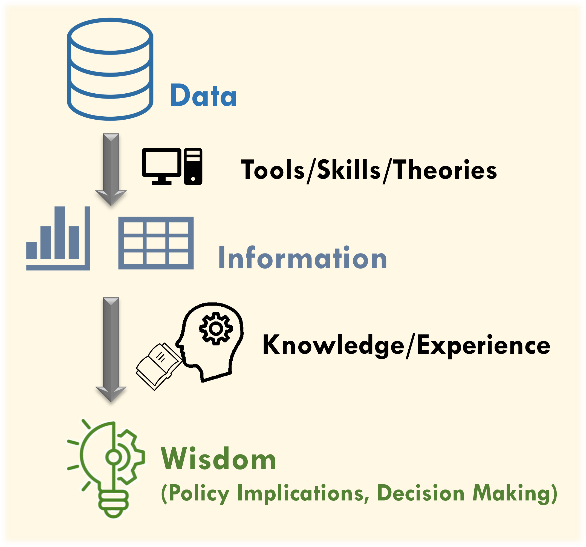
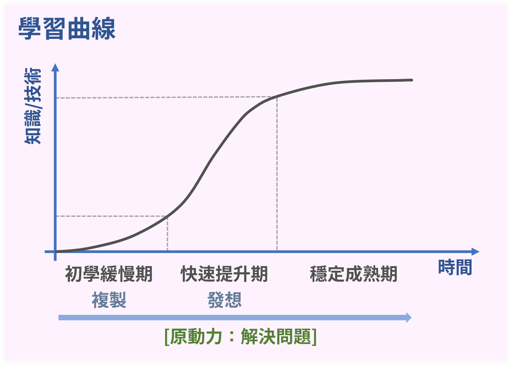

--- 
title: "運輸資料分析角落：初學者園地"
author: "Chia-Jung (Robert) Yeh  葉家榮\\\n [**PhD: Insitute of Transport and Logistics Studies, USYD**](https://www.sydney.edu.au/business/about/our-people/research-students/chia-jung-yeh-557.html)\\\nM.S.: Department of Transportation and Logistics Management, NYCU"
date: "`r Sys.Date()`"
site: bookdown::bookdown_site
output:
  bookdown::html_document2: default
  bookdown::pdf_document2: default
documentclass: book
bibliography: [book.bib, packages.bib]
biblio-style: apalike
link-citations: yes
github-repo: ChiaJung-Yeh/Transport-Analysis
description: "本書簡介R語言資料分析的基礎，含括基礎語法、dplyr套件與ggplot2套件的使用，深入淺出資料分析的步驟，最後透過交通運輸案例將所介紹的套件與函式應用於實務資料。"
google-site-verification: "i4Iib3GevuN2t_jtsNp0YabkQRXcrER03lw4OKVffco"
---

```{r setup1, include=FALSE}
knitr::opts_chunk$set(echo = TRUE)
library(dplyr)
library(sf)
library(ggplot2)
library(ggsflabel)
library(ggspatial)
library(knitr)
library(kableExtra)
library(TDX)
library(DT)
library(rtemps)

windowsFonts(A=windowsFont("微軟正黑體"))

client_id=read.csv("./key.txt", header=F)[1,2]
client_secret=read.csv("./key.txt", header=F)[2,2]
access_token=get_token(client_id, client_secret)
```

<meta name="google-site-verification" content="i4Iib3GevuN2t_jtsNp0YabkQRXcrER03lw4OKVffco" />

# **前言** {-}

><p style="font-size:25px;line-height:2">**解決問題是學習資料分析的原動力...**</p>  


## 簡介與目錄 {-}

本書簡介運輸資料分析之方法，並透過實務應用瞭解運輸資料的特性、分析原理，以及 R 語言各套件與函式的功能。共分為六大章節。前三章節為 R 語言的資料探勘基礎，系統性地介紹資料分析的常用套件與函式，分節說明：R 語言基礎語法、資料清洗與處理、資料視覺化。後三章節以運輸資料為主軸，應用前三章節所介紹的函式分析資料，分節包含：基本資料統計、地理分析、進階應用。全書先系統性地介紹資料分析必學基礎，後藉由零散的個案分析，提供較全面的實際資料操作，期能擴充 R 語言使用者對於此一領域的熟悉程度。

```{r outline-table, echo=F, eval=T}
outline_table=data.frame(topic=c(rep("資料分析基礎", 3), rep("運輸資料分析", 3)),
                         chapter=c("[**Chapter 1** R 語言基礎語法](#r-語言基礎語法)",
                                   "[**Chapter 2** 資料清洗與處理](#資料清洗與處理)",
                                   "[**Chapter 3** 資料視覺化](#資料視覺化)",
                                   "[**Chapter 4** 基本資料統計](#基本資料統計)",
                                   "[**Chapter 5** 地理分析](#地理分析)",
                                   "[**Chapter 6** 進階應用](#進階應用)"))

colnames(outline_table)=c("主題","章節")
kable(outline_table, booktabs=T, caption="本書目錄")%>%
  kable_styling(bootstrap_options=c("striped", "hover"), font_size=14)%>%
  column_spec(1, bold=T)%>%
  row_spec(0, bold=T, color="white", background="#8E8E8E")%>%
  collapse_rows(1)
```


## 資料分析心法 {-}

數據分析是社會科學中重要的研究方法與課題，運輸領域亦不例外，而拜科技所賜，我們所能蒐集、儲存的數據量愈加龐大，所能剖析的面相愈多元，也更能夠瞭解資料背後的意義。數據資料處理是一門基本功，在深入分析、建構模型之前，必須透徹瞭解資料性質，並依此整理資料、繪製圖表，以觀察數據的整體趨勢，進而推敲可能的現象，並透過資料科學的手段模擬、驗證起初的假設。因此資料處理是最入門的學問，如何**認識資料**、**有效率地處理資料**，並**形塑為預期的格式**，係本書的重點。本書旨在探討資料分析中的**「資料處理」**環節，羅列初學者必須理解的程式撰寫方法與技巧，**<u>並非</u>**著墨於資料科學的模型及理論！

數據分析的概念如圖\@ref(fig:data-information-fig)所示，最原始的資料（Data）通常是提供個體或雜亂無章的紀錄，必須透過資料處理轉換為有意義的資訊，可能以表或圖呈現之，有利於初步觀察與判斷潛在的趨勢。最後經過模型建構驗證假設，並以自身的專業所學（Domain Knowledge）或經驗剖析結果，最後產出具有政策意涵與引導決策執行的結論。

```{r data-information-fig, echo=F, eval=T, out.width="50%", fig.align="center", fig.cap="數據分析概念"}

```

在數據分析的學習過程中，起初往往會四處碰壁而無方向，此時必須保握一個最基本原則：**「學習資料分析是為了解決專業所學問題」**，而非強調程式撰寫的執行效率、簡潔度。在社會科學領域中更傾向強調資料分析的實用性，以及所推衍的意涵，而非分析的過程。因此在初學階段，建議可以透過**大量複製**的方式，模仿他人的程式碼，並修改成適用於自身問題的程式碼，如是可快速瞭解各套件與函式的應用。隨後邁入快速提升期，將能享受大幅度的增長，並可將累積的經驗應用於各個自身專業場域，此時亦能更清楚瞭解撰寫程式在社會科學領域中的核心精神。綜觀上述，建議初學者在學習程式時必須以**「解決問題」**為原動力，而非漫無目的學習程式語言，卻不清楚學習的應用場域，如是尚能更快速應對自身所學、所面臨到的課題。

```{r learning-curve-fig, echo=F, eval=T, out.width="50%", fig.align="center", fig.cap="學習曲線"}

```


## 安裝套件 {-}

本書各分析所需使用的主要套件與其功能彙整如表\@ref(tab:package-download-table)，請先行安裝。

```{r package-download, echo=T, eval=F}
# 安裝dplyr、data.table、ggplot2、sf、devtools套件
install.packages(c("dplyr", "tidyr", "data.table", "ggplot2", "sf", "devtools"))

# 另自GitHub下載TDX與TWspdata套件
devtools::install_github("ChiaJung-Yeh/NYCU_TDX")
devtools::install_github("ChiaJung-Yeh/TWspdata")

# 載入套件
library(dplyr)
library(tidyr)
library(data.table)
library(ggplot2)
library(sf)
library(TDX)
library(TWspdata)
```

```{r package-download-table, echo=F, eval=T}
package_table=data.frame(package=c("[`dplyr`](https://dplyr.tidyverse.org/)","[`tidyr`](https://tidyr.tidyverse.org/)", "[`data.table`](https://rdatatable.gitlab.io/data.table/)", "[`ggplot2`](https://ggplot2.tidyverse.org/)", "[`sf`](https://r-spatial.github.io/sf/)", "[`TDX`](https://chiajung-yeh.github.io/TDX_Guide/)", "[`TWspdata`](https://github.com/ChiaJung-Yeh/TWspdata)"),
                         package_function=c("數據分析","數據分析","數據分析（尤其更大量的數據）","繪圖","地理分析","介接臺灣運輸資料
","臺灣相關資料"))

colnames(package_table)=c("套件","功能")
kable(package_table, booktabs=T, caption="使用套件之功能")%>%
  kable_styling(bootstrap_options=c("striped", "hover"), font_size=14)%>%
  column_spec(1, bold=T)%>%
  row_spec(0, bold=T, color="white", background="#8E8E8E")
```

其中 TDX 套件整合了各運輸資料與社會經濟資料串接方式，僅須透過一函式指令即可下載指定的資料，以省去資料分析時介接之不便，提升分析效率。使用 TDX 套件的大部分函式皆須一組金鑰（access token），其取得方式如下，請注意程式碼中 CLIENT_ID 與 CLIENT_SECRET 請自 [TDX 平臺](https://tdx.transportdata.tw/register)註冊會員並申請。

```{r tdx-usage, echo=T, eval=F}
client_id=CLIENT_ID
client_secret=CLIENT_SECRET
access_token=get_token(client_id, client_secret)
```

在得到金鑰（access_token）後，可輸入在 TDX 套件的函式中，以正確取得指定的資料。

其他關於 TDX 註冊、申請方式，以及所有函式功能與使用方法，請參見 [TDX 運輸資料介接指南](https://chiajung-yeh.github.io/TDX_Guide/)。

---

## 其他參考資料 {-}

以下網站陳列其他教材與參考資料：

1. [R Preliminary](https://chiajung-yeh.github.io/R-Code-Sharing/R_Preliminary/R_Preliminary.html)
2. [Spatial Analysis with R](https://chiajung-yeh.github.io/Spatial-Analysis/)  
3. [地理資訊系統與空間運算：R軟體應用](https://www.books.com.tw/products/0010979785)

